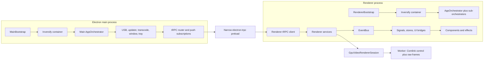
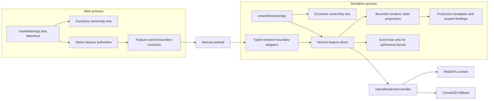

# PrismGB Codebase Normalization and Reduction Analysis

- **Date:** 2026-07-09
- **Branch examined:** `wave/x1-comlink-split` (seven local commits ahead of its remote at the start of the audit)
- **Scope:** application source, tests, build/package configuration, CI, generated output, and installed production dependencies
- **Purpose:** identify architectural normalization work that removes handwritten boilerplate and duplicated state/contracts, reduces source and packaged bloat, and improves runtime efficiency without erasing valid process, trust, accessibility, or GPU boundaries

This is an analysis and implementation plan, not an implementation diff. Existing unrelated worktree changes were left untouched.

## Executive conclusion

PrismGB does not have one isolated “large file” problem. Its main source of bloat is **parallel architectural representation**:

1. A fixed application object graph is described by constructor types, 73 DI tokens, roughly 200 Inversify decorator sites, binding modules, container access, and a separate test metadata/mock graph.
2. State crosses main, tRPC, renderer services, an event bus, stores, bridges, and components, often becoming a second or third cache of the same authority.
3. Event channels, payload labels, payload types, IPC push names, Zod schemas, and drift tests manually mirror one another.
4. Tests contain a parallel UI/runtime framework even though renderer tests already have `happy-dom` and production templates.
5. GPU ownership has improved, but session construction, scheduling, worker response compatibility, and render-plan/uniform work remain split across layers.
6. Packaging currently copies renderer assets twice and configures the whole included `ffprobe-static` package for unpacking. Its installed six-binary tree is 351,496,224 bytes, but the per-target packaged delta has not yet been measured.

The recommended direction is a **balanced architectural reduction**:

- explicit, typed composition roots with reverse-order resource ownership;
- acyclic feature-owned contracts and bounded renderer state projections;
- a narrow event bus limited to boundary events and real fanout;
- production templates and typed testkits reused by tests;
- one package-owned video renderer controller/session;
- explicit separation of build resources, renderer runtime assets, and platform-native binaries.

This direction preserves the strongest existing boundaries: Electron main/preload/renderer isolation, the narrow tRPC preload, Zod validation at trust boundaries, dependency-cruiser package entrypoints, main-owned native integrations, and the GPU worker's raw transferable frame plane versus Comlink control plane.

## Evidence rules

The report uses these labels deliberately:

- **Observed** — verified from current files, static reference searches, filesystem measurements, installed package contents, command output, or a direct runtime probe.
- **Inferred** — an architectural conclusion that explains the observations but is not itself a runtime measurement.
- **Assumption** — a product or extensibility premise that must be confirmed before deletion.
- **Estimate** — a planning range, never a claim that a completed diff already achieved it.

Physical line counts include comments and blank lines. They are useful for locating maintenance surface, not for evaluating code quality by themselves. Installed dependency size is not the same as final installer size; packaged-artifact measurements are called out separately where still required.

## Quantitative baseline

| Tracked surface | Files | Physical lines | Notes |
|---|---:|---:|---|
| `src` (`ts/js/mjs/css/html/json/wgsl`) | 272 | 31,980 | 232 TypeScript files and 26,230 TypeScript lines |
| `tests` (same relevant code/config extensions) | 257 | 37,829 | 204 TypeScript files; 52 JavaScript files and 7,901 unchecked JS lines |
| `tests/factories` | 16 | 3,445 | Handwritten JS factory layer |
| `tests/support` | 18 | 1,670 | DI, DOM, media, storage, and runtime installers |
| `scripts` | 14 | 1,869 | Includes the 86-line shell merge script |
| CSS | 32 | 5,120 | 52 `!important` declarations |

Counts use `git ls-files` plus extension-filtered `wc -l`; ignored generated E2E fixtures, test results, `dist`, and `release` are excluded. The scripts row includes every tracked file under `scripts`.

Observed implications:

- Tests contain 18.3% more physical lines than application source under the same broad extension set. That is not automatically excessive, but 5,115 lines are concentrated in factory/support infrastructure before counting test assertions.
- The direct DI slice is 634 production lines plus 454 test/harness lines: 1,088 lines across token files, modules, containers, DI metadata, the harness's own test, and container tests. This is attributable surface, not a promise that all 1,088 lines disappear.
- The event manifest has 77 entries. Source contains 107 `publish(EventChannels...)` calls and 50 `@OnEvent` handlers, in addition to explicit subscriptions.
- The five auto-hide implementation files are 841 lines and their five focused test files are 1,702 lines. The 2,543-line footprint demonstrates coordination cost; it is not a deletion estimate.
- `ffprobe-static/bin` contains six binaries totaling exactly 351,496,224 bytes in the installed tree.

## Current architecture



The process boundary is sound. The reducible complexity is mostly *within* each process and in the number of representations used to move from one boundary to the next.

## Ranked findings

| Priority | Finding | Primary value | Risk if delayed |
|---|---|---|---|
| P0 | Fix lifecycle ownership before structural reduction | Correctness, leak prevention, simpler composition | Cleanup tests currently mask a real production mismatch |
| P0 | Measure and eliminate unnecessary all-target ffprobe staging | Packaged size, unsupported-target clarity | Very large installed/input surface for optional percent progress |
| P1 | Replace the fixed Inversify graph with typed composition roots | Boilerplate deletion, test simplicity, bundle reduction | Every feature change continues updating parallel DI registries |
| P1 | Generate feature contracts from schemas/descriptors | Type safety, fewer drift tests/casts | Event/IPC/schema mirrors can disagree silently |
| P1 | Collapse mirrored events/state into bounded feature projections | Fewer layers, clearer authority | More producer-only channels and lifecycle gaps accumulate |
| P1 | Replace the test-only UI/runtime framework | Test fidelity and major test-code reduction | Tests keep validating mocks rather than production structure |
| P1 | Complete GPU session/controller ownership | Source reduction and fewer lifecycle/backend branches | Streaming and canvas cycles remain container-coupled |
| P2 | Normalize UI registries and auto-hide coordination | Fewer construction/action/state registries | UI behavior remains expensive to change and test |
| P2 | Separate build resources from renderer assets; remove redundant plugins | Build and dist reduction | Every build carries duplicate and irrelevant renderer assets |
| P2 | Cache WebGPU plans/uniform payloads/present bindings on invalidation | Frame-path allocation and CPU reduction | Known per-frame static work remains; impact is not yet profiled |
| P3 | Simplify static settings, device catalog, transcode ownership, CSS, and CI config | Local normalization | Smaller recurring duplication remains after systemic work |

## 1. Lifecycle ownership is both a correctness defect and the first reduction seam

### Observed

- Renderer cleanup calls `safeDispose(logger, 'container', container)` at `src/renderer/app-bootstrap.ts:80-95`.
- `safeDispose` only looks up and invokes the named method, defaulting to `dispose`, at `src/platform/core/primitives/safe-disposer.utils.ts:6-12`.
- A direct probe of the installed Inversify version returned `typeof new Container().dispose === 'undefined'`; the container exposes `unbindAll`/`unbindAllAsync`, not `dispose`.
- The renderer bootstrap test provides a fake container-level `dispose` method at `tests/unit/renderer/app-bootstrap.test.ts:116-121`, backed by the factory at `tests/factories/orchestrator.factory.js:61-110`. The test therefore proves behavior that the production container does not have.
- The module singleton at `src/renderer/application/container.ts:64-74` is never reset. `PlatformBootstrap.clearLifecycleState()` clears only the bootstrap's reference at `src/platform/core/primitives/platform-bootstrap.ts:85-89`.
- `AppOrchestrator` initializes settings, update, update UI, and nine orchestrators at `src/renderer/application/orchestrators/app.orchestrator.ts:51-67`, but its cleanup list at lines 121-140 omits settings, update, and update UI.
- `RendererBootstrap` initializes UI, capture, and transcode bridges plus the renderer transcode service at `src/renderer/app-bootstrap.ts:121-133`; its cleanup at lines 80-95 does not dispose those resources.
- Several omitted resources implement real `dispose()` logic, including renderer update, update UI, transcode, capture bridge, and UI event bridge.
- Initialization is not transactional. `PlatformBootstrap.initialize()` rethrows without rolling back resources acquired before failure, main cleanup skips when `isInitialized` is false, and declared orchestrator subscriptions can survive an `onInitialize()` failure (`src/platform/core/primitives/platform-bootstrap.ts:24-68`; `src/platform/core/primitives/orchestrator.base.ts:43-74`).
- Renderer cleanup is attached as an async `beforeunload` listener at `src/renderer/index.ts:50-67`, but browser unload does not await its Promise. If `createApplication()` fails, the global bootstrap reference is never assigned, so the fatal-error path cannot clean the partially initialized graph.
- Main entry code reaches through `MainBootstrap.getContainer()` and `TOKENS.windowService` for second-instance focus and macOS window recreation at `src/main/index.ts:123-133,156-163`. Container removal needs a typed replacement for those host commands.

### Inferred root cause

The container is being treated simultaneously as a locator, a singleton owner, a lifecycle cascade, and a test override mechanism. Inversify supplies lookup/construction, but the application has no single, truthful ownership tree. The apparent container cascade is a no-op, so initialization and teardown lists drift independently; failure rollback and window-unload semantics are also undefined.

### Recommended design

Create `createMainApp(overrides?)` and `createRendererApp(overrides?)` composition roots that return a typed app graph:

```ts
type RendererApp = {
  readonly initialize: () => Promise<void>;
  readonly orchestrator: AppOrchestrator;
  readonly start: () => Promise<void>;
  readonly dispose: () => Promise<void>;
};

type MainHost = {
  readonly focusPrimaryWindow: () => void;
  readonly ensurePrimaryWindow: () => Promise<void> | void;
};
```

Define an **exclusive ownership tree**, not universal root ownership. A resource has exactly one current owner: either a nested feature host/orchestrator or the process root, never both. Register cleanup immediately after each successful acquisition; roll back construction, `initialize`, or `start` failures; and transfer ownership atomically when removing an existing nested cascade.

Use a root `OrderedDisposer` that awaits dependency-bearing async cleanup sequentially in reverse acquisition order while continuing to collect errors. Do not reuse the current `DisposableBag.clear()` unchanged for this role: it invokes disposers in reverse order but awaits their Promises concurrently at `src/platform/core/primitives/disposable-bag.ts:152-180`. Concurrent disposal remains valid only for explicitly independent siblings.

Constructor dependency objects remain explicit test seams. Use callbacks or a narrow mutable reference to break the canvas/render cycle instead of a lazy container getter. Expose the `MainHost` commands from `createMainApp()` so `src/main/index.ts` no longer needs container access.

Delete, in stages:

- the 14 main and 59 renderer tokens;
- binding modules and container-specific override helpers;
- 47 `@injectable()` annotations and 153 `@inject(...)` parameters;
- runtime decorator metadata configuration and Inversify dependencies;
- the parallel token-to-mock registry and injectable metadata harness;
- tests whose only purpose is asserting container wiring, replacing them with real graph lifecycle tests.

### Required gate

Run `create -> initialize -> start -> dispose` twice with two fresh production composition roots; `dispose` is terminal and idempotent, not an invitation to restart disposed services. The gate must assert invocation **and completion** order, prove listener/subscription counts return to baseline between roots, and detect retained timers/workers/media tracks. Add failure injection after each acquisition/initialization boundary to prove rollback. Also drive a real Electron window close/reload path: async `beforeunload` alone is not a reliable teardown protocol, so define which releases are synchronous and whether main coordinates graceful renderer shutdown. Do not accept another mocked container lifecycle test as the gate.

## 2. Delete proven-dead surfaces before generating replacement abstractions

### Observed

- The main-process `PlatformEventBus` has publishers but no main source subscribers. Device integration publishes two main events and update publishes one; `TranscodeService` accepts `eventBus` at `src/platform/transcode/transcode.service.ts:78-103` but never uses it.
- Fifteen request-side entries in `src/platform/ipc/ipc-channels.ts:1-10` have no exact production symbol reference after request transport moved to tRPC: device status; external-open; fullscreen set/get; update status/check/download/install; performance metrics; GPU policy; login item get/set; and transcode start/cancel/status. Snapshot tests preserve the old surface at `tests/unit/platform/ipc/ipc-channel-baseline.test.ts:26-77`.
- The remaining device/update/transcode push strings are manually checked against event strings by `tests/unit/platform/ipc/channel-parity.test.ts:5-38`.
- At least seven renderer event channels have producers and payload-map rows but no runtime subscriber: `PERFORMANCE.UI_MODE_CHANGED`, `STREAM.HEALTH_OK`, `STREAM.HEALTH_TIMEOUT`, `RENDER.STATS_UPDATE`, `RENDER.CANVAS_RECREATED`, `RENDER.PIPELINE_READY`, and `RENDER.PIPELINE_ERROR`. `PIPELINE_READY` is published in all three session-construction paths, while `PIPELINE_ERROR` is published in two (`src/renderer/infrastructure/services/streaming/streaming-render.service.ts:359-508`).
- GPU response compatibility paths `CAPTURE_REQUESTED`, `RELEASED`, and `DESTROYED` are retained in `src/platform/gpu/worker/protocol.ts:26-74` and `src/platform/gpu/worker/client.ts:184-239`, but have no production consumer beyond routing/callback compatibility.
- `USB_SCAN_DELAY` is defined and tested but has no source consumer.
- Knip currently reports clean. That means these surfaces are symbol-referenced; it does **not** disprove semantic deadness when tests, manifests, or routing tables are their only consumers.

### Recommendation

Make one low-risk deletion slice before broader refactors:

1. Remove request-side IPC constants and baseline assertions; rename the remainder `IPC_PUSH_CHANNELS`.
2. Derive cross-process push channel names from the canonical boundary event descriptor.
3. Remove the unused transcode event-bus dependency and, if no external plugin hook exists, the main-only bus/events.
4. Remove producer-only renderer events after a product-level check for undocumented telemetry/plugin consumers.
5. Remove unused GPU response variants and compatibility callbacks while retaining direct Comlink return values and raw frame responses.
6. Remove dead config and factory exports together with tests that only freeze them.

### Assumption

Deletion of producer-only events assumes there is no untracked plugin, telemetry collector, or externally loaded renderer code consuming string channels. The current repository shows no such extension system.

## 3. Define event, IPC, and validation contracts once

### Observed

- `src/platform/events/event.manifest.ts:12-93` stores domain, name, reconstructible value, and a free-form payload label for 77 entries.
- `src/platform/events/event-payloads.ts:215-290` separately maintains a void-channel union and payload override map, with an `unknown` fallback.
- The current “exhaustiveness” aliases are ineffective: `EventPayloadMap` already maps over every `EventChannelValue`, so `MissingEventPayloads` and `ExtraEventPayloads` at `src/platform/events/event-payloads.ts:279-290` are necessarily `never`; extra override keys and `unknown` fallbacks are not rejected.
- Runtime settings code compares payload-name strings at `src/renderer/lib/settings.definitions.ts:12-23,78-84`; this is the only observed runtime reason for the manifest's payload strings.
- Update/transcode types are repeated across event payloads, `src/platform/ipc/ipc-payloads.contract.ts`, and Zod schemas under `src/main/ipc/schemas`.
- Router code then casts subscription values at `src/main/ipc/router.ts:141-240`.
- Device schema drift guards occupy `src/platform/devices/domain/payload.schemas.ts:35-67` partly because test TypeScript disables strict null checking.
- `TranscodeFormat` is handwritten even though the valid keys already exist in `src/platform/transcode/transcode.config.ts:56-69`.

### Recommended design

Split contracts by trust boundary. Internal renderer events need a channel and compile-time payload type; they can carry non-serializable `MediaStream`, `MediaDeviceInfo`, canvas, and `Blob` objects and should not ship Zod schemas. Cross-process, persisted, or otherwise untrusted values should use a schema-backed descriptor:

```ts
const streamingEvents = defineInternalEvents({
  started: internalEvent<StreamStartedPayload>('stream:started'),
});

const updateBoundary = defineBoundaryEvents({
  stateChanged: boundaryEvent('update:state-changed', UpdateStateChangedSchema),
  progress: boundaryEvent('update:progress', UpdateProgressSchema),
});
```

Derive from those descriptors:

- event channel objects and unions;
- `EventPayloadMap`;
- exact-key payload maps that reject missing **and extra** entries;
- IPC push channel constants from the boundary subset;
- Zod parse functions and `z.infer` transport types only for boundary/persisted data;
- settings event choices;
- contract-focused test cases.

Use leaf `./contract` entrypoints that have no runtime/transport imports, then aggregate them in one direction. Split updates into renderer-safe contract and native runtime entrypoints before normalizing its DTOs; its current root entrypoint immediately exposes `electron-updater`. Add an explicit dependency-cruiser no-circular rule—the current rules enforce entrypoint access but not cycles. Keep schemas in feature/platform contracts, not in the main router. The router should import and apply boundary contracts; it should not own domain DTOs. Normalize the transcode outcome model so the service, tRPC router, and renderer do not each translate between `{success,error}`, thrown errors, and another status object.

### Preserve

- Zod parsing for data crossing the Electron/process trust boundary.
- Scalar boxing required by the current electron-trpc link.
- URL validation and invalid subscription-payload dropping.
- Main and renderer update implementations as distinct sides of the process boundary.

## 4. Move from layered relays to vertical feature ownership

### Observed

- `AppState` creates five signals from event updates at `src/renderer/application/state/app-state.ts:31-79`, while several getters still query the authoritative services directly at lines 89-115.
- `DeviceStatusStore` takes the initial device signal and then maintains another event-driven signal set at `src/renderer/presentation/state/device-status.store.ts:26-76`.
- Update state moves through main update authority, IPC/tRPC subscription, renderer update mirror, `UpdateUiService`, event messages/badges, and component signals.
- `TranscodeUIBridge` maps transcode events to record-button enable/disable events even though `TranscodeProgressStore` observes the same lifecycle and the transcode component owns the button.
- Three performance orchestrators mostly delegate to three corresponding services; those six files total 617 production lines before adapters, DI, and tests. Visibility, activity, and reduced-motion adapters each have one coordinating consumer.
- `weakGpuDetected` is initialized and read, but no source writer was found.
- `AppOrchestrator` initializes twelve dependencies explicitly and cleans a different list.

### Inferred root cause

The architecture treats the event bus as both a domain notification mechanism and a state-management transport. Durable state is therefore rehydrated repeatedly, while thin bridges and orchestrators exist mainly to republish or mirror it.

### Recommended design

Organize renderer code into vertical slices:

```text
renderer/features/
  streaming/   store.ts  actions.ts  view.ts  boundary.ts
  capture/     store.ts  actions.ts  view.ts  boundary.ts
  settings/    store.ts  actions.ts  view.ts
  updates/     store.ts  actions.ts  view.ts  boundary.ts
  notes/       store.ts  actions.ts  view.ts
```

Each slice should expose one renderer projection per **bounded state machine**, not one oversized store per directory. Main remains authoritative for native update and USB connection state; renderer projections subscribe to those authorities once. Renderer media acquisition, streaming, rendering, and capture remain distinct where their lifecycles differ. Components compute presentation from the relevant readonly projections. Keep the event bus for ephemeral many-to-many notifications, cross-feature completion/error fanout, and process-boundary push events—not as the default way to copy durable state.

Specific consolidations:

- Reduce `AppState` to any truly cross-feature UI state that remains, likely cinematic/display mode.
- Fold update UI projection into the update store/component.
- Expose transcode active/progress state directly to its component and delete record-button relay events.
- Replace the three performance orchestrators/services and three browser adapters with one `PerformanceCoordinator` plus a small `BrowserPerformanceSignals` dependency.
- Add an event-liveness check that reports zero-consumer producers, with a documented allowlist for intentionally external/fanout channels.

## 5. Replace the test-only runtime with production templates and typed testkits

### Observed

- `tsconfig.test.json:4-11` allows JavaScript without `checkJs` and disables `strict`, `noImplicitAny`, and `strictNullChecks`.
- Renderer Vitest projects already use `happy-dom` at `vitest.config.js:78-96`.
- `tests/factories/ui.factory.js:81-329` implements its own elements, selectors, class lists, attributes, listeners, queries, and event triggering. Its element maps later repeat production component slices.
- Test factories total 3,445 lines; support totals 1,670 lines.
- Logger and event-bus factories total 539 lines and expose history/query APIs beyond the subset tests consume.
- Media test infrastructure is partially normalized already: `tests/devices/media.testkit.ts` delegates installation to `tests/support/mocks/installers/media.installer.js`, `tests/factories/stream.factory.js` delegates several helpers to the TypeScript testkit, and Playwright consumes generated platform fixture data. Remaining wrappers and the necessarily browser-injected Playwright runtime still duplicate shapes and behavior; their combined footprint is not directly collapsible.
- Several exported factory helpers have no consumer beyond the factory barrel.
- The mocked renderer container lifecycle invents the production-incompatible `dispose` method described earlier.

### Recommended design

1. First add a tested Vitest asset transform or inject an icon/asset resolver: the production shell imports root asset URLs and `import.meta.glob(...?raw)`, which current `vitest.config.js:30-35` explicitly excludes. Then add `renderTestAppShell()` that calls the production app-shell template and production DOM-binding code in `happy-dom`.
2. Replace fake element/query implementations with native DOM operations and small behavior-specific spies.
3. Continue the existing media normalization into one strict TypeScript contract/builder surface with thin Vitest and Playwright adapters; keep the browser-injected synthetic-stream runtime where real browser APIs require it.
4. Use the real event bus with spies around `publish`/`subscribe` rather than a second event-bus implementation.
5. Reduce logger doubles to the actual logger interface.
6. Move shared factories/support to TypeScript, enable strict mode incrementally, then remove production schema workarounds that existed only for the loose test compiler.
7. Delete contract snapshots that merely pin a generated descriptor; retain behavioral, boundary, failure-path, accessibility, and end-to-end tests.

The goal is not “fewer tests.” It is fewer lines spent maintaining a second application framework and more tests against production composition, templates, contracts, and browser behavior.

## 6. Normalize template, component, and action registries together

### Observed

- Production templates contain 76 `data-ref` and 15 `data-action` attributes.
- `src/renderer/presentation/primitives/template-dom.contract.ts:10-17` separately enumerates references, actions, and component slices.
- `src/renderer/presentation/primitives/dom-bindings.utils.ts:65-87` builds five grouped binding structures and flattens them.
- `src/renderer/application/container.ts:16-29` maintains a component-token map.
- `src/renderer/application/di/presentation.module.ts:78-142` repeats construction and element-slice mapping.
- `UISetupOrchestrator` performs runtime drift checks between configured actions and template actions.
- Test factories repeat many of the same element slices.

### Recommendation

Coordinate this with DI removal. A feature-owned component descriptor can contain its root selector/ref, constructor, eager/deferred policy, and disposal. Bind references within component scope from the real DOM, and derive actions from actual `[data-action]` nodes or one typed action table. Avoid introducing a new global manifest that merely becomes a fifth registry.

The stream view should explicitly own its replaceable canvas reference. That will also help remove the current canvas/render circular dependency.

## 7. Consolidate auto-hide behavior into one coordinator/state machine

### Observed

The generic activity controller, cursor effect, toolbar effect, controls effect, and host total 841 source lines. Their focused tests total 1,702 lines. They coordinate overlapping pointer/keyboard activity, animation-frame coalescing, timeouts, streaming/fullscreen modes, hover/focus/panel state, and CSS classes.

Relevant seams:

- `src/platform/ui-base/widgets/activity-auto-hide.controller.ts:36-151`
- `src/renderer/presentation/effects/cursor-auto-hide.effect.ts:16-97`
- `src/renderer/presentation/effects/toolbar-auto-hide.effect.ts:21-234`
- `src/renderer/presentation/effects/controls-auto-hide.effect.ts:19-146`
- `src/renderer/presentation/effects/ui-effects.host.ts:21-208`

### Recommendation

Use one `UiVisibilityCoordinator` with an explicit state machine:

```text
inactive -> visible -> pending-hide -> hidden
             ^            |
             | activity / hover / focus / open panel
             +------------+
```

Project cursor, toolbar, and controls classes from that state rather than running separate controllers. Preserve toolbar `MutationObserver`/open-panel behavior and controls `focus-within` semantics. Consolidation should be validated with state-transition tables and a smaller set of integration tests, not by deleting nuanced accessibility behavior.

## 8. Complete GPU renderer ownership without undoing the worker architecture

### Observed

- `StreamingRenderService` is 612 lines and owns session lifecycle, backend selection, canvas transitions, frame scheduling, health, stats publication, and performance-mode behavior.
- It repeats similar `createGpuVideoRendererSession(...)` callback/configuration blocks at `src/renderer/infrastructure/services/streaming/streaming-render.service.ts:359-388`, `438-467`, and `489-508`.
- It owns the `requestVideoFrameCallback` loop at lines 569-611 while `GpuVideoRendererSession` owns bitmap transfer and pending-frame backpressure at `src/platform/gpu/application/video-session.ts:238-271`.
- `StreamingCanvasLifecycleService` calls back into the render service, creating the lazy DI cycle.
- The worker protocol still carries response variants and callbacks that duplicate direct Comlink control results.
- The raw frame plane is intentionally separate from the Comlink control plane; that is appropriate for transferable, high-frequency frames.

### Recommended design

Promote the package-owned session into a `VideoRendererController` that owns:

- video-frame scheduling and cancellation;
- one session options/callback builder;
- backend transition state;
- canvas transfer/expiration state;
- pending-frame/backpressure accounting;
- preset, brightness, resize, capture, and stats projection.

The renderer feature should provide the current video/canvas and observe one controller state stream. A canvas host emits replacement/resize callbacks; it should not depend back on the renderer service. Control operations should return Promises directly through Comlink; retain callbacks only for asynchronous frame-rendered/stats/error events.

Do not remove Comlink, move GPU work back to the main thread, reintroduce WebGL2, or merge the raw frame transport into RPC. Those would trade code reduction for worse ownership or hot-path behavior.

## 9. Fix packaging and build bloat with measured, target-aware assets

### 9.1 `ffprobe-static` is disproportionate to its feature

#### Observed

- `package.json:146-149` marks all included `node_modules/ffprobe-static/**/*` content for unpacking. Electron Builder applies target filters (for example, excluding `.exe` dependency files on non-Windows targets), so this is not proof that every target ships all six files.
- The installed package input contains six x64/ia32/arm64 binaries for Darwin, Linux, and Windows totaling 351,496,224 bytes.
- The product matrix declares `linux-arm64`, but this package contains no Linux arm64 binary.
- `probeDuration()` uses ffprobe only to calculate percent progress at `src/platform/transcode/transcode-process.ts:24-81`.
- Missing ffprobe resolves to duration `0`; transcode continues and reports indeterminate progress. Probe errors are also caught at `src/platform/transcode/transcode.service.ts:151-157`.

#### Recommendation

Preferred: remove `ffprobe-static`, make progress explicitly indeterminate until completion, and keep `ffmpeg-static` for the actual transcode feature. If exact percentage is a product requirement, copy only the matching target binary into a target-specific resource path or obtain duration from an already available metadata source. Measure `app.asar.unpacked`, the unpacked app, and final installers before and after; the 351 MB installed-tree number is not itself a verified per-target delta.

### 9.2 Renderer assets are copied twice and mix runtime with build resources

#### Observed

- `vite.config.js:17-28` static-copies the entire `assets` directory.
- `vite.config.js:132-133` also declares the same directory as `publicDir`.
- A fresh `dist/renderer` contains byte-identical root and `assets/` copies of all seven tracked assets plus the ignored `.DS_Store`: eight duplicated files.
- One redundant copy is 718,736 tracked bytes plus 8,196 ignored bytes.
- The runtime references are inconsistent: the header/overlay use root URLs, while tray production code expects `dist/renderer/assets/tray-icon.png`.
- Installer icons and entitlements are build resources, not renderer web assets.

#### Recommendation

Split directories by ownership:

```text
build-resources/      icon.icns  icon.ico  icon.png  entitlements.mac.plist
src/renderer/public/  Logo.png   overlay-icons/default.svg
runtime-resources/    tray-icon.png
```

Use one Vite public/copy mechanism, update tray resolution to a packaged runtime resource, exclude dotfiles, and remove `vite-plugin-static-copy` if no explicit copy task remains.

### 9.3 Renderer polyfill plugin appears unnecessary

#### Observed

`vite-plugin-electron-renderer` is configured with `nodeIntegration: false`. Its stated purpose is polyfilling Electron, Node built-ins, and CommonJS packages in the renderer. Static search found no renderer Node/Electron import; the renderer's Electron dependency is `electron-trpc/renderer`, which consumes the narrow preload global.

#### Recommendation

Remove the plugin in an isolated build/dev/E2E experiment. Keep the removal only if production build, dev boot smoke, and renderer IPC flows pass. This is a dependency/config simplification; no runtime-size claim should be made until bundle comparison.

The fresh build and dev smoke also emitted Rollup's `Unknown input options: platform` warning for main and preload, and `vite-plugin-electron` created a 178-byte untracked root `index.html` placeholder because there is no root renderer entry. The clean script removes that placeholder only before the next build, which immediately recreates it. Align plugin versions/configuration, stop passing the obsolete option, and prevent or clean the placeholder at command completion.

### 9.4 Use builder-native locale filtering and target-specific native staging

#### Observed

- `scripts/afterPack.js:50-65` prunes only `appOutDir/locales`. That layout applies to Linux/Windows but misses macOS Electron framework `.lproj` locale directories.
- The installed macOS Electron framework contains 220 locale packs totaling 48,393,236 bytes; `electron-builder` already supports `electronLanguages` and target-aware macOS resource locations.
- `package.json:149` unpacks all USB prebuilds. The installed `usb/prebuilds` tree contains 12 Android, Darwin, Linux, and Windows binaries totaling 4,770,172 bytes, while the release matrix declares five specific targets.

#### Recommendation

Set `electronLanguages: ["en-US"]`, validate every packaged target, then delete the handwritten locale-pruning branch. Stage only the USB prebuild selected for the target OS, architecture, and Linux libc where applicable, using one manifest shared by packaging and runtime resolution. Keep the native ABI gate and packaged smoke tests. Treat 48,393,236 and 4,770,172 as installed input ceilings, not promised installer savings.

## 10. Remove static work from the WebGPU frame path, after profiling

### Observed static hotspot

- Every WebGPU frame builds an enabled-pass array and render plan at `src/platform/gpu/infrastructure/webgpu.driver.ts:377-383`.
- Every frame builds a new `Float32Array` for every WebGPU pass and hashes its bytes at lines 500-512 and 81-105, even though uniforms are rebuilt only on preset, brightness, and resize changes in `src/platform/gpu/infrastructure/pipeline-controller.ts:114-136`.
- The present bind group is created every frame at `src/platform/gpu/infrastructure/webgpu.driver.ts:471-483`; its input texture changes only when the selected final pass/texture changes.
- The current renderer output contains two approximately 31.8 KB WebGPU driver chunks, one reached from the main-thread generic renderer factory and one from the worker build graph.

### Inference

The logical invalidation points are already explicit, so uniform payloads and enabled-pass plans can be computed when preset/brightness/size/backend state changes rather than on every frame. A cached present bind group must additionally be keyed by the selected plan source and GPU resource generation: resize destroys/recreates textures, and release, reinitialization, or device recovery invalidates every view/binding. The duplicate chunk may be reduced by exposing backend-specific factories: a direct Canvas2D factory for the local fallback and a WebGPU-only factory for the worker.

### Required measurement

This is a static hotspot, not a measured regression. Capture p50/p95 frame CPU time, allocations, dropped frames, and GPU submission time before changing it. Re-measure on WebGPU and Canvas2D fallback. Keep the optimization only if it improves the real frame path without weakening preset/resize correctness.

The `createImageBitmap(video)` transfer for each accepted worker frame in `video-session.ts:238-270` is also allocation-sensitive, but it should be evaluated with profiling and browser/Electron capabilities before changing the transport model.

## 11. Normalize smaller domain/configuration ownership after the systemic work

### 11.1 Settings

`settings.definitions.json` is resolved through string source names, mutable registries, fallback values, caching, and runtime payload-label validation in `src/renderer/lib/settings.definitions.ts:17-121`; bootstrap registers the actual sources once at `src/renderer/app-bootstrap.ts:37-40`.

Use a typed `defineSettings` module with direct renderer-safe supplier functions and typed event descriptors. Derive startup/UI settings and protected storage keys. Retain data-driven UI generation; remove string registries, `any`, cache-reset test hooks, and the lazy storage-key Proxy.

### 11.2 Device catalog

The catalog has one device descriptor, while `catalog.ts` supplies normalization, defaults, cloning/freezing, lookup maps, resolution derivation, and test-fixture metadata.

Balanced option: keep multi-device readiness but use a typed `defineDevices(...)` descriptor and derive maps/types. Move test metadata to tests. Aggressive option: if PrismGB is intentionally Chromatic-only, replace the generalized catalog with a typed `CHROMATIC_PROFILE` and explicit acquisition strategy. This is a product decision; do not assume it from the current one-entry catalog.

### 11.3 Transcode ownership

`TranscodeService` owns jobs, processes, and sessions in three parallel maps, while temp utilities maintain another active-session set and directory scan. Replace this with one record map such as `Map<jobId, { status, process?, session? }>` but keep active-resource release separate from status eviction: current completion removes process/session immediately and retains status for five minutes at `src/platform/transcode/transcode.service.ts:283-315`. Use `releaseRuntimeResources()` for success/cancellation/error/disposal and a later `evictStatus()` for the TTL. Preserve cancellation output deletion and crash-orphan cleanup.

### 11.4 Lifecycle base classes

`ManagedLifecycleHost` already centralizes timers, listeners, observers, and disposal, while `BaseService`, `BaseOrchestrator`, and `PresentationComponent` expose layer-specific facades. After composition ownership is explicit, optionally prune duplicated facade/API forwarding around that existing primitive. Do not create another lifecycle abstraction or force unrelated objects into one inheritance hierarchy merely to remove lines.

### 11.5 Updates entrypoint

Updates expose a root platform entrypoint that imports native `electron-updater`, while GPU, devices, and transcode separate renderer-safe and runtime entrypoints. Move updates under main infrastructure or create a runtime-only platform entrypoint and enforce it with the same alias/dependency rules.

## 12. CSS, workspace config, and CI normalization are useful but secondary

### CSS

Static comparison found exact recurring visible-popover declaration blocks in `src/renderer/presentation/features/settings/styles/settings-menu.css:236-240`, `src/renderer/presentation/features/notes/styles/notes-toolbar.css:188-192`, and `src/renderer/presentation/features/notes/styles/notes-autocomplete.css:28-32`. Brightness and volume slider blocks mirror one another in `src/renderer/presentation/features/toolbar/styles/slider-controls.css:33-85,107-158`; toolbar reveal/hide state is also repeated. Introduce a small set of shared popover, slider, and toolbar-state primitives, preferably using state attributes and cascade layers. Preserve feature-local layout and accessibility states; do not replace the stylesheet with a token generator solely to reduce line count.

### Narrow dependency cleanup

- `@testing-library/dom` is configured/re-exported only by `tests/testing-library.setup.js:8-36`; no current test consumes its queries. Either adopt it intentionally for the real-DOM migration or remove the setup and 2,426,344-byte installed development package.
- `type-fest` supplies only `ValueOf` at `src/platform/core/types/type-utils.ts:5`; define `type ValueOf<T> = T[keyof T]` locally and remove the 558,867-byte installed development package.

These are install/toolchain cleanups, not packaged-app savings.

### Workspace aliases

`scripts/lib/workspace-aliases.mjs` is a good source of truth for Vite, Vitest, and dependency-cruiser. `tsconfig.base.json` still manually repeats platform paths and relies on a parity test. Move the entrypoint registry to data that can emit both JS config and generated TypeScript paths, or generate a checked file. Keep exact-entrypoint enforcement and the prohibition on deep imports.

### Vitest and CI

Vitest projects repeat common global/reset flags. CI uses a useful platform manifest, but workflow choice lists and setup/test jobs still repeat matrix knowledge. `test:run` already includes `tests/integration` through the renderer project, yet all three jobs in `.github/workflows/reusable-ci-tests.yml:48-55,79-83,108-112` run `test:integration` again. Build jobs generate per-platform checksums and release publishing regenerates a combined file. Extract shared test project defaults, remove the duplicate integration invocation, and drive platform selection/artifact collection from the manifest. This is maintenance and CI-time reduction, not a reason to weaken per-platform native ABI/build smoke coverage.

## Target architecture



### Boundary rules for the target

1. Main owns Electron, native USB, updater, filesystem/transcode process, windows, and tray.
2. Preload exposes only the typed transport contract; sandbox/context isolation stay enabled.
3. Leaf feature contract entrypoints own boundary DTO schemas; IPC/tRPC adapts them but does not redefine them. Internal trusted events remain type-only.
4. Renderer features own one projection per bounded state machine while main retains native system authority; the event bus is not a state database.
5. Platform packages expose explicit public/runtime/testkit entrypoints and no deep imports.
6. GPU owns its renderer controller, frame scheduling, backend transitions, worker control, and resource cleanup.
7. Tests consume production contracts/templates/composition and add minimal typed doubles only at external boundaries.
8. Contract aggregation is one-way and dependency-cruiser rejects circular package dependencies.

## Reduction envelope

These are planning indicators, not additive promises. Areas overlap, and replacement code is required.

| Area | Measured current surface | Plausible net reduction | Confidence |
|---|---:|---:|---|
| DI/composition wiring and direct DI tests | 1,088 lines | 500-900 lines | Medium; depends on retaining no runtime plugin graph |
| Test factories/support | 5,115 lines | 600-1,200 lines | Medium-high; real DOM/templates already exist |
| Event/IPC/schema mirrors and parity snapshots | Several hundred lines across manifests, maps, schemas, casts, and six overlapping contract tests | 200-450 lines | Medium; generated descriptors still need code |
| Mirrored state, bridges, and performance wrappers | More than 1,000 directly inspected lines | 300-700 lines | Medium; behavioral fanout must be preserved |
| Auto-hide implementation and focused tests | 2,543 lines | 300-800 lines | Low-medium; nuanced state behavior limits safe deletion |
| GPU session/protocol/stream orchestration | Several thousand lines across streaming and GPU package | 300-700 lines | Medium; preserve worker/frame semantics |
| Stale IPC/events/GPU callbacks/factory exports | Small, directly dead surface | 150-300 lines | High after external-consumer confirmation |
| Duplicate renderer assets | 726,932 redundant current bytes including `.DS_Store` | Same bytes from current `dist`; more if build-only resources leave renderer | High for duplicate; packaged delta must be measured |
| `ffprobe-static` | 351,496,224 installed binary bytes | Potentially dominant packaged reduction | High installed-tree evidence; installer delta unmeasured |

Do not sum the LOC ranges. DI, event/state, UI registry, GPU, and test reductions touch some of the same files.

## Phased execution plan

### Phase 0 — Establish truthful baselines

- Add a reproducible size report for source/test/config lines, renderer chunks, unpacked application resources, and final installers per target.
- Add a production-graph repeated lifecycle test and listener/timer/worker leak assertions.
- Record event producer/consumer/fanout data.
- Profile WebGPU and Canvas2D frame CPU/allocation/dropped-frame baselines.
- Record behavior baselines for capture, transcode, update, display mode, accessibility, and device reconnect.
- Decide whether exact transcode percentage is a product requirement; record the selected ffprobe strategy before implementation.

**Gate:** baseline artifacts are generated in CI or by documented commands; no optimization proceeds from an unmeasured bundle/package/runtime claim.

### Phase 1 — Correct lifecycle and delete confirmed dead surface

- Introduce transactional rollback and an exclusive ownership tree, transferring one existing cleanup cascade at a time to avoid double-disposal.
- Add sequential dependency-ordered teardown, fix bootstrap cleanup/reinitialization, define renderer unload coordination, and replace the misleading container mock test.
- Remove stale IPC request constants, unused main bus dependencies/events, producer-only renderer channels, dead GPU callbacks, config constants, and factory exports.
- Split build/runtime assets and remove duplicate copy behavior/dotfiles.
- Implement the Phase 0 ffprobe decision, builder-native locale filtering, and target-specific native staging.

**Gate:** repeated real lifecycle test, full unit/integration suite, dev boot smoke, build, and unpacked artifact inspection.

### Phase 2 — Replace Inversify with process composition roots

- Build typed main composition first; migrate main tests.
- Add typed `MainHost` window commands before removing container access from the Electron entrypoint.
- Build renderer feature constructors and composition root; preserve explicit lazy canvas seam temporarily.
- Remove tokens/decorators/modules/harnesses and dependencies only after all consumers migrate.

**Gate:** dependency-cruiser, the current app/test typecheck, full tests, real bootstrap lifecycle/failure rollback, Electron close/reload, and E2E smoke. Compare renderer/main bundles.

### Phase 3 — Normalize contracts and strict tests

- Split updates contract/runtime entrypoints, introduce the no-circular dependency rule, then add type-only internal and schema-backed boundary descriptors.
- Derive payload types, push channels, settings choices, and contract tests.
- Normalize transcode/update/device DTOs and error semantics.
- Convert shared factories/support to TypeScript and ratchet strict test settings by directory.

**Gate:** zero router boundary casts attributable to duplicated DTOs; exact descriptor keys; invalid payload tests remain; the ratcheted test directories compile in strict mode; all target builds typecheck.

### Phase 4 — Convert renderer to vertical feature state

- Establish bounded renderer projections/command surfaces while preserving native main authority.
- Remove `AppState` mirrors, update/transcode UI bridges, redundant badge/button channels, and thin performance wrappers.
- Add event-liveness enforcement.

**Gate:** behavioral tests for state transitions and cross-feature fanout; no unowned subscription/timer after disposal.

### Phase 5 — Complete GPU ownership and hot-path invalidation

- Introduce `VideoRendererController` and remove repeated session construction/canvas cycle.
- Simplify worker control responses without touching raw frame transport.
- Add invalidation-owned WebGPU plan/uniform/present-binding caches only after profiling.
- Split Canvas2D/WebGPU factories and compare emitted chunks.

**Gate:** capture-after-frame, canvas transfer expiration, resize, preset/brightness, backpressure, fallback, reconnect, p50/p95 frame timing, and dropped-frame tests/measurements.

### Phase 6 — Consolidate UI/test infrastructure

- Use production shell/templates and DOM bindings in tests.
- Replace parallel component/action registries as part of feature composition.
- Consolidate auto-hide state and CSS primitives.
- Unify media, logger, and event-bus testkits.

**Gate:** accessibility/keyboard/focus tests, Playwright smoke, and coverage of preserved behavior. Test LOC may decrease; behavioral coverage must not.

### Phase 7 — Optional product-dependent reductions

- Decide multi-device catalog versus Chromatic-only profile.
- Decide bundled ffmpeg versus target-specific/lazy/native media architecture.

**Gate:** explicit product decision and per-platform release artifact verification.

## Acceptance criteria

The reduction program is successful only if it demonstrates all of the following:

1. **Truthful ownership:** every initialized disposable has exactly one owner, partial construction/start rolls back, dependent async resources finish disposal sequentially in reverse order, and terminal disposal is idempotent.
2. **Single contract authority:** internal event types and boundary DTO schemas derive their channel/payload maps exactly once; parity snapshots are unnecessary and package contracts are acyclic.
3. **Bounded state authority:** each renderer state-machine projection has a named system authority and is not copied through services, events, stores, and components without a stated reason.
4. **Less handwritten architecture:** DI tokens/decorators/binding registries and test metadata are gone or generated from one descriptor.
5. **Smaller real artifacts:** before/after unpacked apps and installers are measured per supported platform, not inferred from `node_modules` alone.
6. **Measured runtime improvement:** GPU hot-path work shows better p50/p95 CPU/allocation/dropped-frame data, not just fewer lines.
7. **Preserved boundaries:** Electron security, Zod trust validation, platform entrypoints, native/main ownership, raw-frame/Comlink separation, and accessibility semantics remain enforced.
8. **Preserved behavior:** full lint, dependency, type, unit/integration, build, dev smoke, and relevant Playwright gates pass after each phase.
9. **Attributable diffs:** no comment stripping, indiscriminate barrel deletion, compatibility shims, or coverage deletion counted as architectural improvement.

## False-positive reductions to reject

- Do not merge main and renderer `UpdateService` implementations merely because they share a name.
- Do not remove Zod validation or scalar boxing at the process boundary to reduce types/casts.
- Do not flatten all local `*Like` interfaces; consumer-local narrow ports can be valid interface segregation.
- Do not remove platform runtime/testkit entrypoints wholesale; they enforce package boundaries.
- Do not move GPU frames into Comlink RPC or move worker rendering back to the renderer thread.
- Do not reintroduce WebGL2 as a compatibility layer.
- Do not treat a one-device catalog as proof that multi-device support has no product value.
- Do not delete end-to-end, failure-path, accessibility, or platform tests solely to improve test/source ratio.
- Do not claim installed `node_modules`, raw asset, or gzip changes as final installer savings without packaging the supported targets.

## Validation state for this analysis

Observed during the analysis:

- `npm run lint:dead-code` — passed.
- `npm run lint` — passed; dependency-cruiser reported 267 modules and 983 dependencies with no violations.
- `npm run typecheck` — passed for app and tests.
- `npm run test:run` — passed: 164 test files and 1,997 tests in 134.44 seconds. Worker processes repeatedly warned that `--localstorage-file` lacked a valid path; the warning did not fail tests and should be normalized with the test environment.
- `npm run build:vite` — passed: 462 renderer, 305 main, and one preload module transformed. The fresh output reproduced the two 31,770/31,782-byte WebGPU chunks and eight duplicated asset items. Rollup warned twice about the unsupported `platform` input option, and the plugin recreated the root placeholder described in Section 9.3.
- `npm run packaging:check-native-abi` — passed for Electron 41.6.1 / ABI 145 and native dependency `usb`.
- `npm run dev:smoke` — passed end to end through main and renderer initialization, window creation, and main shutdown. Electron emitted macOS sandbox/task-policy and shutdown diagnostics, but the smoke gate exited successfully.
- Direct Inversify runtime probe — confirmed `Container.dispose` is undefined and `unbindAll`/`unbindAllAsync` exist.
- Static producer/consumer searches, exact symbol searches, line counts, installed binary byte counts, and byte-for-byte asset comparisons — completed.

Not run: a fresh Electron Builder release matrix, final installer comparison, GPU performance benchmark, and Playwright E2E suite. This analysis therefore labels package-input and runtime opportunities as unmeasured where appropriate.

## Independent audit record

Three independent specialists read the entire first draft and rechecked their assigned evidence. None edited the workspace.

- **Architecture/lifecycle audit:** confirmed the central composition/state/GPU direction and found ten corrections. The report now specifies transactional rollback, exclusive ownership transfer, sequential async teardown, typed main host commands, real Electron unload validation, acyclic contract entrypoints, bounded renderer projections, seven producer-only channels, correct transcode status retention, and consistent phase gates.
- **Duplication/contracts/test audit:** confirmed the counts, duplication findings, ranges, and false-positive safeguards. It expanded the DI denominator to 1,088 lines, split type-only internal events from schema-backed boundary events, documented the ineffective payload exhaustiveness guard, corrected the media-test characterization, added the production-template asset-transform prerequisite, and added CSS evidence.
- **Runtime/package/performance audit:** confirmed the asset and WebGPU measurements and the static-only performance language. It corrected ffprobe target wording, scripts/asset counts, added builder-native locale and target-specific USB analysis, added resource-generation invalidation, and identified two narrow development dependency removals plus generated root placeholder residue.

A final verification pass re-read the revised sections. Runtime/package approved the delivered version cleanly; duplication requested two wording corrections to the event example/inventory, and architecture requested fresh composition roots rather than restarting a disposed graph. Those corrections are applied. Architecture also flagged lines 244-245 as a duplicate, but an exact recheck showed two distinct layers—`AppState` and `DeviceStatusStore`—so both observations were retained.

Reconciliation decisions:

- Installed ffprobe bytes are reported as package input, never as a verified per-target installer delta.
- The duplicate asset measurement is one redundant copy: 718,736 tracked bytes plus 8,196 ignored bytes, or 726,932 total.
- The event inventory was expanded from five examples to seven repository-visible producer-only channels after a second exact reference search.
- All LOC reduction ranges remain estimates, overlap, and are explicitly non-additive.
