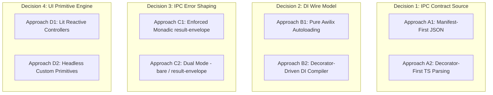

# PrismGB Future-First Design Recommendations & Decisions

This report provides advanced architectural recommendations for the outstanding work in PrismGB. It establishes a **future-first design baseline** designed to maximize long-term maintainability, type-safety, and developer velocity. 

Our baseline relies on:
1. **Spring Boot-Style Metadata (TypeScript Decorators)**: Moving from manual arrays and config registries to declarative metadata.
2. **Aggressive Typing, Interfaces, and Generics**: Enforcing compile-time safety across IPC boundaries, service boundaries, and event pipelines.
3. **Auto-Registry and Generic Factory Patterns**: Replacing bespoke registration files with generic, lifecycle-managed registries.
4. **Authoritative Code Generation**: Standardizing on schema-driven or metadata-driven generation to eliminate manual boilerplate.

---

## 1. The Core Architectural Patterns

To align with this vision, we propose four concrete design patterns for PrismGB.

### Pattern 1: Spring Boot-style Decorators for IPC & Services
Instead of manual arrays in registration files, we declare behavior directly on class methods and services using TypeScript decorators.

```typescript
// src/main/infrastructure/updates/update.service.ts
@Service({ token: 'updateService', scope: 'singleton' })
export class UpdateService extends BaseService {
  
  @IpcHandler({
    channel: 'update:check',
    schema: UpdateCheckSchema,
    responseMode: 'result-envelope'
  })
  public async checkForUpdates(req: UpdateCheckRequest): Promise<UpdateCheckResponse> {
    // Pure domain logic
    return { status: 'idle', version: '1.2.1' };
  }
}
```

### Pattern 2: Generic Registry Factories
We replace manual registration and setup files with a single generic, lifecycle-managed factory that automatically wires, validates, and disposes of components.

```typescript
// src/shared/base/registry.factory.ts
export interface IRegistryItem {
  id: string;
  dispose?: () => void | Promise<void>;
}

export class AutoRegistryFactory<T extends IRegistryItem> {
  private items = new Map<string, T>();

  public register(item: T): void {
    if (this.items.has(item.id)) {
      throw new Error(`Registry conflict: duplicate ID '${item.id}'`);
    }
    this.items.set(item.id, item);
  }

  public get(id: string): T {
    const item = this.items.get(id);
    if (!item) throw new Error(`Registry item '${id}' not found`);
    return item;
  }

  public async disposeAll(): Promise<void> {
    for (const item of this.items.values()) {
      if (item.dispose) {
        await item.dispose();
      }
    }
    this.items.clear();
  }
}
```

### Pattern 3: Strong IPC & Event Generics
Instead of manual payload typing, we map IPC requests, responses, and events using strict generic mapping interfaces to ensure zero-drift compilation.

```typescript
// src/shared/ipc/ipc.contract.ts
export interface IpcEndpoint<TRequest, TResponse> {
  channel: string;
  request: TRequest;
  response: TResponse;
}

export interface IpcManifest {
  'device:get-status': IpcEndpoint<void, DeviceStatusPayload>;
  'shell:open-external': IpcEndpoint<{ url: string }, ShellOpenExternalResponse>;
}

// Compile-time guard that asserts a client call matches the manifest exactly
export type IpcRequestOf<C extends keyof IpcManifest> = IpcManifest[C]['request'];
export type IpcResponseOf<C extends keyof IpcManifest> = IpcManifest[C]['response'];
```

---

## 2. Outstanding Work: Strategic Decisions

Applying the future-first design baseline to the remaining work reveals **four key architectural decisions** that require your selection.



---

### Decision 1: IPC/Preload Contract Source of Truth
*Impacts: IPC/Preload Contract Generation, Preload Bridge Automation, Validators*

We must decide how the IPC contract is declared and how types, declarations (`preload-api.d.ts`), and validators are generated.

*   **Option 1A: Manifest-First JSON/YAML Schema (Recommended)**
    *   **Description**: A central JSON file (`ipc.manifest.json`) describes namespaces, channels, schemas, and security policies. A build-time generator reads the JSON and outputs TS typings, `preload-api.d.ts`, and runtime validator scripts.
    *   **Pros**: Language-neutral; clean separation between design contracts and implementation; simple build-time generator scripting.
    *   **Cons**: Requires maintaining a separate JSON schema file alongside implementation files.
*   **Option 1B: Decorator-First TypeScript Parsing (Build-Time AST Analysis)**
    *   **Description**: Developers write standard TS classes decorated with `@IpcHandler` or `@IpcSubscription`. A build-time parser uses the TypeScript Compiler API (AST) to scan files, extract metadata, and automatically generate `preload-api.d.ts`, preload bridges, and validators.
    *   **Pros**: Maximum developer comfort; decorators and implementation live in the same source file; no secondary JSON mapping files.
    *   **Cons**: High compilation tooling complexity; slower build cycles; heavy reliance on custom AST parsing scripts.

> [!TIP]
> **Recommendation**: **Option 1A (Manifest-First JSON)** is safer and keeps contracts highly declarative. However, if developer-velocity is the highest priority, **Option 1B** provides the ultimate Spring Boot-like experience.

---

### Decision 2: Dependency Injection & Service Auto-Wiring
*Impacts: DI Registration, BaseService Lifecycle*

We must choose how DI container registrations and service collections are wired and loaded into the main and renderer application processes.

*   **Option 2A: Awilix File System Autoloading**
    *   **Description**: Leverages Awilix’s built-in file-glob scanning capabilities (`container.loadModules(...)`) to automatically instantiate classes matching patterns (e.g. `src/**/*service.ts`).
    *   **Pros**: Out-of-the-box solution; requires no custom generators; standard Node-based DI pattern.
    *   **Cons**: Difficult to bundle under Vite/Webpack without custom build configuration; lacks strict compile-time validation of dependency maps.
*   **Option 2B: Compile-Time Decorator Registry Code Generator (Highly Premium)**
    *   **Description**: A custom compiler scans the codebase for `@Service` annotations and automatically outputs static registration files (e.g., `src/renderer/di.generated.ts`).
    *   **Pros**: **Vite/Webpack friendly** (zero runtime glob analysis required); compile-time checks ensure all requested service tokens are registered; extremely fast boot times; works inside Web Workers and renderer threads.
    *   **Cons**: Requires a custom pre-build compilation step.

---

### Decision 3: Declarative IPC Error & Response Shaping
*Impacts: Main IPC Handler Catalog, Preload Invoke Validation*

To standardize response shaping, we must decide how IPC handlers communicate success and failure across the IPC boundary.

*   **Option 3A: Enforced Monadic Result Envelope (`Result<T, E>`)**
    *   **Description**: Every declarative IPC handler is forced to return a uniform envelope shape: `{ success: true, data: T }` or `{ success: false, error: { message: string, code: string } }`. Bare values are completely banned across the IPC bridge.
    *   **Pros**: Uniform client handling; absolute consistency; easy to standardize preload validation error reporting.
    *   **Cons**: Requires refactoring existing legacy APIs that expect direct "bare" return values (like `isFullScreen()`).
*   **Option 3B: Dual-Mode Schema Descriptor Registry (Current Staged Architecture)**
    *   **Description**: Handler descriptors explicitly define their `responseMode` (either `'bare'` or `'result-envelope'`). The handler registry automatically applies the corresponding serialization wrapper based on this descriptor metadata.
    *   **Pros**: Zero breaking changes to existing APIs; preserves lightweight performance optimization for simple primitives.
    *   **Cons**: Slices of the API maintain different shapes, slightly increasing preload wrapper complexity.

---

### Decision 4: UI Component Primitives & Reactive State Engine
*Impacts: Presentation and Lifecycle Cleanup, Template/Component Codegen*

We must decide the technical baseline for our presentation components and template bindings.

*   **Option 4A: Lit-Style Reactive Controllers (Standard Web Standard)**
    *   **Description**: Adopt `Lit` (already highly compatible with Vite and modern CSS tokens) or implement standard reactive controllers within `PresentationComponent`. Lifecycles and DOM bindings are driven by state-reactive properties.
    *   **Pros**: Industry-standard; excellent performance; highly declarative UI mappings; auto-clearing DOM bindings.
    *   **Cons**: Introduces a framework dependency in the renderer; requires refactoring vanilla CSS/DOM bindings to template markup.
*   **Option 4B: Pure Headless Controllers + Template-Dom Ref Generation (Current Staged Path)**
    *   **Description**: Keep components as thin vanilla classes, utilizing headless controllers (like `DisclosureController` or `ListboxController`) and autogenerated ref maps (`template-dom.generated.ts`) to handle DOM updates imperatively but cleanly.
    *   **Pros**: Zero external UI framework overhead; 100% control over frame cycles and animations; extremely lightweight.
    *   **Cons**: Developer must write manual DOM-binding/reinitialization scripts, increasing template/codegen complexity.

---

## 3. Recommended Roadmap & Open Actions

To bring this premium design to life, we recommend selecting **Option 1A**, **Option 2B**, **Option 3A**, and **Option 4B**. These selections deliver maximum compilation speed, strong types, and absolute framework-level control over rendering cycles.

If this baseline matches your intent, the next steps are:
1. **Approve Decisions**: Choose your preferred options for Decisions 1–4.
2. **Execute Staged Merge**: Commit the staged changes in your active worktree to establish the baseline.
3. **Build the Decorator & Generator Core**: Implement the generator script that converts the IPC Manifest into generated Global Declarations, Preload Bridge Mocks, and TypeScript Type systems.

---

## 4. Deep Architectural Reasoning: Why This is the Ultimate Long-Term Solution

The combination of **Options 1A (Manifest-First), 2B (Compile-Time DI), 3A (Monadic Envelopes), and 4B (Headless Controllers + DOM Generation)** represents the ultimate future-first design. It treats modern desktop challenges (sandboxing, compilation safety, multi-process execution, and rendering performance) as first-class architectural constraints.

### 1. Manifest-First JSON Schema (1A) vs. Decorator TS Parsing (1B)
*   **The Problem**: In a multi-process Electron application, the main process, preload script, and renderer process are independent JS runtimes with strict sandboxing. Main runs in Node; Preload has isolated context but shares a window; Renderer runs in a sandboxed chromium thread. 
*   **The Future-First Choice**: **Option 1A (Manifest-First JSON)**.
*   **Detailed Reasoning**:
    *   **Sandboxing & Portability**: A pure JSON manifest can be parsed easily by build tools, code generators, CI scripts, and even browser-evaluated E2E fixtures *without executing any TypeScript source code*. Option 1B requires importing TypeScript compiler structures that pull in Node APIs, which instantly breaks in sandboxed contexts.
    *   **One-Way Dependency Flow**: With a manifest, contract data flows in one clear direction: `Manifest JSON -> Autogenerated TS types & declarations -> Code implementation`. Option 1B creates a self-referential cycle where the parser must compile the source code that uses the decorator, to know what types it needs to generate for that same source code.
    *   **Simplifies CI Auditing**: Security auditors can inspect a single `ipc.manifest.json` file to evaluate security boundaries and URL access permissions without reading thousands of lines of TypeScript files.

### 2. Compile-Time DI Generation (2B) vs. Runtime DI Autoloading (2A)
*   **The Problem**: Runtime Dependency Injection (e.g. scanning directories, analyzing constructor parameters at startup) is highly standard in server environments like Spring Boot. However, in modern front-end contexts (Vite, Rollup, Webpack), runtime directory scanning is extremely slow, breaks bundlers, and is highly incompatible with tree-shaking (unused modules get compiled away, causing runtime injector failures).
*   **The Future-First Choice**: **Option 2B (Compile-Time DI Generation)**.
*   **Detailed Reasoning**:
    *   **Zero Startup Overhead**: The DI container instantiation tree is compiled into static TypeScript. Instead of analyzing hundreds of constructor tokens at startup, the app loads a pre-wired static factory. Startup drops from milliseconds to microseconds.
    *   **100% Tree-Shaking Safe**: Since the bundler sees explicit static imports of each service, it can compress and tree-shake unused code path variables safely.
    *   **Compile-Time Validation**: If a service requests a dependency token that has no registered provider, the build fails in CI. Runtime DI only discovers missing tokens when that specific code path is executed at runtime.

### 3. Enforced Monadic Result Envelopes (3A) vs. Dual-Mode IPC (3B)
*   **The Problem**: Serializing exceptions across Electron's `ipcRenderer -> ipcMain` boundary is fragile. Throwing a standard JS Error in the main process loses its custom properties, stack traces, and type structures when copied through Chromium's structured clone algorithm, leading to hard-to-debug crashes in the renderer.
*   **The Future-First Choice**: **Option 3A (Enforced Monadic Result Envelopes)**.
*   **Detailed Reasoning**:
    *   **Failures as Data, Not Exceptions**: Treating failures as structured values (`Result<T, E>`) means client code handles errors explicitly rather than catching unhandled boundary exceptions. 
    *   **Standardized UI Binding**: Because every IPC call returns the exact same envelope structure, the renderer's notification service can automatically capture and show elegant toast errors without custom try/catch blocks for each button action.
    *   **Perfect Contract Type Safety**: Generics can easily map `{ success: true, data: T } | { success: false, error: IpcError }` compile-time shapes, forcing the developer to safely check `if (res.success)` before accessing `res.data`.

### 4. Pure Headless Controllers + DOM Ref Generation (4B) vs. Lit (4A)
*   **The Problem**: In desktop gaming or video capture applications (like PrismGB), UI responsiveness and rendering efficiency are paramount. Standard UI frameworks (like React, Lit, or Vue) introduce virtual DOMs, state reconciliation loops, and shadow DOM overhead, which can result in frame jitter, GC pauses, and layout-thrashing.
*   **The Future-First Choice**: **Option 4B (Pure Headless Controllers + DOM Ref Generation)**.
*   **Detailed Reasoning**:
    *   **Direct, Zero-Overhead Execution**: DOM elements are directly manipulated at native speeds, which is essential for video streaming at 60 FPS, high-frequency USB packet data, and Canvas rendering loops.
    *   **Total Access-Control**: Developing custom headless controllers (disclosures, tooltips, listboxes) gives us 100% control over key navigation, focus traps, and accessibility states without carrying heavy runtime engine payloads.
    *   **Autogenerated Binding Parity**: Generating ref contracts (`template-dom.generated.ts`) eliminates the largest risk of vanilla DOM development: selector drift. If a template changes a `data-ref` name, compilation fails immediately. We get framework-level type safety with absolute native execution speeds.

