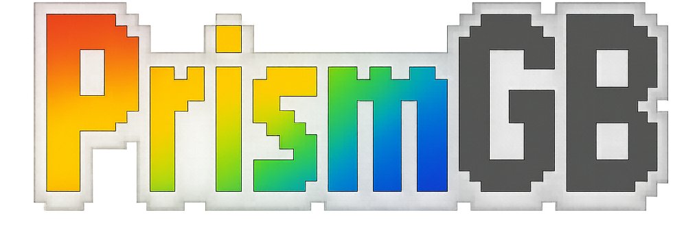

# PrismGB

<p align="center">
  
</p>

<p align="center">
  <strong>A desktop streaming and capture application for the Mod Retro Chromatic</strong>
</p>

<p align="center">
  <a href="https://github.com/josstei/prismgb-app/releases/latest"></a>
  <a href="LICENSE"></a>
  
  
  
</p>

<p align="center">
  <a href="#installation">Installation</a> •
  <a href="#features">Features</a> •
  <a href="#usage">Usage</a> •
  <a href="#architecture">Architecture</a> •
  <a href="#troubleshooting">Troubleshooting</a> •
  <a href="#license">License</a>
</p>

---

> **DISCLAIMER**
>
> This is an **unofficial**, community-developed application.
>
> PrismGB is not affiliated with, endorsed by, or sponsored by [Mod Retro](https://modretro.com).
> The Chromatic is a product of Mod Retro.
>
> For official Chromatic support and information, please visit [modretro.com](https://modretro.com).

---

PrismGB is a free, open-source desktop application that lets you stream and capture video from your [Mod Retro Chromatic](https://modretro.com) handheld gaming device. Connect your Chromatic via USB and enjoy your gameplay on a larger screen, take screenshots, or record your gaming sessions with GPU-accelerated rendering and professional-grade video output.

## Features

### Video Streaming & Display

| Feature | Description |
|---------|-------------|
| **Live Video Streaming** | Stream your Chromatic's 160x144 display to your desktop in real-time |
| **GPU-Accelerated Rendering** | WebGL2 primary with WebGPU and Canvas2D fallback for broad compatibility |
| **4-Pass Shader Pipeline** | Upscale, Unsharp Mask, Color Elevation, and CRT/LCD effects |
| **Multiple Output Resolutions** | 160x144 (native), 320x288, 640x576, 1280x1152, 1280x720 (HD) |
| **Performance Mode** | Reduced rendering effects for weaker GPUs (Canvas2D fallback) |

### Render Presets

PrismGB includes 6 carefully tuned render presets:

| Preset | Description |
|--------|-------------|
| **True Color** | Accurate GBC color reproduction with no effects |
| **Vibrant** | Enhanced saturation, brightness, and sharpening |
| **Hi-Def** | Maximum clarity with strong sharpening |
| **Vintage** | CRT scanlines, bloom, barrel distortion, and vignette |
| **Pixel** | Visible LCD pixel grid overlay |
| **Performance** | Minimal processing, upscale only |

### Capture & Recording

| Feature | Description |
|---------|-------------|
| **Screenshot Capture** | Instant PNG screenshots with flash effect |
| **Video Recording** | Record gameplay with format selection |
| **WebM Format** | VP9 video + Opus audio (native, no transcoding) |
| **MP4 Format** | H.264 video + AAC audio (FFmpeg transcoding) |
| **MOV Format** | ProRes video + PCM audio (professional/archival quality) |

### User Interface

| Feature | Description |
|---------|-------------|
| **Brightness Control** | Real-time brightness adjustment (0.5x - 1.5x) |
| **Volume Control** | Real-time audio level control (0-100%) |
| **Cinematic Mode** | Distraction-free viewing with auto-fading toolbar |
| **Fullscreen Mode** | Immersive viewing with optional auto-enter on startup |
| **Status Strip** | Device state, resolution, and FPS display (toggleable) |
| **Notes Panel** | Create, edit, delete notes with search and autosave |
| **System Tray** | Background operation with USB monitoring |
| **Auto-Update** | In-app check, download, and install flow |

### Device Support

| Feature | Description |
|---------|-------------|
| **USB Hot-Plug** | Automatic device detection and reconnection |
| **Auto-Stream** | Optionally start streaming when device connects |
| **Device Profiles** | Extensible device profile system |

## Requirements

- A [Mod Retro Chromatic](https://modretro.com) device
- USB connection to your computer
- Windows 10+, macOS 10.15+, or Linux (Ubuntu 18.04+, Fedora, Arch, etc.)

## Supported Devices

| Device | USB Vendor ID | USB Product ID | Native Resolution |
|--------|---------------|----------------|-------------------|
| Mod Retro Chromatic | `0x374e` | `0x0101` | 160x144 (10:9) |

## Installation

### Download Pre-built Releases

Download the latest release for your operating system from the [Releases](https://github.com/josstei/prismgb-app/releases) page:

| Platform | Download | Description |
|----------|----------|-------------|
| Windows  | `PrismGB-Setup-x.x.x.exe` | Installer with Start Menu shortcuts |
| Windows  | `PrismGB-x.x.x-portable.exe` | Portable version, no install needed |
| macOS (Apple Silicon) | `PrismGB-x.x.x-mac-arm64.dmg` | For M1/M2/M3/M4 Macs |
| macOS (Intel) | `PrismGB-x.x.x-mac-x64.dmg` | For Intel-based Macs |
| Linux (x64) | `PrismGB-x.x.x-linux-x64.AppImage` | For Intel/AMD 64-bit systems |
| Linux (x64) | `PrismGB-x.x.x-linux-x64.deb` | For Debian/Ubuntu (Intel/AMD) |
| Linux (x64) | `PrismGB-x.x.x-linux-x64.tar.gz` | Compressed archive (Intel/AMD) |
| Linux (ARM64) | `PrismGB-x.x.x-linux-arm64.AppImage` | For ARM 64-bit systems (Raspberry Pi 4/5, etc.) |
| Linux (ARM64) | `PrismGB-x.x.x-linux-arm64.deb` | For Debian/Ubuntu (ARM64) |
| Linux (ARM64) | `PrismGB-x.x.x-linux-arm64.tar.gz` | Compressed archive (ARM64) |

> **Note:** Replace `x.x.x` with the actual version number (e.g., `1.2.1`).

### Windows Installation

**Using the Installer (recommended):**
1. Download `PrismGB-Setup-x.x.x.exe`
2. Run the installer and follow the prompts
3. Launch PrismGB from the Start Menu or desktop shortcut

**Using the Portable Version:**
1. Download `PrismGB-x.x.x-portable.exe`
2. Run the executable directly - no installation required
3. Great for USB drives or systems where you can't install software

### macOS Installation

1. Download the appropriate DMG for your Mac:
   - **Apple Silicon (M1/M2/M3/M4):** `PrismGB-x.x.x-mac-arm64.dmg`
   - **Intel:** `PrismGB-x.x.x-mac-x64.dmg`
2. Open the DMG file
3. Drag PrismGB to your Applications folder
4. Launch PrismGB from your Applications folder or Spotlight

> **Tip:** Not sure which Mac you have? Click the Apple menu → "About This Mac". If it says "Apple M1/M2/M3/M4", use the ARM64 version. If it says "Intel", use the x64 version.

### Linux Installation

**Option 1: AppImage (recommended for most users)**
```bash
# Make the AppImage executable
chmod +x PrismGB-x.x.x-linux-x64.AppImage    # Intel/AMD
chmod +x PrismGB-x.x.x-linux-arm64.AppImage  # ARM64

# Run the application
./PrismGB-x.x.x-linux-x64.AppImage    # Intel/AMD
./PrismGB-x.x.x-linux-arm64.AppImage  # ARM64
```
> AppImages are self-contained and work on most Linux distributions without installation.

**Option 2: Debian/Ubuntu (.deb)**
```bash
# Install the package (automatically installs libusb dependency)
sudo dpkg -i PrismGB-x.x.x-linux-x64.deb    # Intel/AMD
sudo dpkg -i PrismGB-x.x.x-linux-arm64.deb  # ARM64

# If there are dependency errors, run:
sudo apt-get install -f
```

**Option 3: Tar Archive**
```bash
# Extract the archive
tar -xzf PrismGB-x.x.x-linux-x64.tar.gz
tar -xzf PrismGB-x.x.x-linux-arm64.tar.gz

# Run PrismGB from the extracted folder
./PrismGB-x.x.x-linux-x64/prismgb
./PrismGB-x.x.x-linux-arm64/prismgb
```

**Required: USB Library**

PrismGB requires `libusb` for USB device communication. Install it if not already present:

```bash
# Debian/Ubuntu
sudo apt install libusb-1.0-0

# Fedora
sudo dnf install libusb

# Arch Linux
sudo pacman -S libusb
```

**Building from Source**

If you're building from source (or if prebuilt binaries aren't available for your Node.js version), you'll need additional build tools:

```bash
# Debian/Ubuntu
sudo apt install build-essential python3 libusb-1.0-0-dev libudev-dev

# Fedora
sudo dnf install gcc gcc-c++ make python3 libusb-devel systemd-devel

# Arch Linux
sudo pacman -S base-devel python libusb
```

See [DEVELOPMENT.md](DEVELOPMENT.md) for full build instructions.

## Usage

1. **Connect your Chromatic** to your computer via USB
2. **Launch PrismGB**
3. **Click the video area** to start streaming
4. Use the control buttons to:
   - Take a **screenshot**
   - Start/stop **video recording**
   - Choose a **render preset**
   - Adjust **brightness** and **volume**
   - Toggle the **notes** panel
   - Enter **fullscreen** mode
   - Toggle **cinematic mode** for a cleaner viewing experience
5. Open the settings menu to manage:
   - **Status strip** visibility
   - **Performance mode**
   - **Fullscreen on startup**
   - **Recording format** (WebM, MP4, MOV)
   - **Update** checks and installs

### File Locations

Screenshots and recordings are automatically saved to your **Downloads** folder:

| Platform | Location |
|----------|----------|
| Windows  | `C:\Users\<username>\Downloads\` |
| macOS    | `~/Downloads/` |
| Linux    | `~/Downloads/` |

- Screenshots: `prismgb-screenshot-YYYYMMDD-HHMMSS.png`
- Recordings: `prismgb-recording-YYYYMMDD-HHMMSS.<format>` (WebM, MP4, or MOV based on settings)

### Settings

| Setting | Default | Description |
|---------|---------|-------------|
| Volume | 100% | Audio playback volume |
| Brightness | 1.0x | Display brightness multiplier |
| Render Preset | Vibrant | Active shader preset |
| Status Strip | Visible | Show device/FPS footer |
| Performance Mode | Off | Use Canvas2D instead of GPU |
| Fullscreen on Startup | Off | Auto-enter fullscreen |
| Cinematic Mode | Off | Auto-hide toolbar |
| Auto-Stream | On | Start streaming on device connect |
| Recording Format | MP4 | Output format for recordings |

### Local Data

- Settings and notes are stored locally in browser localStorage
- Device IDs are cached locally to speed up reconnects
- Clear app data to reset all settings

## Architecture

PrismGB uses a modern **three-process Electron architecture** with clean separation of concerns:

```
┌─────────────────────────────────────────────────────────────────────────┐
│                              Main Process                                │
│  ┌─────────────┐ ┌─────────────┐ ┌─────────────┐ ┌─────────────────────┐│
│  │   Window    │ │    Tray     │ │   Device    │ │     Transcode       ││
│  │  Service    │ │   Service   │ │   Service   │ │      Service        ││
│  └─────────────┘ └─────────────┘ └─────────────┘ └─────────────────────┘│
│  ┌─────────────┐ ┌─────────────┐ ┌───────────────────────────────────┐  │
│  │   Update    │ │ Performance │ │         IPC Handler Registry      │  │
│  │   Service   │ │   Metrics   │ │                                   │  │
│  └─────────────┘ └─────────────┘ └───────────────────────────────────┘  │
└────────────────────────────────┬────────────────────────────────────────┘
                                 │ IPC (contextBridge)
┌────────────────────────────────┴────────────────────────────────────────┐
│                            Preload Script                                │
│                     (Secure IPC bridge, no Node.js)                      │
└────────────────────────────────┬────────────────────────────────────────┘
                                 │
┌────────────────────────────────┴────────────────────────────────────────┐
│                           Renderer Process                               │
│  ┌─────────────────────────────────────────────────────────────────────┐│
│  │                      Streaming Orchestrator                          ││
│  │  ┌───────────────┐ ┌───────────────────┐ ┌───────────────────────┐  ││
│  │  │   Streaming   │ │  Render Pipeline  │ │    GPU Render Loop    │  ││
│  │  │    Service    │ │  (4-pass shader)  │ │   (WebGL2/WebGPU)     │  ││
│  │  └───────────────┘ └───────────────────┘ └───────────────────────┘  ││
│  └─────────────────────────────────────────────────────────────────────┘│
│  ┌─────────────────────────────────────────────────────────────────────┐│
│  │                       Capture Orchestrator                           ││
│  │  ┌───────────────┐ ┌───────────────────┐ ┌───────────────────────┐  ││
│  │  │   Capture     │ │   GPU Recording   │ │    Save Service       │  ││
│  │  │   Service     │ │     Service       │ │  (format routing)     │  ││
│  │  └───────────────┘ └───────────────────┘ └───────────────────────┘  ││
│  └─────────────────────────────────────────────────────────────────────┘│
│  ┌──────────────┐ ┌──────────────┐ ┌──────────────┐ ┌──────────────────┐│
│  │   Device     │ │   Settings   │ │    Notes     │ │      Update      ││
│  │   Service    │ │   Service    │ │   Service    │ │     Service      ││
│  └──────────────┘ └──────────────┘ └──────────────┘ └──────────────────┘│
│  ┌─────────────────────────────────────────────────────────────────────┐│
│  │                          UI Layer                                    ││
│  │   Shell • Toolbar • Settings Menu • Notes Panel • Status Strip      ││
│  └─────────────────────────────────────────────────────────────────────┘│
└─────────────────────────────────────────────────────────────────────────┘
```

### Key Patterns

| Pattern | Description |
|---------|-------------|
| **Orchestrator** | Coordinates services and manages state machines |
| **Service** | Single-responsibility business logic with event emission |
| **DI Container** | Awilix-based dependency injection (main process) |
| **Event Bus** | EventEmitter3 for cross-service communication |
| **IPC Bridges** | Translate between main/renderer process boundaries |

### GPU Rendering Pipeline

The 4-pass shader pipeline processes each frame:

1. **Pass 1: Upscale** - Bilinear/nearest-neighbor scaling to output resolution
2. **Pass 2: Unsharp Mask** - Edge sharpening (configurable strength 0.0-0.8)
3. **Pass 3: Color Elevation** - Gamma, saturation, brightness, contrast, green bias
4. **Pass 4: CRT/LCD** - Scanlines, pixel mask, bloom, curvature, vignette

### Technology Stack

| Category | Technology |
|----------|------------|
| **Framework** | Electron v28 |
| **Build Tool** | Vite v7.3 |
| **Runtime** | Node.js v22 LTS |
| **GPU Rendering** | WebGL2, WebGPU, Canvas2D |
| **Audio** | Web Audio API |
| **Recording** | MediaRecorder API |
| **Transcoding** | FFmpeg/FFprobe (static binaries) |
| **USB** | usb-detection, libusb |
| **DI** | Awilix |
| **Logging** | Winston |
| **Testing** | Vitest, Playwright |

## Troubleshooting

### Device Not Detected

1. Ensure your Chromatic is powered on and connected via USB
2. Try a different USB port or cable
3. On Linux, you may need to configure udev rules for USB access
4. Restart the application after connecting the device

### Video Not Displaying

1. Click on the video area to initiate the stream
2. Check that no other application is using the Chromatic's video feed
3. Try disconnecting and reconnecting the device

### GPU or Rendering Issues

1. Enable **Performance Mode** in Settings to reduce rendering load
2. Disable GPU acceleration by launching with `PRISMGB_DISABLE_GPU=1`

### App Keeps Running After Closing the Window

PrismGB stays in the system tray so device monitoring can continue. Use the tray icon and choose **Quit** to exit.

### Permission Issues (Linux)

If you encounter USB permission errors, you have two options:

**Option 1: Add user to plugdev group**
```bash
sudo usermod -a -G plugdev $USER
```
Log out and back in for changes to take effect.

**Option 2: Create a udev rule (recommended)**

Create a file `/etc/udev/rules.d/99-chromatic.rules` with this content:
```bash
# Mod Retro Chromatic
SUBSYSTEM=="usb", ATTR{idVendor}=="374e", ATTR{idProduct}=="0101", MODE="0666"
```

Then reload udev rules:
```bash
sudo udevadm control --reload-rules
sudo udevadm trigger
```

Reconnect your Chromatic after applying the rule.

### Recording Format Issues

| Format | Notes |
|--------|-------|
| **WebM** | Native browser recording, fastest, smallest file size |
| **MP4** | Requires FFmpeg transcoding, universal compatibility |
| **MOV** | Requires FFmpeg transcoding, largest file size, professional quality |

If transcoding fails, ensure FFmpeg binaries are included in the application package.

## Documentation

| Document | Description |
|----------|-------------|
| [DEVELOPMENT.md](DEVELOPMENT.md) | Build instructions and development setup |
| [CONTRIBUTING.md](CONTRIBUTING.md) | Contribution guidelines |
| [docs/feature-map.md](docs/feature-map.md) | Complete feature-to-code mapping |
| [docs/architecture-diagrams.md](docs/architecture-diagrams.md) | Mermaid diagrams of service flows |
| [docs/architecture-diagrams-onboarding.md](docs/architecture-diagrams-onboarding.md) | Architectural onboarding guide |
| [docs/naming-conventions.md](docs/naming-conventions.md) | Code naming standards |
| [docs/ci-cd-workflows.md](docs/ci-cd-workflows.md) | GitHub Actions workflows |

## Testing

PrismGB includes comprehensive test coverage:

| Test Type | Framework | Description |
|-----------|-----------|-------------|
| **Unit Tests** | Vitest | 115+ tests for business logic |
| **Integration Tests** | Vitest | Multi-service workflow testing |
| **E2E Tests** | Playwright | Full application workflows |
| **Smoke Tests** | Custom | Post-build validation |

Run tests:
```bash
npm test              # Watch mode
npm run test:run      # Single run
npm run test:coverage # Coverage report
npm run test:e2e      # E2E tests
```

Coverage thresholds: 80% line/function/statement, 75% branches.

## Contributing

Contributions are welcome! See [DEVELOPMENT.md](DEVELOPMENT.md) for build instructions and [CONTRIBUTING.md](CONTRIBUTING.md) for guidelines.

## License

This project is licensed under the MIT License - see the [LICENSE](LICENSE) file for details.

**Trademark:** PrismGB™ and the gem logo are trademarks of josstei. See [TRADEMARK](TRADEMARK) for usage guidelines.

## Acknowledgments

- [Mod Retro](https://modretro.com) for creating the Chromatic handheld

## Support

If you find PrismGB useful, consider supporting its development:

<a href="https://ko-fi.com/josstei"></a>
