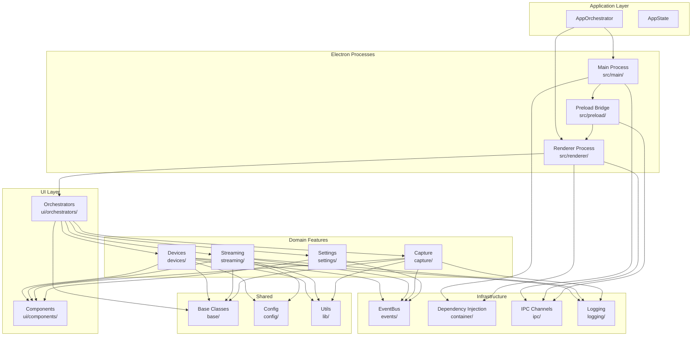

# PrismGB Documentation

Welcome to the PrismGB technical documentation. This guide will help you understand the architecture, features, and implementation details of the PrismGB desktop application.

## Project Overview

PrismGB is an Electron desktop application designed for streaming and capturing video from the Mod Retro Chromatic handheld gaming device. It provides:

- **Live Video Streaming** - Real-time video feed from connected devices
- **Screenshot Capture** - Single-frame image capture with configurable quality
- **Video Recording** - Record gameplay sessions directly to disk
- **Cross-Platform Support** - Runs on Windows, macOS, and Linux
- **Device Management** - Auto-detection and profile-based device configuration

The application follows modern architectural patterns including domain-driven design, dependency injection, and event-driven communication to maintain scalability and testability.

## Quick Navigation

### Architecture Documentation

- [Architecture Overview](./architecture/overview.md) - High-level system design and component relationships
- [Electron Process Separation](./architecture/electron-processes.md) - Main, renderer, and preload process responsibilities
- [Dependency Injection](./architecture/dependency-injection.md) - Service container and Awilix configuration
- [Event System](./architecture/event-system.md) - EventBus patterns and event-driven communication

### Feature Documentation

- [Device Management](./features/devices.md) - Device detection, profiles, adapters, and registry
- [Streaming](./features/streaming.md) - Stream acquisition, coordination, and lifecycle
- [Rendering](./features/rendering.md) - Canvas rendering and video display
- [Capture](./features/capture.md) - Screenshot and video recording implementation
- [Settings](./features/settings.md) - Application settings and configuration management

### UI Documentation

- [UI Components](./ui/components.md) - Reusable UI components and patterns
- [UI Patterns](./ui/patterns.md) - Common UI interaction patterns and best practices

### Shared Infrastructure

- [Utilities](./shared/utilities.md) - Helper functions, constants, and shared utilities

## Key Concepts

### Electron Process Separation

PrismGB follows Electron's multi-process architecture:

- **Main Process** (`src/main/`) - Node.js environment handling window management, system tray, and IPC coordination
- **Renderer Process** (`src/renderer/`) - Browser environment managing UI, streaming, and user interactions
- **Preload Scripts** (`src/preload/`) - Secure bridge exposing controlled APIs from main to renderer

This separation ensures security by isolating privileged operations while maintaining a responsive UI.

### Domain-Driven Feature Organization

Code is organized by business domain in `src/domains/`:

- `capture/` - Screenshot and video recording functionality
- `devices/` - Device detection, profiles, and adapters
- `streaming/` - Video stream acquisition and rendering
- `ui/` - User interface components and interactions

Each domain encapsulates its own models, services, and orchestrators, promoting modularity and maintainability.

### Event-Driven Architecture

The application uses a centralized EventBus for cross-service communication:

- Decouples services from direct dependencies
- Enables reactive programming patterns
- Simplifies testing through event mocking
- Provides clear audit trail of system events

Services publish domain events (e.g., `device:connected`, `stream:started`) that other components can subscribe to without tight coupling.

### Dependency Injection

Services are wired through dependency injection containers:

- **Main Process**: Awilix container (`src/main/core/container.js`)
- **Renderer Process**: Custom ServiceContainer (`src/renderer/core/container.js`)

This pattern enables:
- Testability through dependency mocking
- Clear service dependency graphs
- Lazy initialization and lifecycle management
- Single Responsibility Principle adherence

## Architecture At-a-Glance

## Technology Stack

### Core Technologies

- **Electron 28** - Cross-platform desktop application framework
- **Vite** - Fast development server and build tool
- **Vitest** - Unit testing framework with happy-dom environment

### Dependencies

- **Awilix** - Dependency injection container (main process)
- **eventemitter3** - Fast event emitter for EventBus implementation
- **usb** - Native USB device communication
- **@ffmpeg/ffmpeg** - Video processing and encoding

### Development Tools

- **ESLint** - Code quality and style enforcement
- **Husky** - Git hooks for pre-commit testing
- **happy-dom** - Lightweight DOM implementation for testing

## Getting Started

For development setup and contribution guidelines, see the main project [CLAUDE.md](../CLAUDE.md) and [CONTRIBUTING.md](../CONTRIBUTING.md).

To understand the architecture in depth, start with the [Architecture Overview](./architecture/overview.md).

## Documentation Conventions

- Code examples use ES6+ syntax with JSDoc annotations
- File paths are absolute from project root
- Architecture diagrams use Mermaid notation
- Examples include both usage and testing patterns

---

**Last Updated**: 2025-12-07
**Version**: 1.0.0
