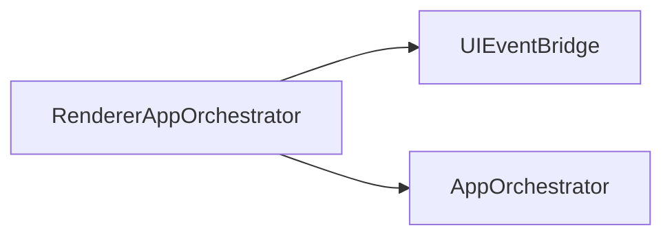
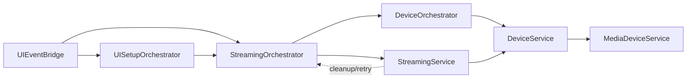
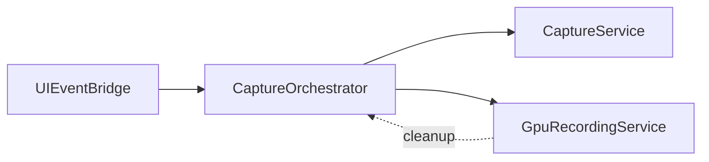
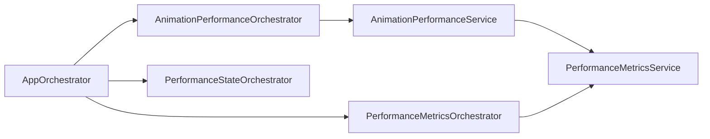
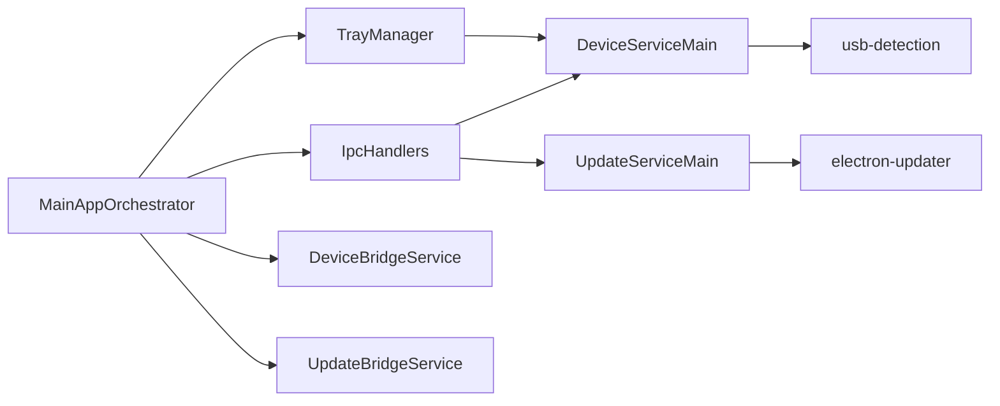

# Architecture Diagrams (Onboarding)

This document is a simplified view of the core flows. It favors readability over completeness.

Legend
- Solid edges: delegation or control flow.
- Dashed edges: error/cleanup or retry path.
- IPC edges are labeled.

## 1) App Startup (Renderer)



## 2) UI Events to Streaming



## 3) Capture and GPU Recording



## 4) Performance and Metrics



## 5) Main Process IPC and Services



## 6) Cross-Process Channels

```mermaid
flowchart LR
  DeviceBridge[DeviceBridgeService]
  UpdateBridge[UpdateBridgeService]
  DeviceServiceRenderer[DeviceService (Renderer)]
  UIService[UIService / UI Components]

  DeviceBridge -- IPC: device-status --> DeviceServiceRenderer
  UpdateBridge -- IPC: update-status --> UIService
```

## What to Look for in Code

- Orchestrators should be thin: they wire flows and delegate to services.
- Services should be single-responsibility and own the actual work.
- Managers/handlers are main-process only and interface with OS or device APIs.
- Bridges are main-process IPC entry points to the renderer.
- Process-first layout: renderer code lives under `src/renderer`, main process under `src/main`, preload under `src/preload`, shared utilities under `src/shared`.
