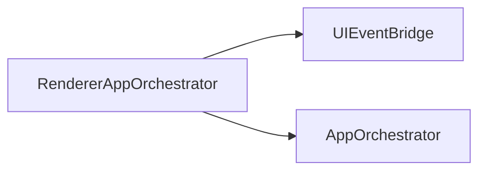
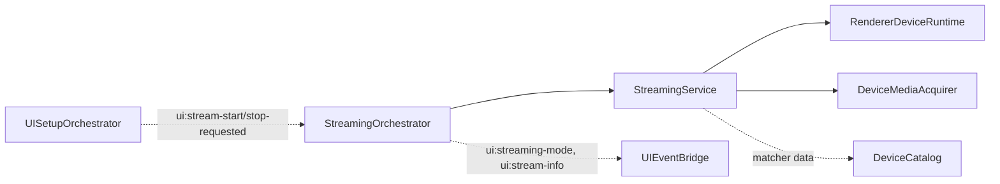
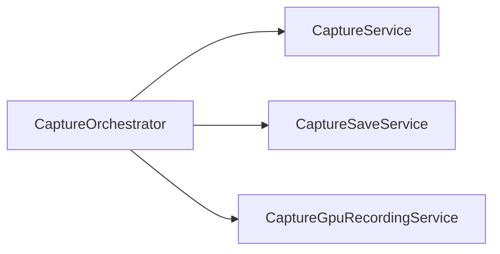
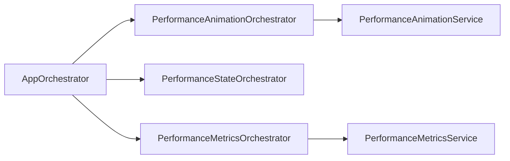
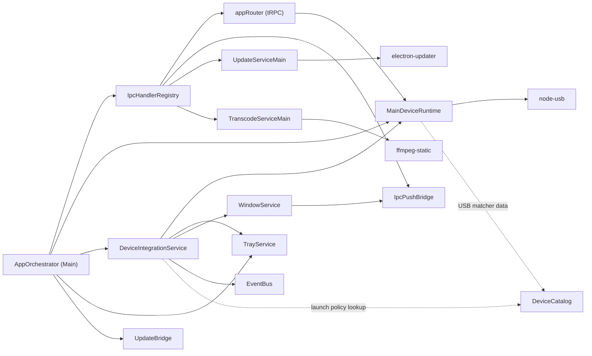
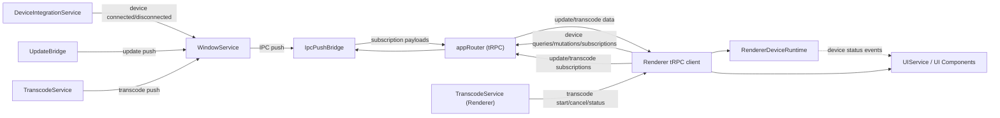

# Architecture Diagrams (Onboarding)

<!-- Source: docs/architecture-diagrams.md, src/main/application/container.ts, src/renderer/application/di/service-registrations.ts, src/renderer/infrastructure/services/devices/device-runtime.service.ts, src/renderer/infrastructure/services/streaming/streaming.service.ts -->

This document is a simplified view of the core flows. It favors readability over completeness.

Related docs:
- `docs/feature-map.md`
- `docs/naming-conventions.md`

Legend
- Solid edges: direct dependency (constructor injection).
- Dashed labeled edges: indirect communication via EventBus.
- Dashed unlabeled edges: error/cleanup or retry path.
- Dotted labeled edges: package data, contract, or static helper usage.
- IPC edges are labeled.

## 1) App Startup (Renderer)

```mermaid
flowchart LR
  RendererAppOrchestrator[RendererAppOrchestrator]
  UIEventBridge[UIEventBridge]
  AppOrchestrator[AppOrchestrator]

  RendererAppOrchestrator --> UIEventBridge
  RendererAppOrchestrator --> AppOrchestrator
```

## 2) UI Events to Streaming

```mermaid
flowchart LR
  UISetupOrchestrator[UISetupOrchestrator]
  StreamingOrchestrator[StreamingOrchestrator]
  StreamingService[StreamingService]
  RendererDeviceRuntime[RendererDeviceRuntime]
  DeviceMediaAcquirer[DeviceMediaAcquirer]
  DeviceCatalog[DeviceCatalog]
  UIEventBridge[UIEventBridge]

  UISetupOrchestrator -. "ui:stream-start/stop-requested" .-> StreamingOrchestrator
  StreamingOrchestrator --> StreamingService
  StreamingOrchestrator -. "ui:streaming-mode, ui:stream-info" .-> UIEventBridge
  StreamingService --> RendererDeviceRuntime
  StreamingService --> DeviceMediaAcquirer
  StreamingService -. "matcher data" .-> DeviceCatalog
```

## 3) Capture and GPU Recording

```mermaid
flowchart LR
  CaptureOrchestrator[CaptureOrchestrator]
  CaptureService[CaptureService]
  CaptureSaveService[CaptureSaveService]
  CaptureGpuRecordingService[CaptureGpuRecordingService]

  CaptureOrchestrator --> CaptureService
  CaptureOrchestrator --> CaptureSaveService
  CaptureOrchestrator --> CaptureGpuRecordingService
```

Note: `CaptureSaveService` handles format selection (WebM direct download, or MP4/MOV via ffmpeg transcode in main process). See `docs/architecture-diagrams.md` for the full transcode flow.

## 4) Performance and Metrics

```mermaid
flowchart LR
  AppOrchestrator[AppOrchestrator]
  PerformanceAnimationOrchestrator[PerformanceAnimationOrchestrator]
  PerformanceStateOrchestrator[PerformanceStateOrchestrator]
  PerformanceMetricsOrchestrator[PerformanceMetricsOrchestrator]
  PerformanceAnimationService[PerformanceAnimationService]
  PerformanceMetricsService[PerformanceMetricsService]

  AppOrchestrator --> PerformanceAnimationOrchestrator
  AppOrchestrator --> PerformanceStateOrchestrator
  AppOrchestrator --> PerformanceMetricsOrchestrator
  PerformanceAnimationOrchestrator --> PerformanceAnimationService
  PerformanceMetricsOrchestrator --> PerformanceMetricsService
```

## 5) Main Process IPC and Services

```mermaid
flowchart LR
  AppOrchestrator["AppOrchestrator (Main)"]
  IpcHandlerRegistry[IpcHandlerRegistry]
  AppRouter["appRouter (tRPC)"]
  IpcPushBridge[IpcPushBridge]
  WindowService[WindowService]
  TrayService[TrayService]
  EventBus[EventBus]
  DeviceIntegrationService[DeviceIntegrationService]
  MainDeviceRuntime[MainDeviceRuntime]
  UpdateBridge[UpdateBridge]
  UpdateServiceMain[UpdateServiceMain]
  TranscodeServiceMain[TranscodeServiceMain]
  UsbMonitor[node-usb]
  DeviceCatalog[DeviceCatalog]
  AutoUpdater[electron-updater]
  FFmpeg[ffmpeg-static]

  AppOrchestrator --> IpcHandlerRegistry
  AppOrchestrator --> MainDeviceRuntime
  AppOrchestrator --> DeviceIntegrationService
  AppOrchestrator --> TrayService
  AppOrchestrator --> UpdateBridge

  IpcHandlerRegistry --> AppRouter
  IpcHandlerRegistry --> IpcPushBridge
  AppRouter --> MainDeviceRuntime
  IpcHandlerRegistry --> UpdateServiceMain
  IpcHandlerRegistry --> TranscodeServiceMain
  DeviceIntegrationService --> MainDeviceRuntime
  DeviceIntegrationService --> TrayService
  DeviceIntegrationService --> WindowService
  DeviceIntegrationService --> EventBus
  DeviceIntegrationService -. "launch policy lookup" .-> DeviceCatalog
  WindowService --> IpcPushBridge
  MainDeviceRuntime --> UsbMonitor
  MainDeviceRuntime -. "USB matcher data" .-> DeviceCatalog
  UpdateServiceMain --> AutoUpdater
  TranscodeServiceMain --> FFmpeg
```

## 6) Cross-Process Channels

```mermaid
flowchart LR
  DeviceIntegrationService[DeviceIntegrationService]
  WindowService[WindowService]
  IpcPushBridge[IpcPushBridge]
  AppRouter["appRouter (tRPC)"]
  UpdateBridge[UpdateBridge]
  TranscodeService[TranscodeService]
  RendererDeviceRuntime[RendererDeviceRuntime]
  TrpcClient[Renderer tRPC client]
  UIService["UIService / UI Components"]
  TranscodeServiceRenderer["TranscodeService (Renderer)"]

  DeviceIntegrationService -- "device connected/disconnected" --> WindowService
  WindowService -- IPC push --> IpcPushBridge
  TrpcClient -- device queries/mutations/subscriptions --> AppRouter
  AppRouter --> IpcPushBridge
  IpcPushBridge -- subscription payloads --> AppRouter
  TrpcClient --> RendererDeviceRuntime
  RendererDeviceRuntime -. "device status events" .-> UIService
  UpdateBridge -- update push --> WindowService
  TranscodeService -- transcode push --> WindowService
  TrpcClient -- update/transcode subscriptions --> AppRouter
  AppRouter -- update/transcode data --> TrpcClient
  TrpcClient --> UIService
  TranscodeServiceRenderer -- transcode start/cancel/status --> TrpcClient
```

## What to Look for in Code

- Orchestrators should be thin: they wire flows and delegate to services.
- Services should be single-responsibility and own the actual work.
- Managers/handlers are main-process only and interface with OS or device APIs.
- Main-process device ownership is `MainDeviceRuntime` for USB status and `DeviceIntegrationService` for tray/window/EventBus side effects.
- Renderer device ownership is `RendererDeviceRuntime` plus platform ports; streaming uses `DeviceMediaAcquirer` for media capture.
- `@prismgb/devices` is the shared manifest catalog and contract package; only its `/service` export is main-process runtime code.
- Process-first layout: renderer code lives under `src/renderer`, main process under `src/main`, preload under `src/preload`.
