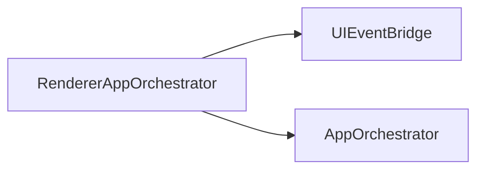
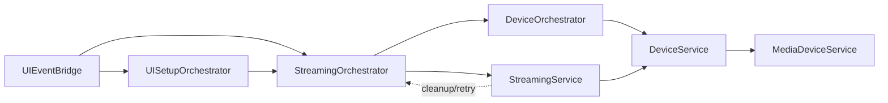
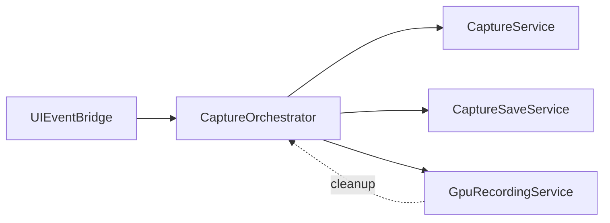
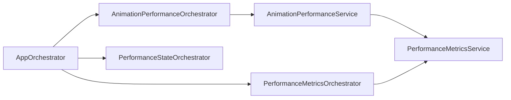
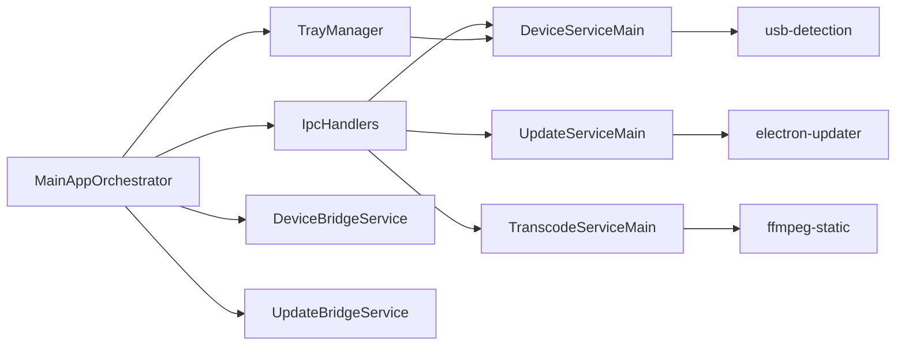
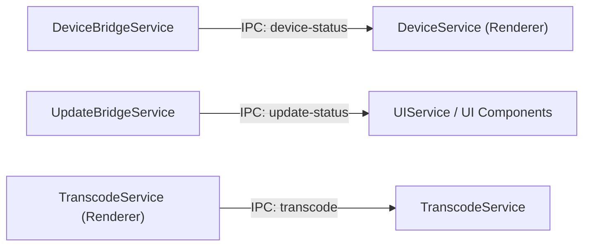

# Architecture Diagrams (Onboarding)

This document is a simplified view of the core flows. It favors readability over completeness.

Related docs:
- `docs/feature-map.md`
- `docs/naming-conventions.md`

Legend
- Solid edges: delegation or control flow.
- Dashed edges: error/cleanup or retry path.
- IPC edges are labeled.

## 1) App Startup (Renderer)

```mermaid
flowchart LR
  RendererAppOrchestrator[RendererAppOrchestrator]
  UIEventBridge[UIEventBridge]
  AppOrchestrator[AppOrchestrator]

  RendererAppOrchestrator --> UIEventBridge
  RendererAppOrchestrator --> AppOrchestrator
```

## 2) UI Events to Streaming

```mermaid
flowchart LR
  UIEventBridge[UIEventBridge]
  UISetupOrchestrator[UISetupOrchestrator]
  StreamingOrchestrator[StreamingOrchestrator]
  StreamingService[StreamingService]
  DeviceOrchestrator[DeviceOrchestrator]
  DeviceService[DeviceService]
  MediaDeviceService[MediaDeviceService]

  UIEventBridge --> UISetupOrchestrator
  UIEventBridge --> StreamingOrchestrator
  UISetupOrchestrator --> StreamingOrchestrator
  StreamingOrchestrator --> StreamingService
  StreamingOrchestrator --> DeviceOrchestrator
  DeviceOrchestrator --> DeviceService
  StreamingService --> DeviceService
  DeviceService --> MediaDeviceService
  StreamingService -. cleanup/retry .-> StreamingOrchestrator
```

## 3) Capture and GPU Recording

```mermaid
flowchart LR
  UIEventBridge[UIEventBridge]
  CaptureOrchestrator[CaptureOrchestrator]
  CaptureService[CaptureService]
  CaptureSaveService[CaptureSaveService]
  GpuRecordingService[GpuRecordingService]

  UIEventBridge --> CaptureOrchestrator
  CaptureOrchestrator --> CaptureService
  CaptureOrchestrator --> CaptureSaveService
  CaptureOrchestrator --> GpuRecordingService
  GpuRecordingService -. cleanup .-> CaptureOrchestrator
```

Note: `CaptureSaveService` handles format selection (WebM direct download, or MP4/MOV via ffmpeg transcode in main process). See `docs/architecture-diagrams.md` for the full transcode flow.

## 4) Performance and Metrics

```mermaid
flowchart LR
  AppOrchestrator[AppOrchestrator]
  AnimationPerformanceOrchestrator[AnimationPerformanceOrchestrator]
  PerformanceStateOrchestrator[PerformanceStateOrchestrator]
  PerformanceMetricsOrchestrator[PerformanceMetricsOrchestrator]
  AnimationPerformanceService[AnimationPerformanceService]
  PerformanceMetricsService[PerformanceMetricsService]

  AppOrchestrator --> AnimationPerformanceOrchestrator
  AppOrchestrator --> PerformanceStateOrchestrator
  AppOrchestrator --> PerformanceMetricsOrchestrator
  AnimationPerformanceOrchestrator --> AnimationPerformanceService
  AnimationPerformanceService --> PerformanceMetricsService
  PerformanceMetricsOrchestrator --> PerformanceMetricsService
```

## 5) Main Process IPC and Services

```mermaid
flowchart LR
  MainAppOrchestrator[MainAppOrchestrator]
  IpcHandlers[IpcHandlers]
  TrayManager[TrayManager]
  DeviceBridge[DeviceBridgeService]
  UpdateBridge[UpdateBridgeService]
  DeviceServiceMain[DeviceServiceMain]
  UpdateServiceMain[UpdateServiceMain]
  TranscodeServiceMain[TranscodeServiceMain]
  UsbDetection[usb-detection]
  AutoUpdater[electron-updater]
  FFmpeg[ffmpeg-static]

  MainAppOrchestrator --> IpcHandlers
  MainAppOrchestrator --> TrayManager
  MainAppOrchestrator --> DeviceBridge
  MainAppOrchestrator --> UpdateBridge

  IpcHandlers --> DeviceServiceMain
  IpcHandlers --> UpdateServiceMain
  IpcHandlers --> TranscodeServiceMain
  TrayManager --> DeviceServiceMain
  DeviceServiceMain --> UsbDetection
  UpdateServiceMain --> AutoUpdater
  TranscodeServiceMain --> FFmpeg
```

## 6) Cross-Process Channels

```mermaid
flowchart LR
  DeviceBridge[DeviceBridgeService]
  UpdateBridge[UpdateBridgeService]
  TranscodeService[TranscodeService]
  DeviceServiceRenderer["DeviceService (Renderer)"]
  UIService["UIService / UI Components"]
  TranscodeServiceRenderer["TranscodeService (Renderer)"]

  DeviceBridge -- IPC: device-status --> DeviceServiceRenderer
  UpdateBridge -- IPC: update-status --> UIService
  TranscodeServiceRenderer -- IPC: transcode --> TranscodeService
```

## What to Look for in Code

- Orchestrators should be thin: they wire flows and delegate to services.
- Services should be single-responsibility and own the actual work.
- Managers/handlers are main-process only and interface with OS or device APIs.
- Bridges are main-process IPC entry points to the renderer.
- Process-first layout: renderer code lives under `src/renderer`, main process under `src/main`, preload under `src/preload`, shared utilities under `src/shared`.
