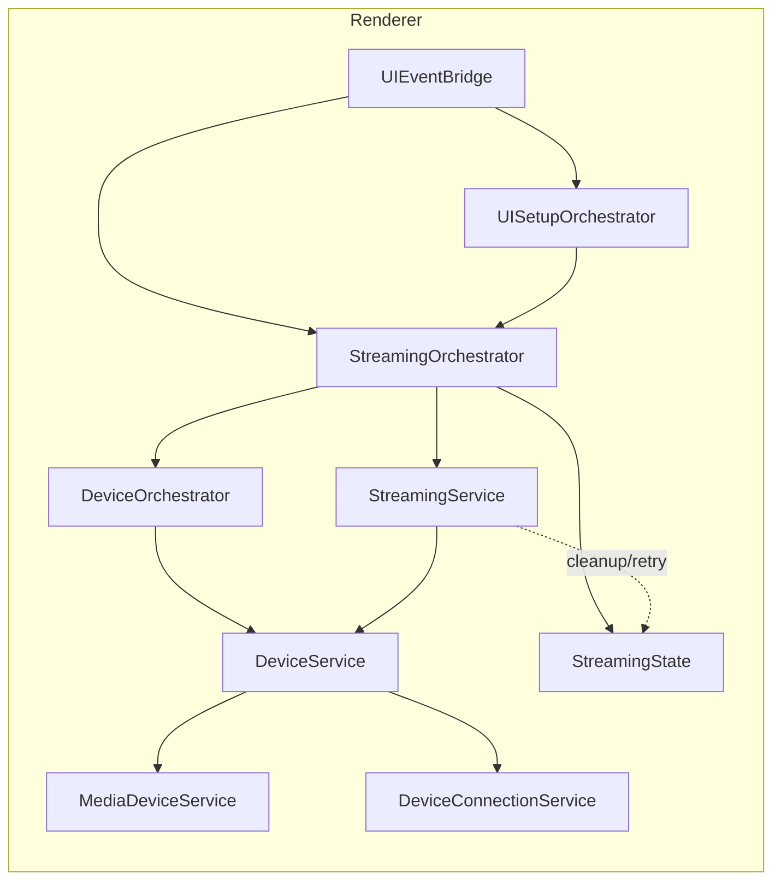
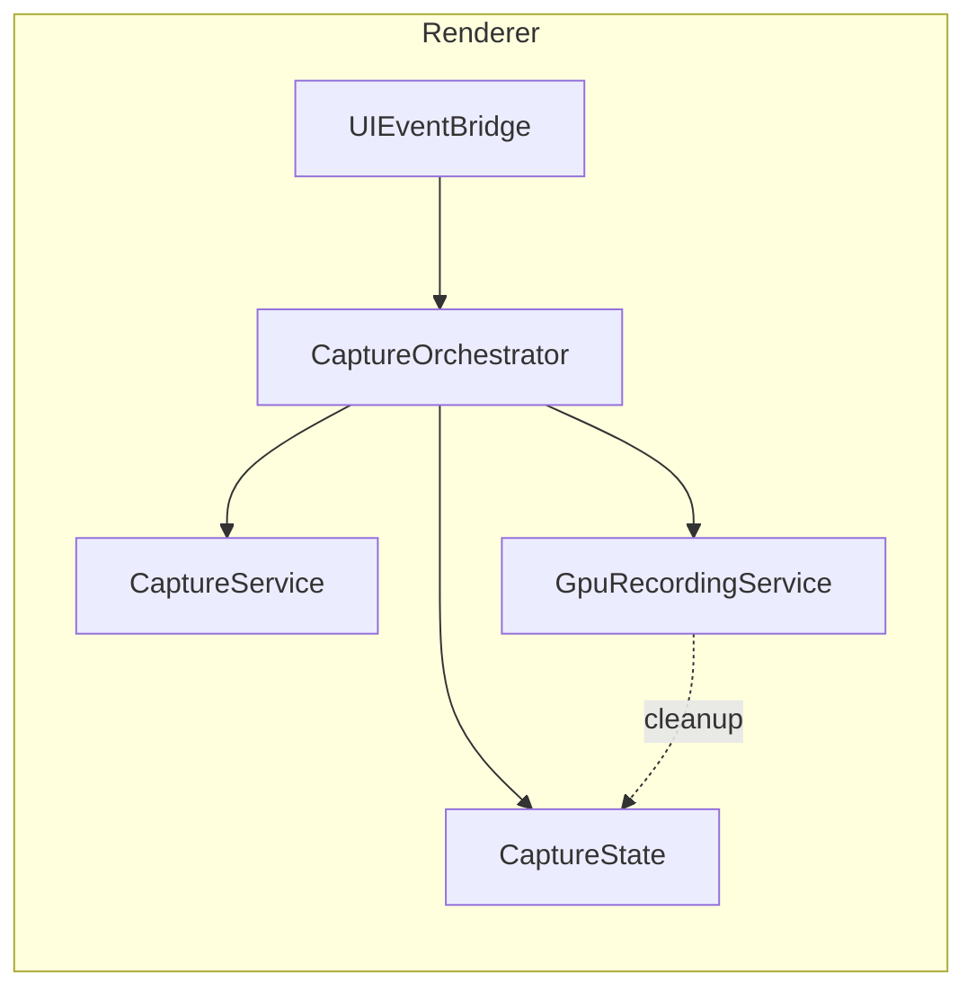
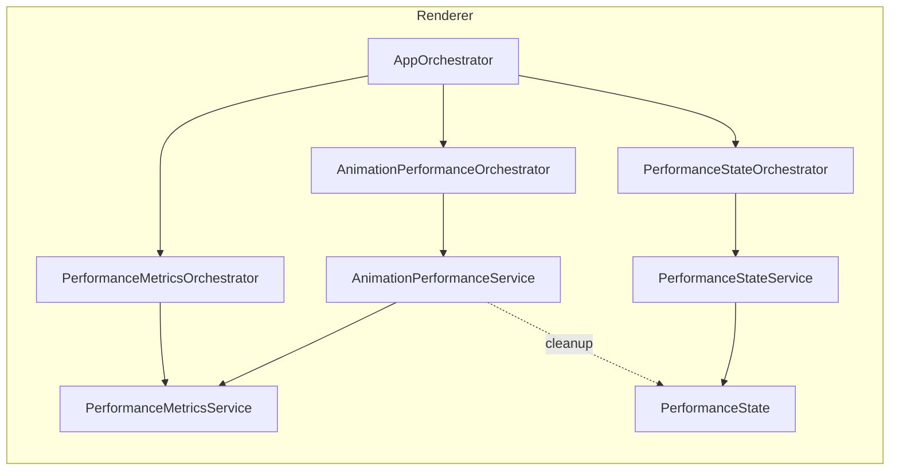
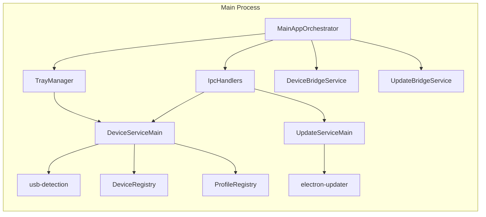
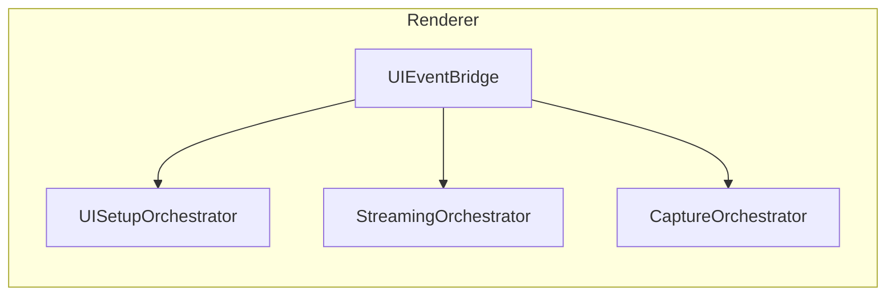
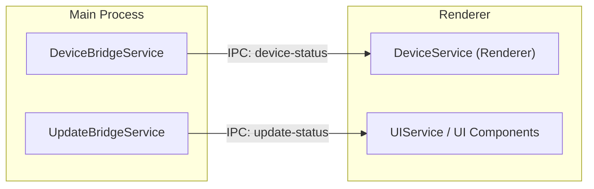

# Architecture Diagrams

These diagrams provide focused, review-friendly views of the application's core orchestration and service boundaries.

Related docs:
- `docs/feature-map.md`
- `docs/naming-conventions.md`

Legend
- Solid edges: control flow or delegation.
- Dashed edges: error/cleanup or retry flow.
- Nodes labeled "State" are the primary owners of state transitions.
- IPC edges are labeled explicitly.

## Streaming and Device Selection

## Capture and GPU Recording

## Performance and Metrics

## Main Process IPC and Core Services

## UI Event Flow

## Cross-Process Device and Update Channels

## Notes

- Device selection is explicitly shown as a sub-step in `StreamingService` to make filtering and ordering visible during reviews.
- IPC edges are separated into their own diagram so cross-process boundaries are obvious.
- State owners are called out where they influence lifecycle (start/stop, error/retry).
- Process-first layout: renderer code lives under `src/renderer`, main process under `src/main`, preload under `src/preload`, shared utilities under `src/shared`.
