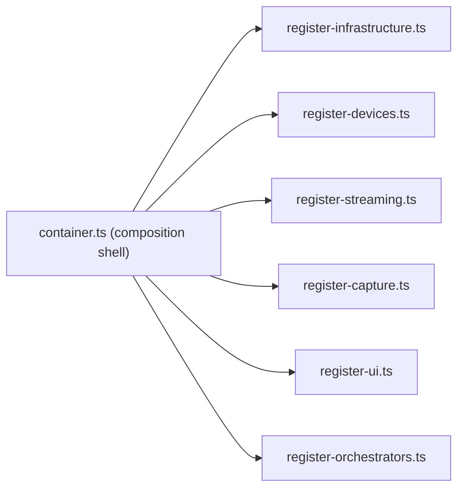
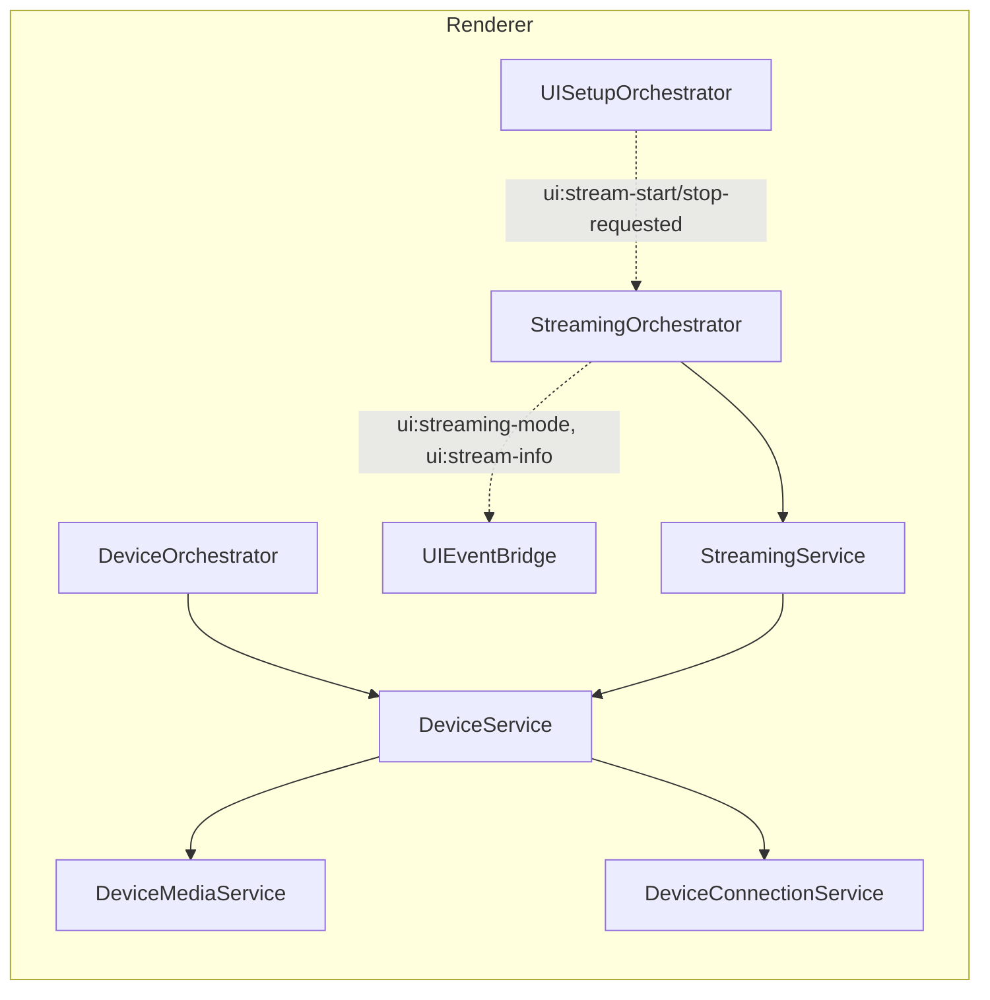
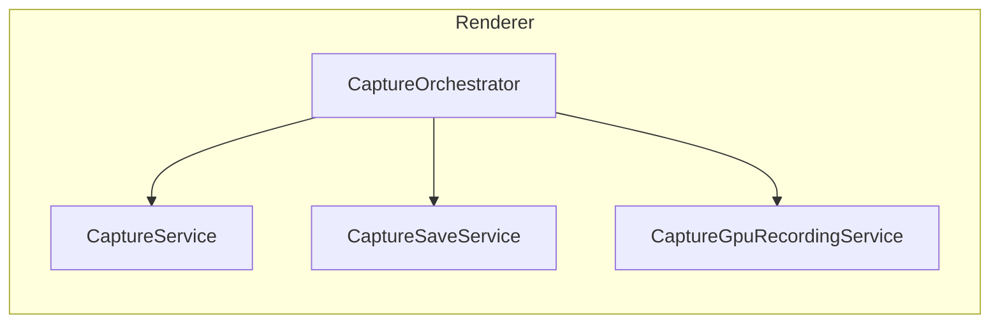
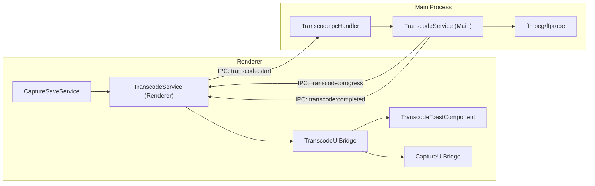
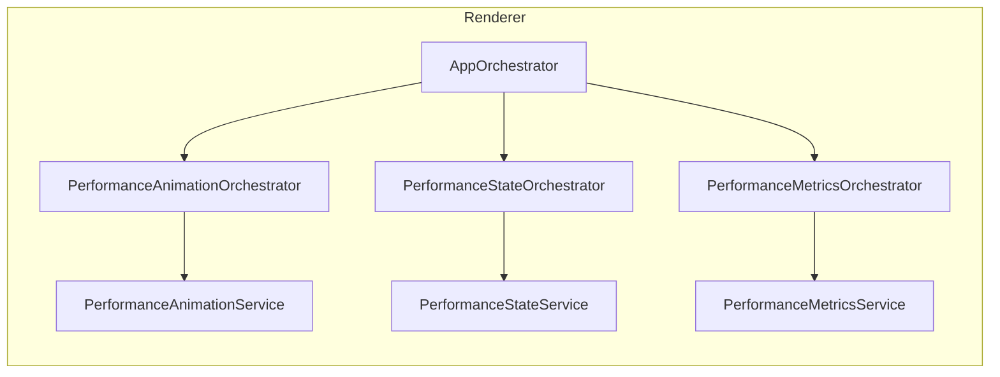
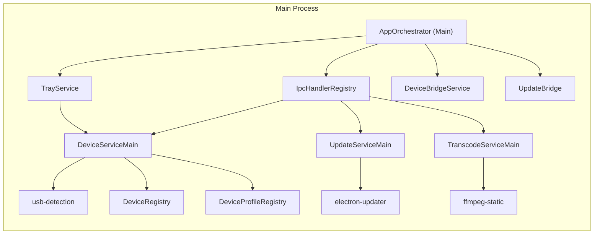
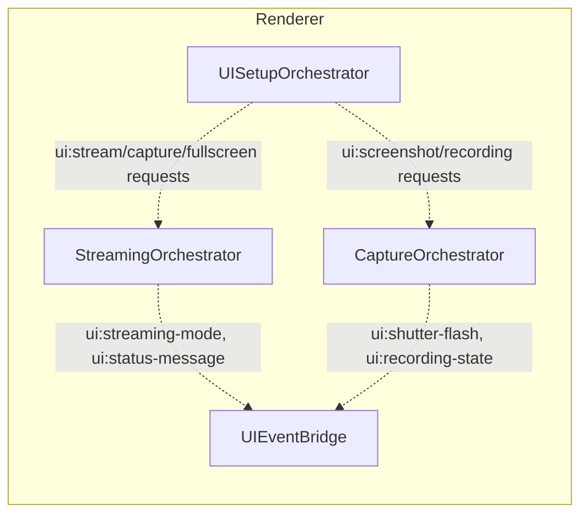
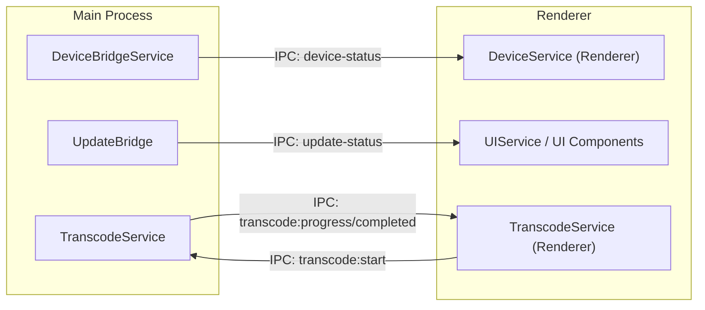

# Architecture Diagrams

These diagrams provide focused, review-friendly views of the application's core orchestration and service boundaries.

Related docs:
- `docs/feature-map.md`
- `docs/naming-conventions.md`

Legend
- Solid edges: direct dependency (constructor injection).
- Dashed labeled edges: indirect communication via EventBus.
- Dashed unlabeled edges: error/cleanup or retry flow.
- IPC edges are labeled explicitly.

## Renderer DI Composition

```mermaid
flowchart LR
  Container["container.ts (composition shell)"]
  Infra["register-infrastructure.ts"]
  Devices["register-devices.ts"]
  Streaming["register-streaming.ts"]
  Capture["register-capture.ts"]
  UI["register-ui.ts"]
  Orchestrators["register-orchestrators.ts"]

  Container --> Infra
  Container --> Devices
  Container --> Streaming
  Container --> Capture
  Container --> UI
  Container --> Orchestrators
```

## Streaming and Device Selection

```mermaid
flowchart LR
  subgraph RENDERER[Renderer]
    UISetupOrchestrator[UISetupOrchestrator]
    StreamingOrchestrator[StreamingOrchestrator]
    StreamingService[StreamingService]
    DeviceOrchestrator[DeviceOrchestrator]
    DeviceService[DeviceService]
    DeviceMediaService[DeviceMediaService]
    DeviceConnectionService[DeviceConnectionService]
    UIEventBridge[UIEventBridge]
  end

  UISetupOrchestrator -. "ui:stream-start/stop-requested" .-> StreamingOrchestrator
  StreamingOrchestrator --> StreamingService
  StreamingOrchestrator -. "ui:streaming-mode, ui:stream-info" .-> UIEventBridge
  DeviceOrchestrator --> DeviceService
  StreamingService --> DeviceService
  DeviceService --> DeviceMediaService
  DeviceService --> DeviceConnectionService
```

## Capture and GPU Recording

```mermaid
flowchart LR
  subgraph RENDERER[Renderer]
    CaptureOrchestrator[CaptureOrchestrator]
    CaptureService[CaptureService]
    CaptureSaveService[CaptureSaveService]
    CaptureGpuRecordingService[CaptureGpuRecordingService]
  end

  CaptureOrchestrator --> CaptureService
  CaptureOrchestrator --> CaptureSaveService
  CaptureOrchestrator --> CaptureGpuRecordingService
```

## Recording Transcode Flow

```mermaid
flowchart LR
  subgraph RENDERER[Renderer]
    CaptureSaveService[CaptureSaveService]
    TranscodeServiceRenderer["TranscodeService (Renderer)"]
    TranscodeUIBridge[TranscodeUIBridge]
    TranscodeToast[TranscodeToastComponent]
    CaptureUIBridge[CaptureUIBridge]
  end

  subgraph MAIN[Main Process]
    TranscodeIpcHandler[TranscodeIpcHandler]
    TranscodeServiceMain["TranscodeService (Main)"]
    FFmpeg[ffmpeg/ffprobe]
  end

  CaptureSaveService --> TranscodeServiceRenderer
  TranscodeServiceRenderer -- IPC: transcode:start --> TranscodeIpcHandler
  TranscodeIpcHandler --> TranscodeServiceMain
  TranscodeServiceMain --> FFmpeg
  TranscodeServiceMain -- IPC: transcode:progress --> TranscodeServiceRenderer
  TranscodeServiceMain -- IPC: transcode:completed --> TranscodeServiceRenderer
  TranscodeServiceRenderer --> TranscodeUIBridge
  TranscodeUIBridge --> TranscodeToast
  TranscodeUIBridge --> CaptureUIBridge
```

## Performance and Metrics

```mermaid
flowchart LR
  subgraph RENDERER[Renderer]
    AppOrchestrator[AppOrchestrator]
    PerformanceAnimationOrchestrator[PerformanceAnimationOrchestrator]
    PerformanceStateOrchestrator[PerformanceStateOrchestrator]
    PerformanceMetricsOrchestrator[PerformanceMetricsOrchestrator]
    PerformanceAnimationService[PerformanceAnimationService]
    PerformanceStateService[PerformanceStateService]
    PerformanceMetricsService[PerformanceMetricsService]
  end

  AppOrchestrator --> PerformanceAnimationOrchestrator
  AppOrchestrator --> PerformanceStateOrchestrator
  AppOrchestrator --> PerformanceMetricsOrchestrator
  PerformanceAnimationOrchestrator --> PerformanceAnimationService
  PerformanceStateOrchestrator --> PerformanceStateService
  PerformanceMetricsOrchestrator --> PerformanceMetricsService
```

## Main Process IPC and Core Services

```mermaid
flowchart LR
  subgraph MAIN[Main Process]
    AppOrchestrator["AppOrchestrator (Main)"]
    IpcHandlerRegistry[IpcHandlerRegistry]
    TrayService[TrayService]
    DeviceBridge[DeviceBridgeService]
    UpdateBridge[UpdateBridge]
    DeviceServiceMain[DeviceServiceMain]
    UpdateServiceMain[UpdateServiceMain]
    TranscodeServiceMain[TranscodeServiceMain]
    UsbDetection[usb-detection]
    DeviceRegistry[DeviceRegistry]
    DeviceProfileRegistry[DeviceProfileRegistry]
    AutoUpdater[electron-updater]
    FFmpeg[ffmpeg-static]
  end

  AppOrchestrator --> IpcHandlerRegistry
  AppOrchestrator --> TrayService
  AppOrchestrator --> DeviceBridge
  AppOrchestrator --> UpdateBridge

  IpcHandlerRegistry --> DeviceServiceMain
  IpcHandlerRegistry --> UpdateServiceMain
  IpcHandlerRegistry --> TranscodeServiceMain
  TrayService --> DeviceServiceMain

  DeviceServiceMain --> UsbDetection
  DeviceServiceMain --> DeviceRegistry
  DeviceServiceMain --> DeviceProfileRegistry
  UpdateServiceMain --> AutoUpdater
  TranscodeServiceMain --> FFmpeg
```

## UI Event Flow

```mermaid
flowchart LR
  subgraph RENDERER[Renderer]
    UISetupOrchestrator[UISetupOrchestrator]
    StreamingOrchestrator[StreamingOrchestrator]
    CaptureOrchestrator[CaptureOrchestrator]
    UIEventBridge[UIEventBridge]
  end

  UISetupOrchestrator -. "ui:stream/capture/fullscreen requests" .-> StreamingOrchestrator
  UISetupOrchestrator -. "ui:screenshot/recording requests" .-> CaptureOrchestrator
  StreamingOrchestrator -. "ui:streaming-mode, ui:status-message" .-> UIEventBridge
  CaptureOrchestrator -. "ui:shutter-flash, ui:recording-state" .-> UIEventBridge
```

## Cross-Process Device, Update, and Transcode Channels

```mermaid
flowchart LR
  subgraph MAIN[Main Process]
    DeviceBridge[DeviceBridgeService]
    UpdateBridge[UpdateBridge]
    TranscodeService[TranscodeService]
  end

  subgraph RENDERER[Renderer]
    DeviceServiceRenderer["DeviceService (Renderer)"]
    UIService["UIService / UI Components"]
    TranscodeServiceRenderer["TranscodeService (Renderer)"]
  end

  DeviceBridge -- IPC: device-status --> DeviceServiceRenderer
  UpdateBridge -- IPC: update-status --> UIService
  TranscodeServiceRenderer -- IPC: transcode:start --> TranscodeService
  TranscodeService -- IPC: transcode:progress/completed --> TranscodeServiceRenderer
```

## Notes

- Device selection is explicitly shown as a sub-step in `StreamingService` to make filtering and ordering visible during reviews.
- IPC edges are separated into their own diagram so cross-process boundaries are obvious.
- State owners are called out where they influence lifecycle (start/stop, error/retry).
- Process-first layout: renderer code lives under `src/renderer`, main process under `src/main`, preload under `src/preload`, shared utilities under `src/shared`.
- Shared timing constants live in `src/shared/config/timing.config.ts`; infrastructure code should not pull timing values from presentation config.
- `src/core` has been retired and removed; the `@core` alias is not configured in vite or vitest, so `@core/` imports will fail at build time.
