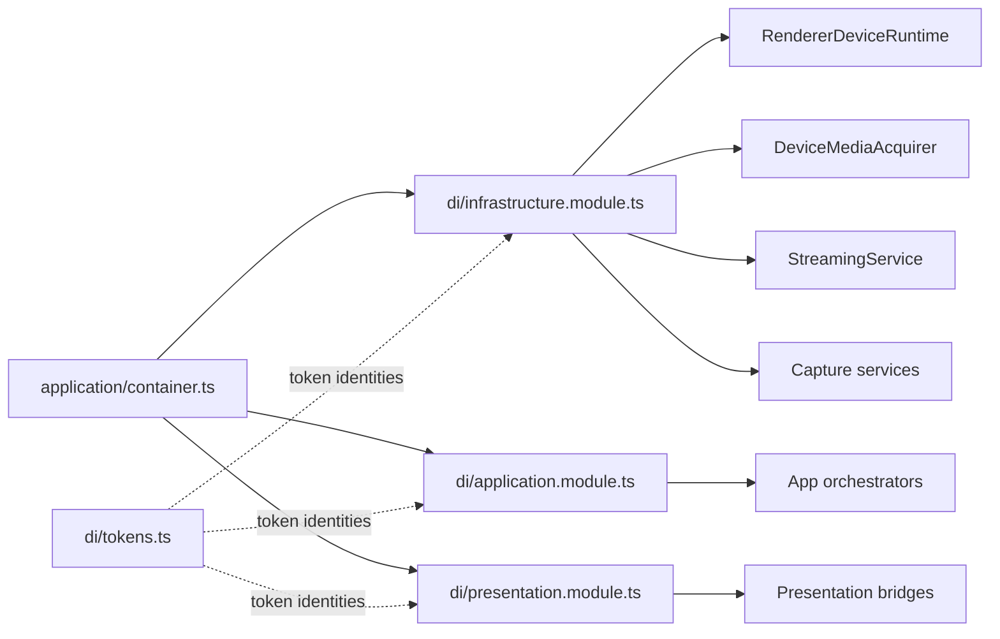
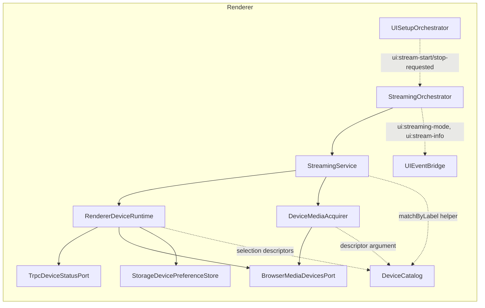
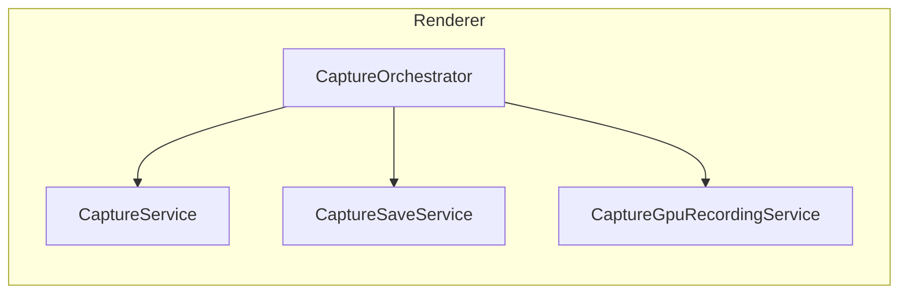
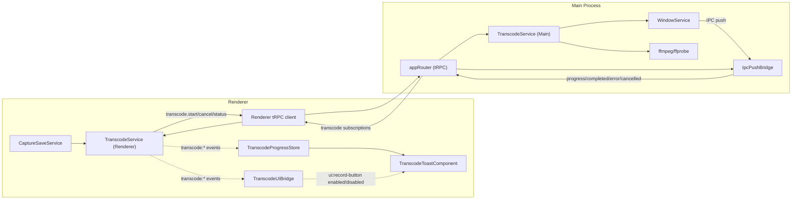
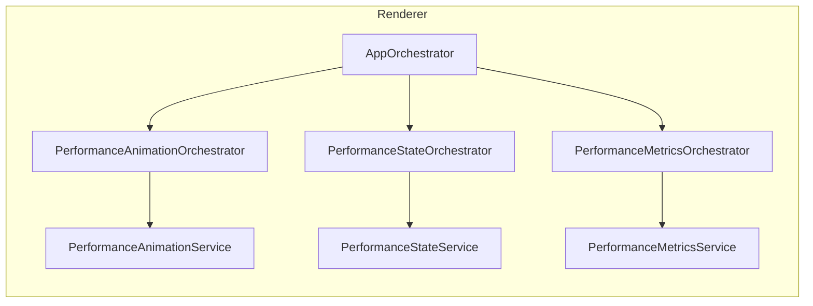
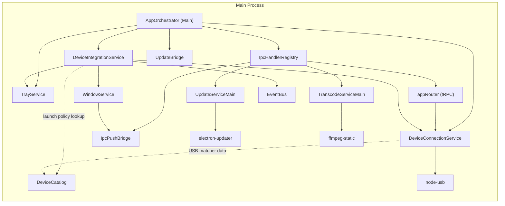
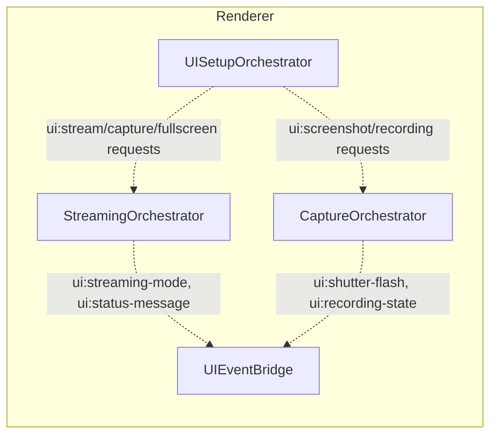
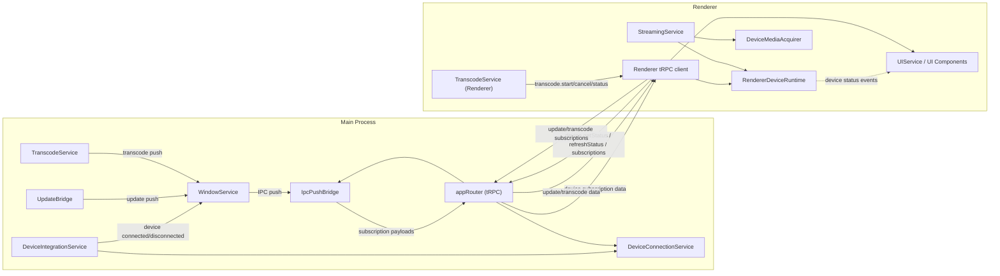

# Architecture Diagrams

<!-- Source: src/main/application/container.ts, src/main/infrastructure/devices/device-integration.service.ts, src/main/ipc/router.ts, src/renderer/application/di/tokens.ts, src/renderer/application/di/presentation.module.ts, src/renderer/infrastructure/services/devices/device-runtime.service.ts, src/renderer/infrastructure/services/streaming/device-media-acquirer.service.ts, src/platform/devices/index.ts, src/platform/devices/runtime.ts -->

These diagrams provide focused, review-friendly views of the application's core orchestration and service boundaries.

Related docs:
- `docs/feature-map.md`
- `docs/naming-conventions.md`

Legend
- Solid edges: direct dependency (constructor injection).
- Dashed labeled edges: indirect communication via EventBus.
- Dashed unlabeled edges: error/cleanup or retry flow.
- Dotted labeled edges: package data, contract, or static helper usage.
- IPC edges are labeled explicitly.

## Renderer DI Composition

```mermaid
flowchart LR
  Container["application/container.ts"]
  Tokens["di/tokens.ts"]
  InfraMod["di/infrastructure.module.ts"]
  AppMod["di/application.module.ts"]
  PresMod["di/presentation.module.ts"]
  DeviceRuntime[RendererDeviceRuntime]
  MediaAcquirer[DeviceMediaAcquirer]
  StreamingService[StreamingService]
  CaptureServices[Capture services]
  PresentationBridges[Presentation bridges]
  Orchestrators[App orchestrators]

  Container --> InfraMod
  Container --> AppMod
  Container --> PresMod
  Tokens -. token identities .-> InfraMod
  Tokens -. token identities .-> AppMod
  Tokens -. token identities .-> PresMod
  InfraMod --> DeviceRuntime
  InfraMod --> MediaAcquirer
  InfraMod --> StreamingService
  InfraMod --> CaptureServices
  PresMod --> PresentationBridges
  AppMod --> Orchestrators
```

## Streaming and Device Selection

```mermaid
flowchart LR
  subgraph RENDERER[Renderer]
    UISetupOrchestrator[UISetupOrchestrator]
    StreamingOrchestrator[StreamingOrchestrator]
    StreamingService[StreamingService]
    RendererDeviceRuntime[RendererDeviceRuntime]
    DeviceMediaAcquirer[DeviceMediaAcquirer]
    TrpcDeviceStatusPort[TrpcDeviceStatusPort]
    BrowserMediaDevicesPort[BrowserMediaDevicesPort]
    StorageDevicePreferenceStore[StorageDevicePreferenceStore]
    DeviceCatalog[DeviceCatalog]
    UIEventBridge[UIEventBridge]
  end

  UISetupOrchestrator -. "ui:stream-start/stop-requested" .-> StreamingOrchestrator
  StreamingOrchestrator --> StreamingService
  StreamingOrchestrator -. "ui:streaming-mode, ui:stream-info" .-> UIEventBridge
  StreamingService --> RendererDeviceRuntime
  StreamingService --> DeviceMediaAcquirer
  StreamingService -. "matchByLabel helper" .-> DeviceCatalog
  RendererDeviceRuntime --> TrpcDeviceStatusPort
  RendererDeviceRuntime --> BrowserMediaDevicesPort
  RendererDeviceRuntime --> StorageDevicePreferenceStore
  RendererDeviceRuntime -. "selection descriptors" .-> DeviceCatalog
  DeviceMediaAcquirer --> BrowserMediaDevicesPort
  DeviceMediaAcquirer -. "descriptor argument" .-> DeviceCatalog
```

## Capture and GPU Recording

```mermaid
flowchart LR
  subgraph RENDERER[Renderer]
    CaptureOrchestrator[CaptureOrchestrator]
    CaptureService[CaptureService]
    CaptureSaveService[CaptureSaveService]
    CaptureGpuRecordingService[CaptureGpuRecordingService]
  end

  CaptureOrchestrator --> CaptureService
  CaptureOrchestrator --> CaptureSaveService
  CaptureOrchestrator --> CaptureGpuRecordingService
```

## Recording Transcode Flow

```mermaid
flowchart LR
  subgraph RENDERER[Renderer]
    CaptureSaveService[CaptureSaveService]
    TranscodeServiceRenderer["TranscodeService (Renderer)"]
    TrpcClient[Renderer tRPC client]
    TranscodeUIBridge[TranscodeUIBridge]
    TranscodeProgressStore[TranscodeProgressStore]
    TranscodeToast[TranscodeToastComponent]
  end

  subgraph MAIN[Main Process]
    AppRouter["appRouter (tRPC)"]
    TranscodeServiceMain["TranscodeService (Main)"]
    WindowService[WindowService]
    IpcPushBridge[IpcPushBridge]
    FFmpeg[ffmpeg/ffprobe]
  end

  CaptureSaveService --> TranscodeServiceRenderer
  TranscodeServiceRenderer -- "transcode.start/cancel/status" --> TrpcClient
  TrpcClient --> AppRouter
  AppRouter --> TranscodeServiceMain
  TranscodeServiceMain --> FFmpeg
  TranscodeServiceMain --> WindowService
  WindowService -- IPC push --> IpcPushBridge
  AppRouter --> IpcPushBridge
  IpcPushBridge -- "progress/completed/error/cancelled" --> AppRouter
  AppRouter -- "transcode subscriptions" --> TrpcClient
  TrpcClient --> TranscodeServiceRenderer
  TranscodeServiceRenderer -. "transcode:* events" .-> TranscodeUIBridge
  TranscodeServiceRenderer -. "transcode:* events" .-> TranscodeProgressStore
  TranscodeProgressStore --> TranscodeToast
  TranscodeUIBridge -. "ui:record-button enabled/disabled" .-> TranscodeToast
```

## Performance and Metrics

```mermaid
flowchart LR
  subgraph RENDERER[Renderer]
    AppOrchestrator[AppOrchestrator]
    PerformanceAnimationOrchestrator[PerformanceAnimationOrchestrator]
    PerformanceStateOrchestrator[PerformanceStateOrchestrator]
    PerformanceMetricsOrchestrator[PerformanceMetricsOrchestrator]
    PerformanceAnimationService[PerformanceAnimationService]
    PerformanceStateService[PerformanceStateService]
    PerformanceMetricsService[PerformanceMetricsService]
  end

  AppOrchestrator --> PerformanceAnimationOrchestrator
  AppOrchestrator --> PerformanceStateOrchestrator
  AppOrchestrator --> PerformanceMetricsOrchestrator
  PerformanceAnimationOrchestrator --> PerformanceAnimationService
  PerformanceStateOrchestrator --> PerformanceStateService
  PerformanceMetricsOrchestrator --> PerformanceMetricsService
```

## Main Process IPC and Core Services

```mermaid
flowchart LR
  subgraph MAIN[Main Process]
    AppOrchestrator["AppOrchestrator (Main)"]
    IpcHandlerRegistry[IpcHandlerRegistry]
    AppRouter["appRouter (tRPC)"]
    IpcPushBridge[IpcPushBridge]
    WindowService[WindowService]
    TrayService[TrayService]
    EventBus[EventBus]
    DeviceIntegrationService[DeviceIntegrationService]
    DeviceConnectionService[DeviceConnectionService]
    UpdateBridge[UpdateBridge]
    UpdateServiceMain[UpdateServiceMain]
    TranscodeServiceMain[TranscodeServiceMain]
    UsbMonitor[node-usb]
    DeviceCatalog[DeviceCatalog]
    AutoUpdater[electron-updater]
    FFmpeg[ffmpeg-static]
  end

  AppOrchestrator --> IpcHandlerRegistry
  AppOrchestrator --> DeviceConnectionService
  AppOrchestrator --> DeviceIntegrationService
  AppOrchestrator --> TrayService
  AppOrchestrator --> UpdateBridge

  IpcHandlerRegistry --> AppRouter
  IpcHandlerRegistry --> IpcPushBridge
  AppRouter --> DeviceConnectionService
  IpcHandlerRegistry --> UpdateServiceMain
  IpcHandlerRegistry --> TranscodeServiceMain
  DeviceIntegrationService --> DeviceConnectionService
  DeviceIntegrationService --> TrayService
  DeviceIntegrationService --> WindowService
  DeviceIntegrationService --> EventBus
  DeviceIntegrationService -. "launch policy lookup" .-> DeviceCatalog
  WindowService --> IpcPushBridge
  DeviceConnectionService --> UsbMonitor
  DeviceConnectionService -. "USB matcher data" .-> DeviceCatalog
  UpdateServiceMain --> AutoUpdater
  TranscodeServiceMain --> FFmpeg
```

## UI Event Flow

```mermaid
flowchart LR
  subgraph RENDERER[Renderer]
    UISetupOrchestrator[UISetupOrchestrator]
    StreamingOrchestrator[StreamingOrchestrator]
    CaptureOrchestrator[CaptureOrchestrator]
    UIEventBridge[UIEventBridge]
  end

  UISetupOrchestrator -. "ui:stream/capture/fullscreen requests" .-> StreamingOrchestrator
  UISetupOrchestrator -. "ui:screenshot/recording requests" .-> CaptureOrchestrator
  StreamingOrchestrator -. "ui:streaming-mode, ui:status-message" .-> UIEventBridge
  CaptureOrchestrator -. "ui:shutter-flash, ui:recording-state" .-> UIEventBridge
```

## Cross-Process Device, Update, and Transcode Channels

```mermaid
flowchart LR
  subgraph MAIN[Main Process]
    DeviceConnectionService[DeviceConnectionService]
    DeviceIntegrationService[DeviceIntegrationService]
    WindowService[WindowService]
    IpcPushBridge[IpcPushBridge]
    AppRouter["appRouter (tRPC)"]
    UpdateBridge[UpdateBridge]
    TranscodeService[TranscodeService]
  end

  subgraph RENDERER[Renderer]
    TrpcClient[Renderer tRPC client]
    RendererDeviceRuntime[RendererDeviceRuntime]
    DeviceMediaAcquirer[DeviceMediaAcquirer]
    StreamingService[StreamingService]
    UIService["UIService / UI Components"]
    TranscodeServiceRenderer["TranscodeService (Renderer)"]
  end

  DeviceIntegrationService --> DeviceConnectionService
  DeviceIntegrationService -- "device connected/disconnected" --> WindowService
  WindowService -- IPC push --> IpcPushBridge
  TrpcClient -- "device.getStatus / refreshStatus / subscriptions" --> AppRouter
  AppRouter --> DeviceConnectionService
  AppRouter --> IpcPushBridge
  IpcPushBridge -- "subscription payloads" --> AppRouter
  AppRouter -- "device subscription data" --> TrpcClient
  TrpcClient --> RendererDeviceRuntime
  StreamingService --> RendererDeviceRuntime
  StreamingService --> DeviceMediaAcquirer
  RendererDeviceRuntime -. "device status events" .-> UIService
  UpdateBridge -- update push --> WindowService
  TranscodeService -- transcode push --> WindowService
  TrpcClient -- "update/transcode subscriptions" --> AppRouter
  AppRouter -- "update/transcode data" --> TrpcClient
  TrpcClient --> UIService
  TranscodeServiceRenderer -- "transcode.start/cancel/status" --> TrpcClient
```

## Notes

- `@platform/devices` root exports the manifest-backed catalog, contracts, matchers, and payload helpers used across processes.
- `@platform/devices/runtime` is main-process only and exports `DeviceConnectionService`.
- `RendererDeviceRuntime` owns renderer device state, media enumeration, stored media-device IDs, and browser `devicechange` refreshes.
- `DeviceMediaAcquirer` owns `getUserMedia` constraint construction, fallback attempts, stream metadata, and stream release.
- IPC edges are separated into their own diagram so cross-process boundaries are obvious.
- State owners are called out where they influence lifecycle (start/stop, error/retry).
- Process-first layout: renderer code lives under `src/renderer`, main process under `src/main`, preload under `src/preload`.
- Shared timing constants live in `src/platform/config/timing.config.ts` (imported via `@platform/config`); infrastructure code should not pull timing values from presentation config.
- `src/core` has been retired and removed; the `@core` alias is not configured in vite or vitest, so `@core/` imports will fail at build time.
