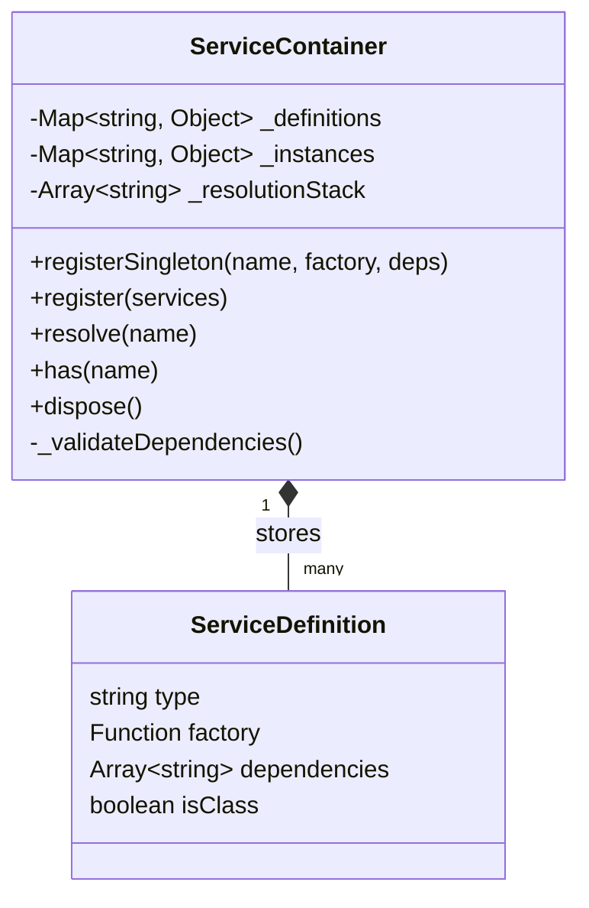
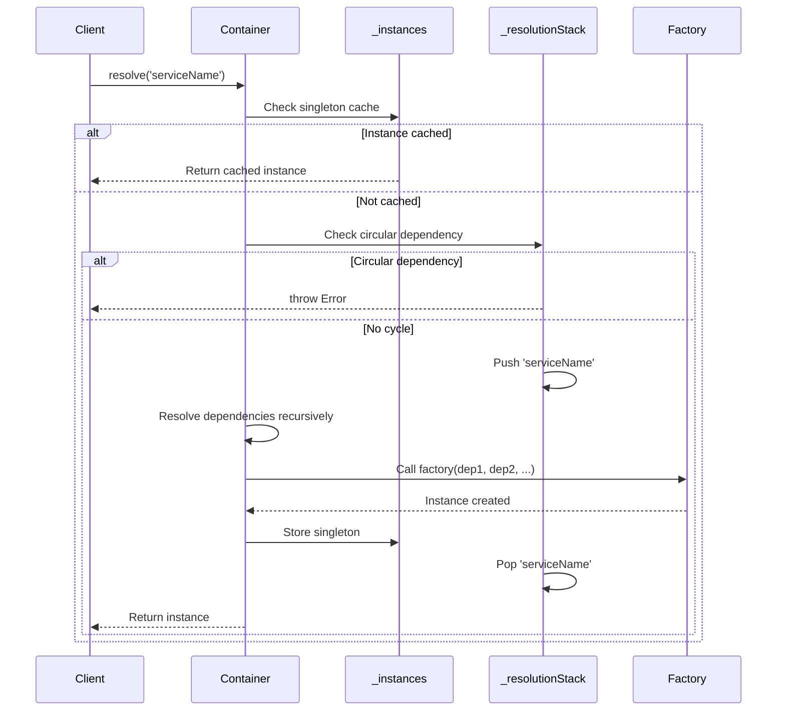

# Dependency Injection

This document describes the dependency injection patterns used in PrismGB to manage service instantiation, lifecycle, and dependencies across main and renderer processes.

## 1. Overview

PrismGB uses two different dependency injection systems tailored to their respective environments:

| Process | DI System | Purpose |
|---------|-----------|---------|
| **Main Process** | Awilix | Full-featured Node.js DI container with auto-wiring |
| **Renderer Process** | ServiceContainer | Lightweight browser-compatible DI container |

### Why Two Systems?

- **Main Process**: Runs in Node.js with full access to npm packages. Uses Awilix, a mature DI library with advanced features.
- **Renderer Process**: Runs in browser context with restricted APIs. Uses a custom lightweight container to avoid Node.js dependencies.

## 2. Main Process DI (Awilix)

Location: `/Users/josstei/Development/prismgb-workspace/prismgb-app/src/app/main/container.js`

### Configuration

```javascript
import * as awilix from 'awilix';
const { createContainer, asClass, asValue, InjectionMode } = awilix;

const container = createContainer({
  injectionMode: InjectionMode.PROXY
});
```

### Registration Patterns

#### Value Registration (asValue)

For configuration objects and pre-instantiated singletons:

```javascript
container.register({
  config: asValue({
    isDevelopment: process.env.NODE_ENV === 'development',
    appName: 'PrismGB',
    version: pkg.version
  }),
  loggerFactory: asValue(new MainLogger())
});
```

#### Class Registration (asClass)

For services that require instantiation:

```javascript
container.register({
  windowManager: asClass(WindowManager).singleton(),
  trayManager: asClass(TrayManager).singleton(),
  ipcHandlers: asClass(IpcHandlers).singleton(),
  deviceManager: asClass(DeviceManager).singleton(),
  profileRegistry: asClass(ProfileRegistry).singleton()
});
```

### Main Process Services

The main process container manages the following service categories:

| Category | Services | Purpose |
|----------|----------|---------|
| **Core** | windowManager, trayManager, ipcHandlers | Window lifecycle, system tray, IPC communication |
| **Device** | deviceManager, profileRegistry | USB device management, device profiles |
| **Infrastructure** | loggerFactory, config | Logging, configuration |

### ESM Compatibility

Awilix's `loadModules` function uses `require()`, which doesn't work with ES modules. Manual registration is used instead:

```javascript
// Manual import and registration for ESM compatibility
const { default: WindowManager } = await import('./WindowManager.js');
const { default: TrayManager } = await import('./TrayManager.js');

container.register({
  windowManager: asClass(WindowManager).singleton(),
  trayManager: asClass(TrayManager).singleton()
});
```

## 3. Renderer Process DI (ServiceContainer)

Location: `/Users/josstei/Development/prismgb-workspace/prismgb-app/src/infrastructure/di/service-container.js`

### ServiceContainer Class

A lightweight dependency injection container built for browser environments.



### Internal Structure

| Property | Type | Purpose |
|----------|------|---------|
| `_definitions` | Map | Stores service registration metadata |
| `_instances` | Map | Caches resolved singleton instances |
| `_resolutionStack` | Array | Tracks resolution chain for circular dependency detection |

### Registration Pattern

```javascript
container.registerSingleton(
  'serviceName',
  function(dep1, dep2) {
    return new MyService({ dep1, dep2 });
  },
  ['dep1', 'dep2']
);
```

**Key Points:**
- First argument: Service name (string)
- Second argument: Factory function or class constructor
- Third argument: Array of dependency names (must match parameter order)

### Service Categories

The renderer container manages services across multiple layers:

#### Infrastructure Services

Core utilities available to all services:

```javascript
// Event communication
container.registerSingleton('eventBus', function(loggerFactory) {
  return new EventBus({ loggerFactory });
}, ['loggerFactory']);

// Logging
container.registerSingleton('loggerFactory', function() {
  return new BrowserLogger();
}, []);

// Browser APIs
container.registerSingleton('storageService', function() {
  return new StorageService();
}, []);

container.registerSingleton('browserApis', function() {
  return new BrowserAPIsService();
}, []);
```

#### Streaming Services

Video rendering and stream management:

```javascript
container.registerSingleton('canvasRenderer',
  function(loggerFactory, animationCache) {
    return new CanvasRenderer(
      loggerFactory.create('CanvasRenderer'),
      animationCache
    );
  },
  ['loggerFactory', 'animationCache']
);

container.registerSingleton('gpuRendererService',
  function(eventBus, loggerFactory, settingsService) {
    return new GPURendererService({ eventBus, loggerFactory, settingsService });
  },
  ['eventBus', 'loggerFactory', 'settingsService']
);

container.registerSingleton('viewportManager',
  function(loggerFactory) {
    return new ViewportManager(loggerFactory.create('ViewportManager'));
  },
  ['loggerFactory']
);
```

#### Domain Services

Business logic services:

```javascript
container.registerSingleton('deviceService',
  function(eventBus, loggerFactory, deviceStatusProvider, storageService, mediaDevicesService) {
    return new DeviceService({
      eventBus,
      loggerFactory,
      deviceStatusProvider,
      storageService,
      mediaDevicesService
    });
  },
  ['eventBus', 'loggerFactory', 'deviceStatusProvider', 'storageService', 'mediaDevicesService']
);

container.registerSingleton('streamingService',
  function(deviceService, eventBus, loggerFactory, adapterRegistry, ipcClient) {
    return new StreamingService({
      deviceService,
      eventBus,
      loggerFactory,
      adapterRegistry,
      ipcClient
    });
  },
  ['deviceService', 'eventBus', 'loggerFactory', 'adapterRegistry', 'ipcClient']
);

container.registerSingleton('captureService',
  function(eventBus, loggerFactory) {
    return new CaptureService({ eventBus, loggerFactory });
  },
  ['eventBus', 'loggerFactory']
);
```

#### Orchestrators

Coordinate multiple services with lifecycle management:

```javascript
container.registerSingleton('deviceOrchestrator',
  function(deviceService, eventBus, loggerFactory) {
    return new DeviceOrchestrator({ deviceService, eventBus, loggerFactory });
  },
  ['deviceService', 'eventBus', 'loggerFactory']
);

container.registerSingleton('appOrchestrator',
  function(
    deviceOrchestrator,
    streamingOrchestrator,
    captureOrchestrator,
    preferencesOrchestrator,
    displayModeOrchestrator,
    uiSetupOrchestrator,
    eventBus,
    loggerFactory
  ) {
    return new AppOrchestrator({
      deviceOrchestrator,
      streamingOrchestrator,
      captureOrchestrator,
      preferencesOrchestrator,
      displayModeOrchestrator,
      uiSetupOrchestrator,
      eventBus,
      loggerFactory
    });
  },
  ['deviceOrchestrator', 'streamingOrchestrator', 'captureOrchestrator',
   'preferencesOrchestrator', 'displayModeOrchestrator', 'uiSetupOrchestrator',
   'eventBus', 'loggerFactory']
);
```

#### UI Services

User interface components and controllers:

```javascript
container.registerSingleton('uiComponentFactory',
  function(eventBus) {
    return new UIComponentFactory({ eventBus });
  },
  ['eventBus']
);

container.registerSingleton('uiComponentRegistry',
  function(uiComponentFactory, eventBus, loggerFactory) {
    return new UIComponentRegistry({ uiComponentFactory, eventBus, loggerFactory });
  },
  ['uiComponentFactory', 'eventBus', 'loggerFactory']
);
```

### Resolution Flow



### Circular Dependency Detection

The container maintains a resolution stack to detect circular dependencies:

```javascript
// Example circular dependency
container.registerSingleton('serviceA', (serviceB) => new A(serviceB), ['serviceB']);
container.registerSingleton('serviceB', (serviceA) => new B(serviceA), ['serviceA']);

// Attempting to resolve will throw:
container.resolve('serviceA');
// Error: Circular dependency detected: serviceA -> serviceB -> serviceA
```

### Container Lifecycle

```javascript
// Initialize (in Application.js)
import { initializeContainer, getContainer } from '@app/renderer/container.js';

const container = initializeContainer();

// Resolve services
const deviceService = container.resolve('deviceService');

// Cleanup (on app shutdown)
container.dispose(); // Calls dispose() on all services that implement it
```

## 4. Base Classes with DI

### BaseService

Location: `/Users/josstei/Development/prismgb-workspace/prismgb-app/src/shared/base/service.js`

Base class for all services providing dependency validation and logger setup.

```javascript
import { BaseService } from '@shared/base/service.js';

export class MyService extends BaseService {
  constructor(dependencies) {
    // Declare required dependencies
    super(dependencies, ['eventBus', 'loggerFactory'], 'MyService');

    // this.eventBus, this.loggerFactory, and this.logger are now available
    // Only declared dependencies are assigned (prevents pollution)
  }

  async doWork() {
    this.logger.info('Working...');
    this.eventBus.publish('work:done', { result: 42 });
  }
}
```

**Features:**

1. **Dependency Validation**: Throws error if required dependencies are missing
2. **Selective Assignment**: Only assigns declared dependencies (prevents prototype pollution)
3. **Auto-Logger Creation**: Creates `this.logger` from `loggerFactory` if provided
4. **Service Name**: Stores service name for debugging

**Implementation:**

```javascript
export class BaseService {
  constructor(dependencies, requiredDeps = [], serviceName = null) {
    const name = serviceName || this.constructor.name;

    // Validate all required dependencies are provided
    validateDependencies(dependencies, requiredDeps, name);

    // Assign only required dependencies
    for (const dep of requiredDeps) {
      this[dep] = dependencies[dep];
    }

    // Create logger if loggerFactory provided
    if (dependencies.loggerFactory) {
      this.logger = dependencies.loggerFactory.create(name);
    }

    this._serviceName = name;
  }
}
```

### BaseOrchestrator

Location: `/Users/josstei/Development/prismgb-workspace/prismgb-app/src/shared/base/orchestrator.js`

Base class for orchestrators with lifecycle management and event subscription tracking.

```javascript
import { BaseOrchestrator } from '@shared/base/orchestrator.js';

export class MyOrchestrator extends BaseOrchestrator {
  constructor(dependencies) {
    super(dependencies, ['eventBus', 'loggerFactory', 'myService'], 'MyOrchestrator');
  }

  async onInitialize() {
    // Setup event subscriptions with automatic cleanup
    this.subscribeWithCleanup({
      'device:connected': (data) => this._handleDeviceConnected(data),
      'device:disconnected': () => this._handleDeviceDisconnected()
    });

    // Other initialization logic
    await this.myService.initialize();
  }

  async onCleanup() {
    // Custom cleanup logic
    await this.myService.shutdown();
    // EventBus subscriptions are automatically cleaned up
  }

  _handleDeviceConnected(data) {
    this.logger.info('Device connected', data);
  }

  _handleDeviceDisconnected() {
    this.logger.info('Device disconnected');
  }
}
```

**Features:**

1. **Template Method Lifecycle**: Subclasses override `onInitialize()` and `onCleanup()`
2. **EventBus Subscription Tracking**: Automatically unsubscribes on cleanup
3. **Idempotent Cleanup**: Safe to call `cleanup()` multiple times
4. **Initialization State**: Tracks `isInitialized` flag

**Lifecycle Methods:**

| Method | Purpose | When Called |
|--------|---------|-------------|
| `initialize()` | Initialize orchestrator | Called by parent orchestrator or Application.js |
| `onInitialize()` | Subclass initialization logic | Called by `initialize()` template method |
| `cleanup()` | Cleanup orchestrator | Called on app shutdown or orchestrator disposal |
| `onCleanup()` | Subclass cleanup logic | Called by `cleanup()` template method |

**EventBus Subscription Management:**

```javascript
// In onInitialize()
this.subscribeWithCleanup({
  'event:one': this._handlerOne.bind(this),
  'event:two': this._handlerTwo.bind(this)
});

// Internally tracks unsubscribe functions
// Automatically calls all unsubscribe functions during cleanup()
```

**Implementation:**

```javascript
export class BaseOrchestrator {
  constructor(dependencies, requiredDeps, name) {
    validateDependencies(dependencies, requiredDeps, name);

    // Assign dependencies
    for (const dep of requiredDeps) {
      this[dep] = dependencies[dep];
    }

    // Create logger
    if (dependencies.loggerFactory) {
      this.logger = dependencies.loggerFactory.create(name);
    }

    this.isInitialized = false;
    this._isCleanedUp = false;
    this._subscriptions = []; // Track EventBus subscriptions
  }

  async initialize() {
    if (this.isInitialized) return;

    await this.onInitialize(); // Template method

    this.isInitialized = true;
    this._isCleanedUp = false;
  }

  async cleanup() {
    if (this._isCleanedUp) return;

    this._cleanupSubscriptions(); // Auto-cleanup EventBus subscriptions
    await this.onCleanup(); // Template method

    this.isInitialized = false;
    this._isCleanedUp = true;
  }

  subscribeWithCleanup(eventMap) {
    Object.entries(eventMap).forEach(([event, handler]) => {
      const unsubscribe = this.eventBus.subscribe(event, handler);
      this._subscriptions.push(unsubscribe);
    });
  }

  _cleanupSubscriptions() {
    this._subscriptions.forEach(unsubscribe => unsubscribe());
    this._subscriptions = [];
  }
}
```

## 5. Dependency Validation

Location: `/Users/josstei/Development/prismgb-workspace/prismgb-app/src/shared/base/validate-deps.js`

Shared validation utility used by both BaseService and BaseOrchestrator.

```javascript
export function validateDependencies(dependencies, required, className) {
  const missing = required.filter(dep => dependencies[dep] === undefined);

  if (missing.length > 0) {
    throw new Error(
      `${className}: Missing required dependencies: ${missing.join(', ')}`
    );
  }
}
```

**Usage:**

```javascript
validateDependencies(
  { eventBus: bus, loggerFactory: logger },
  ['eventBus', 'loggerFactory', 'deviceService'], // deviceService missing!
  'MyService'
);
// Throws: MyService: Missing required dependencies: deviceService
```

## 6. Best Practices

### Service Design

1. **Declare Dependencies Explicitly**
   ```javascript
   // Good - clear dependencies
   constructor(dependencies) {
     super(dependencies, ['eventBus', 'loggerFactory', 'deviceService'], 'MyService');
   }

   // Bad - accessing undeclared dependencies
   constructor(dependencies) {
     super(dependencies, ['eventBus'], 'MyService');
     this.deviceService = dependencies.deviceService; // Not validated!
   }
   ```

2. **Avoid Circular Dependencies**
   ```javascript
   // Bad - circular dependency
   serviceA depends on serviceB
   serviceB depends on serviceA

   // Good - introduce mediator or use EventBus
   serviceA publishes events
   serviceB subscribes to events
   ```

3. **Use EventBus for Decoupling**
   ```javascript
   // Instead of direct service calls
   this.otherService.doSomething();

   // Publish event
   this.eventBus.publish('action:needed', { data });

   // Other service subscribes
   this.eventBus.subscribe('action:needed', (data) => this.doSomething(data));
   ```

### Container Usage

1. **Register Services in Logical Order**
   ```javascript
   // Infrastructure first
   container.registerSingleton('eventBus', ...);
   container.registerSingleton('loggerFactory', ...);

   // Services next
   container.registerSingleton('deviceService', ...);
   container.registerSingleton('streamingService', ...);

   // Orchestrators last (depend on services)
   container.registerSingleton('appOrchestrator', ...);
   ```

2. **Match Dependency Order**
   ```javascript
   // Factory parameters MUST match dependency array order
   container.registerSingleton(
     'myService',
     function(eventBus, loggerFactory, deviceService) { // Order matters!
       return new MyService({ eventBus, loggerFactory, deviceService });
     },
     ['eventBus', 'loggerFactory', 'deviceService'] // Same order!
   );
   ```

3. **Lazy Resolution**
   ```javascript
   // Services are only instantiated when first resolved
   container.registerSingleton('expensiveService', ...);

   // Not created yet

   const service = container.resolve('expensiveService');
   // Now created and cached
   ```

### Testing

1. **Mock Dependencies in Tests**
   ```javascript
   // Create service with mock dependencies
   const mockEventBus = { publish: vi.fn(), subscribe: vi.fn() };
   const mockLogger = { info: vi.fn(), error: vi.fn() };
   const mockLoggerFactory = { create: () => mockLogger };

   const service = new MyService({
     eventBus: mockEventBus,
     loggerFactory: mockLoggerFactory,
     deviceService: mockDeviceService
   });
   ```

2. **Test Dependency Validation**
   ```javascript
   it('should throw error if required dependency missing', () => {
     expect(() => {
       new MyService({ eventBus: mockEventBus }); // Missing loggerFactory
     }).toThrow('Missing required dependencies: loggerFactory');
   });
   ```

3. **Reset Container Between Tests**
   ```javascript
   import { resetContainer } from '@app/renderer/container.js';

   afterEach(() => {
     resetContainer(); // Clean slate for next test
   });
   ```

## 7. Common Patterns

### Factory Services

Use factory functions to create instances with varying configurations:

```javascript
container.registerSingleton('adapterFactory',
  function(eventBus, loggerFactory) {
    return new AdapterFactory(eventBus, loggerFactory);
  },
  ['eventBus', 'loggerFactory']
);

// AdapterFactory can create device adapters on demand
const adapter = adapterFactory.createAdapter('chromatic');
```

### IPC Adapter Pattern

Abstract IPC communication for testability:

```javascript
// Register IPC client (window.deviceAPI from preload)
container.registerSingleton('ipcClient', function() {
  if (!window.deviceAPI) {
    throw new Error('deviceAPI not available');
  }
  return window.deviceAPI;
}, []);

// Wrap IPC client in adapter for testability
container.registerSingleton('deviceStatusProvider',
  function(ipcClient) {
    return new IpcDeviceStatusAdapter(ipcClient);
  },
  ['ipcClient']
);

// Services depend on adapter, not raw IPC
container.registerSingleton('deviceService',
  function(eventBus, loggerFactory, deviceStatusProvider) {
    return new DeviceService({ eventBus, loggerFactory, deviceStatusProvider });
  },
  ['eventBus', 'loggerFactory', 'deviceStatusProvider']
);
```

### State Management Integration

AppState as a derived service that caches service state via events:

```javascript
container.registerSingleton('appState',
  function(streamingService, deviceService, eventBus) {
    return new AppState({ streamingService, deviceService, eventBus });
  },
  ['streamingService', 'deviceService', 'eventBus']
);

// Other services can use appState instead of direct service references
container.registerSingleton('myOrchestrator',
  function(appState, eventBus, loggerFactory) {
    return new MyOrchestrator({ appState, eventBus, loggerFactory });
  },
  ['appState', 'eventBus', 'loggerFactory']
);
```

## 8. Troubleshooting

### Common Errors

**Missing Dependency**

```
Error: MyService: Missing required dependencies: deviceService
```

**Solution:** Ensure the dependency is registered in the container and listed in the service's `requiredDeps` array.

**Circular Dependency**

```
Error: Circular dependency detected: serviceA -> serviceB -> serviceA
```

**Solution:** Refactor to use EventBus for communication or introduce a mediator service.

**Service Not Registered**

```
Error: [ServiceContainer] Service "unknownService" not found. Did you forget to register it?
```

**Solution:** Register the service in the container configuration file.

**Wrong Dependency Order**

```javascript
// Factory receives arguments in wrong order
container.registerSingleton(
  'myService',
  function(deviceService, eventBus) { // Wrong order!
    return new MyService({ eventBus, loggerFactory, deviceService });
  },
  ['eventBus', 'loggerFactory', 'deviceService'] // Declared order
);
```

**Solution:** Match factory parameter order to dependency array order.

### Debugging Tips

1. **Enable Container Logging**
   ```javascript
   const container = createRendererContainer();
   console.log('Registered services:', Array.from(container._definitions.keys()));
   ```

2. **Check Resolution Stack**
   ```javascript
   // Add logging to ServiceContainer.resolve()
   console.log('Resolving:', name);
   console.log('Resolution stack:', this._resolutionStack);
   ```

3. **Verify Singleton Cache**
   ```javascript
   // Check if service is cached
   console.log('Is cached:', container._instances.has('myService'));
   ```

## 9. Migration Guide

### Converting to BaseService

**Before:**

```javascript
export class MyService {
  constructor({ eventBus, loggerFactory, deviceService }) {
    this.eventBus = eventBus;
    this.deviceService = deviceService;
    this.logger = loggerFactory.create('MyService');
  }
}
```

**After:**

```javascript
import { BaseService } from '@shared/base/service.js';

export class MyService extends BaseService {
  constructor(dependencies) {
    super(dependencies, ['eventBus', 'loggerFactory', 'deviceService'], 'MyService');
    // this.eventBus, this.deviceService, this.logger now available
  }
}
```

### Converting to BaseOrchestrator

**Before:**

```javascript
export class MyOrchestrator {
  constructor({ eventBus, loggerFactory, myService }) {
    this.eventBus = eventBus;
    this.myService = myService;
    this.logger = loggerFactory.create('MyOrchestrator');
    this._subscriptions = [];
  }

  async initialize() {
    this._subscriptions.push(
      this.eventBus.subscribe('event', this._handler.bind(this))
    );
  }

  async cleanup() {
    this._subscriptions.forEach(unsub => unsub());
    this._subscriptions = [];
  }
}
```

**After:**

```javascript
import { BaseOrchestrator } from '@shared/base/orchestrator.js';

export class MyOrchestrator extends BaseOrchestrator {
  constructor(dependencies) {
    super(dependencies, ['eventBus', 'loggerFactory', 'myService'], 'MyOrchestrator');
  }

  async onInitialize() {
    this.subscribeWithCleanup({
      'event': this._handler.bind(this)
    });
  }

  async onCleanup() {
    // EventBus subscriptions automatically cleaned up
  }
}
```

## 10. Related Documentation

- [Event Bus Architecture](./event-bus.md) - Event-driven communication patterns
- [Service Architecture](./services.md) - Service design patterns
- [Application Lifecycle](./lifecycle.md) - App initialization and shutdown
