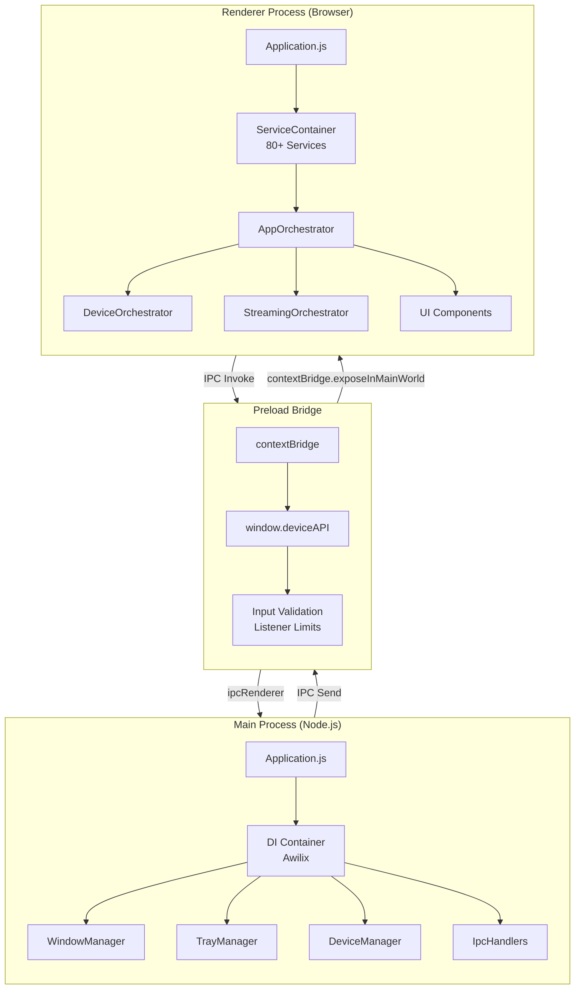
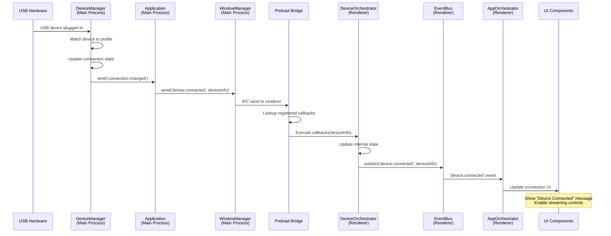
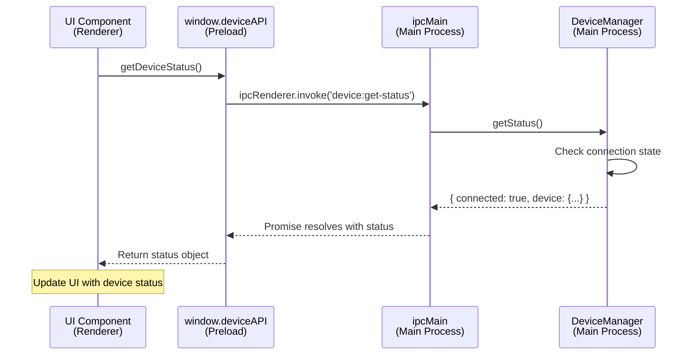
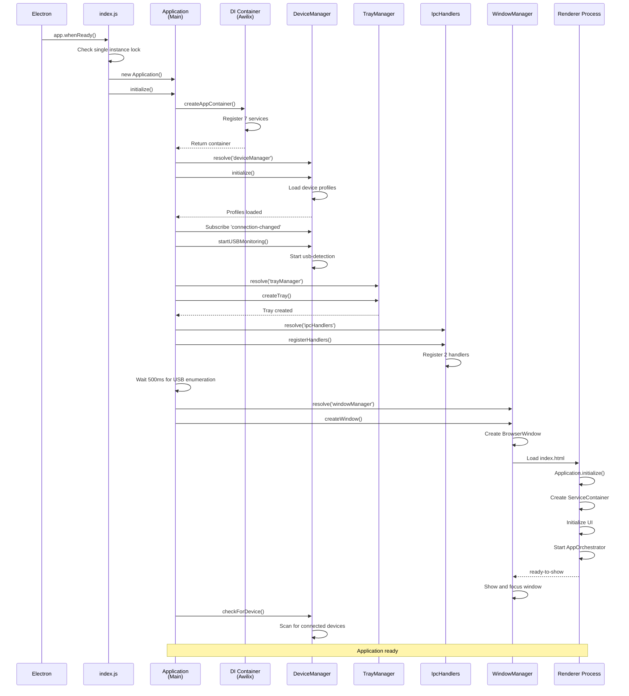

# Electron Process Architecture

This document describes the three-process architecture of PrismGB and how they communicate securely through IPC (Inter-Process Communication).

## Overview

PrismGB uses Electron's process separation model to maintain security and stability:

- **Main Process (Node.js)** - System-level operations, window management, USB device detection
- **Renderer Process (Browser)** - UI rendering, streaming, user interactions
- **Preload Bridge** - Secure IPC channel between main and renderer processes



## 1. Main Process

**Location:** `src/app/main/`

The main process runs in a Node.js environment with access to native system APIs. It handles application lifecycle, window management, system tray, and USB device detection.

### Entry Point: `index.js`

**Responsibilities:**
- Single instance lock enforcement
- GPU hardware acceleration configuration
- Application lifecycle management
- Smoke test mode for CI/CD validation
- Cleanup coordination on quit

**Startup Sequence:**
1. Check for single instance lock (prevent multiple app instances)
2. Configure GPU settings (enable hardware acceleration by default)
3. Create `Application` instance
4. Wait for `app.whenReady()`
5. Call `application.initialize()`
6. Keep app running in system tray when windows close

```javascript
// Single instance lock
const gotTheLock = app.requestSingleInstanceLock();
if (!gotTheLock) {
  app.quit();
} else {
  const application = new Application();
  app.whenReady().then(async () => {
    await application.initialize();
  });
}
```

### Bootstrap: `Application.js`

**Responsibilities:**
- Create and configure Awilix DI container
- Resolve core services (WindowManager, DeviceManager, TrayManager, IpcHandlers)
- Initialize device profiles
- Start USB monitoring
- Wire up device connection events
- Coordinate cleanup on shutdown

**Initialization Flow:**
```javascript
async initialize() {
  1. Create DI container (Awilix)
  2. Resolve core services from container
  3. Initialize DeviceManager (load device profiles)
  4. Subscribe to 'connection-changed' events
  5. Start USB monitoring for hot-plug detection
  6. Create system tray
  7. Register IPC handlers
  8. Wait 500ms for USB device enumeration
  9. Create main window
  10. Check for already-connected devices
}
```

**Event Flow:**
```javascript
// Device connection event handler
deviceManager.on('connection-changed', () => {
  trayManager.updateTrayMenu();

  if (deviceManager.isConnected()) {
    windowManager.send('device:connected', deviceInfo);
  } else {
    windowManager.send('device:disconnected');
  }
});
```

**Cleanup Sequence:**
```javascript
cleanup() {
  1. Close DevTools if open
  2. Destroy main window
  3. Remove device manager event listeners
  4. Stop USB monitoring
  5. Destroy system tray
  6. Dispose DI container
  7. Clear service references
}
```

### Dependency Injection: `container.js`

**Implementation:** Awilix container with PROXY injection mode

**Registered Services:**

| Service | Lifecycle | Dependencies |
|---------|-----------|--------------|
| `config` | Value | Environment variables, package.json |
| `loggerFactory` | Value | MainLogger instance |
| `windowManager` | Singleton | loggerFactory |
| `trayManager` | Singleton | loggerFactory, deviceManager, windowManager |
| `ipcHandlers` | Singleton | deviceManager, loggerFactory |
| `deviceManager` | Singleton | windowManager, profileRegistry, loggerFactory |
| `profileRegistry` | Singleton | loggerFactory |

**Registration Pattern:**
```javascript
const container = createContainer({ injectionMode: InjectionMode.PROXY });

container.register({
  windowManager: asClass(WindowManager).singleton(),
  trayManager: asClass(TrayManager).singleton(),
  deviceManager: asClass(DeviceManager).singleton()
});
```

### Window Management: `WindowManager.js`

**Responsibilities:**
- Create and configure BrowserWindow
- Handle HiDPI display settings
- Load renderer content (dev server vs built files)
- Manage download handlers (auto-save to prevent GTK dialog issues)
- Force window to foreground with platform-specific methods
- Forward renderer console logs in development mode

**Window Configuration:**
```javascript
new BrowserWindow({
  width: 1280,
  height: 720,
  minWidth: 800,
  minHeight: 600,
  backgroundColor: '#0a0a0a',
  autoHideMenuBar: true,
  webPreferences: {
    nodeIntegration: false,     // Security: no Node.js in renderer
    contextIsolation: true,     // Security: isolate preload context
    sandbox: true,              // Security: sandboxed renderer
    preload: preloadPath
  },
  show: false  // Wait for 'ready-to-show' to prevent flicker
});
```

**Development vs Production:**
- **Development:** Load from Vite dev server at `http://localhost:3000/src/app/renderer/index.html`
- **Production:** Load built files from `dist/renderer/src/app/renderer/index.html`

### System Tray: `TrayManager.js`

**Responsibilities:**
- Create system tray icon with dynamic menu
- Show device connection status
- Provide quick actions (Show Window, Quit)
- Update menu when device connects/disconnects

### IPC Handlers: `IpcHandlers.js`

**Responsibilities:**
- Register all IPC request handlers
- Validate incoming requests
- Coordinate with services to fulfill requests

**Registered Handlers:**

| Channel | Handler | Purpose |
|---------|---------|---------|
| `device:get-status` | `ipcMain.handle()` | Return device connection status |
| `shell:open-external` | `ipcMain.handle()` | Open URL in default browser with validation |

**Security Measures:**
```javascript
// Validate URL before opening
const parsedUrl = new URL(url);
if (!['http:', 'https:'].includes(parsedUrl.protocol)) {
  throw new Error('Only http and https URLs are allowed');
}
```

### Device Management: `DeviceManager.js`

**Location:** `src/features/devices/main/device.manager.js`

**Responsibilities:**
- USB hot-plug detection using `usb-detection`
- Load device profiles from registry
- Match connected devices to profiles
- Emit `connection-changed` events
- Maintain connection state

**Initialization:**
```javascript
async initialize() {
  1. Load device profiles from DeviceRegistry
  2. Register each profile with ProfileRegistry
  3. Set _profilesInitialized flag
}
```

**USB Monitoring:**
```javascript
startUSBMonitoring() {
  usbDetection.startMonitoring();
  usbDetection.on('add', device => this.checkForDevice());
  usbDetection.on('remove', device => this.handleDisconnection());
}
```

## 2. Renderer Process

**Location:** `src/app/renderer/`

The renderer process runs in a sandboxed browser environment. It has no direct access to Node.js APIs but can communicate with the main process through the preload bridge.

### Bootstrap: `Application.js`

**Responsibilities:**
- Create ServiceContainer with 80+ service registrations
- Initialize UI components (UIController)
- Initialize adapter registry for device adapters
- Initialize UI event handler
- Resolve and start AppOrchestrator

**Initialization Flow:**
```javascript
async initialize() {
  1. Create DI container (ServiceContainer)
  2. Initialize UI components (UIController)
  3. Register UI components in container
  4. Initialize adapter registry
  5. Initialize UI event handler
  6. Resolve AppOrchestrator
  7. Initialize orchestrator
}

async start() {
  1. Start orchestrator
  2. Orchestrator coordinates all sub-orchestrators
}
```

### Dependency Injection: `container.js`

**Implementation:** Custom ServiceContainer (browser-compatible, no Awilix)

**Service Categories:**

| Category | Services |
|----------|----------|
| **Infrastructure** | eventBus, loggerFactory, storageService, mediaDevicesService, browserApis |
| **Streaming** | canvasRenderer, gpuRendererService, viewportManager, visibilityHandler, streamHealthMonitor, adapterFactory |
| **Device** | deviceService, deviceOrchestrator, ipcDeviceStatusAdapter |
| **Capture** | captureService, captureOrchestrator |
| **Settings** | settingsService, preferencesOrchestrator, displayModeOrchestrator |
| **UI** | appState, uiComponentFactory, uiComponentRegistry, uiEffects, uiEventHandler |
| **Orchestrators** | appOrchestrator, deviceOrchestrator, streamingOrchestrator, captureOrchestrator, uiSetupOrchestrator |

**Registration Pattern:**
```javascript
container.registerSingleton(
  'eventBus',
  function (loggerFactory) {
    return new EventBus({ loggerFactory });
  },
  ['loggerFactory']  // Dependencies
);
```

### Application State: `AppState.js`

**Location:** `src/ui/app.state.js`

**Responsibilities:**
- Centralized state management for UI
- Publish state change events via EventBus
- Track device connection, streaming status, capture state

### Orchestrator Pattern

Orchestrators coordinate multiple services with lifecycle management:

**Base Class:** `BaseOrchestrator` (src/shared/base/orchestrator.js)

**Key Orchestrators:**

| Orchestrator | Responsibilities |
|--------------|------------------|
| `AppOrchestrator` | Top-level coordinator, manages all sub-orchestrators |
| `DeviceOrchestrator` | Device connection, IPC event handling, status updates |
| `StreamingOrchestrator` | Stream acquisition, rendering, lifecycle management |
| `CaptureOrchestrator` | Screenshot and video recording coordination |
| `PreferencesOrchestrator` | User preferences, settings persistence |

**Lifecycle:**
```javascript
class MyOrchestrator extends BaseOrchestrator {
  async onInitialize() {
    // Subscribe to events with automatic cleanup
    this.subscribeWithCleanup({
      'device:connected': (data) => this.handleConnected(data),
      'device:disconnected': () => this.handleDisconnected()
    });
  }

  async onStart() {
    // Start async operations
  }

  async onCleanup() {
    // Cleanup (automatic event unsubscription)
  }
}
```

## 3. Preload Bridge

**Location:** `src/app/preload/index.js`

The preload script runs in a privileged context with access to both Node.js APIs and the renderer DOM. It uses `contextBridge` to expose a secure API to the renderer.

### Security Measures

**1. Context Isolation**
```javascript
contextBridge.exposeInMainWorld('deviceAPI', {
  getDeviceStatus: () => ipcRenderer.invoke('device:get-status'),
  onDeviceConnected: (callback) => { /* ... */ },
  onDeviceDisconnected: (callback) => { /* ... */ }
});
```

**2. Input Validation**
```javascript
function isValidCallback(callback) {
  return typeof callback === 'function';
}

function isValidExternalUrl(url) {
  if (typeof url !== 'string' || url.length === 0 || url.length > 2048) {
    return false;
  }
  const parsed = new URL(url);
  return ['http:', 'https:'].includes(parsed.protocol);
}
```

**3. Listener Limits**
```javascript
const MAX_LISTENERS_PER_CHANNEL = 10;

onConnected: (callback) => {
  if (listenerRegistry.connected.size >= MAX_LISTENERS_PER_CHANNEL) {
    console.warn('Maximum listener limit reached');
    return () => {};  // Return no-op unsubscribe
  }

  const listener = (event, device) => callback(device);
  listenerRegistry.connected.add(listener);
  ipcRenderer.on('device:connected', listener);

  // Return unsubscribe function
  return () => {
    ipcRenderer.removeListener('device:connected', listener);
    listenerRegistry.connected.delete(listener);
  };
}
```

**4. Automatic Cleanup**
```javascript
removeListeners: () => {
  ipcRenderer.removeAllListeners('device:connected');
  ipcRenderer.removeAllListeners('device:disconnected');
  listenerRegistry.connected.clear();
  listenerRegistry.disconnected.clear();
}
```

### Exposed API: `window.deviceAPI`

Available in renderer process after preload executes:

| Method | Type | Purpose |
|--------|------|---------|
| `getDeviceStatus()` | Promise | Get current device connection status |
| `onDeviceConnected(callback)` | Function | Subscribe to device connection events |
| `onDeviceDisconnected(callback)` | Function | Subscribe to device disconnection events |
| `removeDeviceListeners()` | Function | Cleanup all device listeners |
| `openExternal(url)` | Promise | Open URL in default browser |

**Usage in Renderer:**
```javascript
// Get device status
const status = await window.deviceAPI.getDeviceStatus();

// Subscribe to connection events
const unsubscribe = window.deviceAPI.onDeviceConnected((device) => {
  console.log('Device connected:', device);
});

// Cleanup when done
unsubscribe();
```

## 4. IPC Communication

### Channel Definitions

**Location:** `src/infrastructure/ipc/channels.json`

Centralized channel names prevent typos and ensure consistency:

```json
{
  "DEVICE": {
    "GET_STATUS": "device:get-status",
    "CONNECTED": "device:connected",
    "DISCONNECTED": "device:disconnected"
  },
  "SHELL": {
    "OPEN_EXTERNAL": "shell:open-external"
  }
}
```

### Device Connection Flow

Complete sequence from USB device detection to UI update:



### IPC Request/Response Flow

Example: Getting device status from renderer



## 5. Startup Sequence (Complete)

Full application startup from launch to ready state:



## 6. Best Practices

### Main Process

1. **Keep main process lightweight** - Delegate heavy work to renderer or worker threads
2. **Use DI container** - All services should be registered in container
3. **Handle errors gracefully** - Main process crashes kill the entire app
4. **Clean up resources** - Remove listeners, stop monitoring, destroy windows on quit
5. **Validate IPC inputs** - Never trust renderer process data

### Renderer Process

1. **Use orchestrators** - Coordinate complex workflows with BaseOrchestrator
2. **Publish events** - Use EventBus for cross-service communication
3. **Manage state centrally** - AppState is the single source of truth
4. **Clean up subscriptions** - Use `subscribeWithCleanup` in orchestrators
5. **Never access Node.js directly** - Use preload API only

### Preload Bridge

1. **Validate all inputs** - Check types, lengths, protocols
2. **Limit listeners** - Prevent memory leaks with listener caps
3. **Return unsubscribe functions** - Enable proper cleanup
4. **Use contextBridge only** - Never expose ipcRenderer directly
5. **Keep API minimal** - Only expose what's necessary

### IPC Communication

1. **Use channel constants** - Import from `channels.json`
2. **Document all channels** - Update this doc when adding channels
3. **Handle errors** - IPC can fail, always catch rejections
4. **Avoid large payloads** - IPC serializes data, keep messages small
5. **Use invoke/handle pattern** - Prefer request/response over one-way sends

## 7. File Locations Reference

| Component | Path |
|-----------|------|
| Main entry | `/Users/josstei/Development/prismgb-workspace/prismgb-app/src/app/main/index.js` |
| Main bootstrap | `/Users/josstei/Development/prismgb-workspace/prismgb-app/src/app/main/Application.js` |
| Main container | `/Users/josstei/Development/prismgb-workspace/prismgb-app/src/app/main/container.js` |
| WindowManager | `/Users/josstei/Development/prismgb-workspace/prismgb-app/src/app/main/WindowManager.js` |
| TrayManager | `/Users/josstei/Development/prismgb-workspace/prismgb-app/src/app/main/TrayManager.js` |
| IpcHandlers | `/Users/josstei/Development/prismgb-workspace/prismgb-app/src/app/main/IpcHandlers.js` |
| DeviceManager | `/Users/josstei/Development/prismgb-workspace/prismgb-app/src/features/devices/main/device.manager.js` |
| Preload bridge | `/Users/josstei/Development/prismgb-workspace/prismgb-app/src/app/preload/index.js` |
| Renderer bootstrap | `/Users/josstei/Development/prismgb-workspace/prismgb-app/src/app/renderer/Application.js` |
| Renderer container | `/Users/josstei/Development/prismgb-workspace/prismgb-app/src/app/renderer/container.js` |
| IPC channels | `/Users/josstei/Development/prismgb-workspace/prismgb-app/src/infrastructure/ipc/channels.json` |
| Base orchestrator | `/Users/josstei/Development/prismgb-workspace/prismgb-app/src/shared/base/orchestrator.js` |

## 8. Related Documentation

- [Application Architecture Overview](/Users/josstei/Development/prismgb-workspace/prismgb-app/docs/architecture/README.md)
- [Dependency Injection Pattern](/Users/josstei/Development/prismgb-workspace/prismgb-app/docs/architecture/dependency-injection.md)
- [Event Bus Communication](/Users/josstei/Development/prismgb-workspace/prismgb-app/docs/architecture/event-bus.md)
- [Device Detection](/Users/josstei/Development/prismgb-workspace/prismgb-app/docs/features/device-detection.md)
