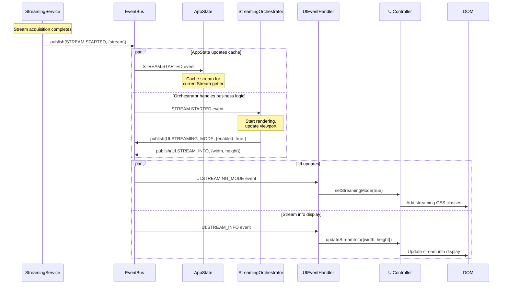

# Event-Driven Architecture

This document describes the event-driven architecture that enables decoupled communication between components in PrismGB.

## Table of Contents

1. [Overview](#overview)
2. [EventBus Implementation](#eventbus-implementation)
3. [Event Channels](#event-channels)
4. [Subscription Patterns](#subscription-patterns)
5. [Event Flow Diagram](#event-flow-diagram)
6. [Best Practices](#best-practices)

## Overview

PrismGB uses an event-driven architecture to enable decoupled publish/subscribe communication between services, orchestrators, and UI components. This pattern provides several benefits:

- **Decoupling** - Publishers don't need to know about subscribers
- **Scalability** - New subscribers can be added without modifying publishers
- **Testability** - Components can be tested in isolation by mocking the EventBus
- **Flexibility** - Event handlers can be added, removed, or modified independently

### Key Components

| Component | Purpose | Location |
|-----------|---------|----------|
| **EventBus** | Central pub/sub mechanism | `src/infrastructure/events/event-bus.js` |
| **EventChannels** | Centralized event name constants | `src/infrastructure/events/event-channels.js` |
| **BaseOrchestrator** | Auto-manages subscriptions with cleanup | `src/shared/base/orchestrator.js` |

## EventBus Implementation

Location: `/Users/josstei/Development/prismgb-workspace/prismgb-app/src/infrastructure/events/event-bus.js`

The EventBus is built on top of [eventemitter3](https://github.com/primus/eventemitter3) for efficient event handling. It provides a simple API for publishing and subscribing to events.

### API

```javascript
class EventBus {
  /**
   * Publish an event to all subscribers
   * @param {string} eventName - The name of the event
   * @param {*} data - Event data payload
   */
  publish(eventName, data)

  /**
   * Subscribe to an event
   * @param {string} eventName - The name of the event to subscribe to
   * @param {Function} handler - The callback function to handle the event
   * @returns {Function} Unsubscribe function
   */
  subscribe(eventName, handler)

  /**
   * Unsubscribe from an event
   * @param {string} eventName - The name of the event
   * @param {Function} handler - The handler function to remove
   */
  unsubscribe(eventName, handler)
}
```

### Dependency Injection

The EventBus is registered as a singleton in the service container and injected into services and orchestrators:

```javascript
// In container.js
eventBus: asClass(EventBus).singleton()

// In a service or orchestrator
constructor({ eventBus }) {
  this.eventBus = eventBus;
}
```

## Event Channels

Location: `/Users/josstei/Development/prismgb-workspace/prismgb-app/src/infrastructure/events/event-channels.js`

EventChannels provides centralized constants for all event names, preventing typos and enabling IDE autocomplete.

### Event Categories

```mermaid
graph TD
    EventChannels[EventChannels]

    EventChannels --> DEVICE[DEVICE]
    EventChannels --> STREAM[STREAM]
    EventChannels --> CAPTURE[CAPTURE]
    EventChannels --> SETTINGS[SETTINGS]
    EventChannels --> RENDER[RENDER]
    EventChannels --> UI[UI]

    DEVICE --> D1[STATUS_CHANGED]
    DEVICE --> D2[ENUMERATION_FAILED]
    DEVICE --> D3[DISCONNECTED_DURING_SESSION]

    STREAM --> S1[STARTED]
    STREAM --> S2[STOPPED]
    STREAM --> S3[ERROR]
    STREAM --> S4[HEALTH_OK]
    STREAM --> S5[HEALTH_TIMEOUT]

    CAPTURE --> C1[SCREENSHOT_READY]
    CAPTURE --> C2[RECORDING_STARTED]
    CAPTURE --> C3[RECORDING_STOPPED]
    CAPTURE --> C4[RECORDING_READY]

    SETTINGS --> SET1[VOLUME_CHANGED]
    SETTINGS --> SET2[STATUS_STRIP_CHANGED]
    SETTINGS --> SET3[RENDER_PRESET_CHANGED]

    RENDER --> R1[CAPABILITY_DETECTED]
    RENDER --> R2[PIPELINE_READY]
    RENDER --> R3[PIPELINE_ERROR]
    RENDER --> R4[STATS_UPDATE]

    UI --> U1[STATUS_MESSAGE]
    UI --> U2[DEVICE_STATUS]
    UI --> U3[OVERLAY_MESSAGE]
    UI --> U4[STREAMING_MODE]
    UI --> U5[SHUTTER_FLASH]
    UI --> U6[RECORDING_STATE]
    UI --> U7[VOLUME_LEVEL]
    UI --> U8[CINEMATIC_MODE]
    UI --> U9[FULLSCREEN_STATE]
    UI --> U10[...]
```



### Category Breakdown

#### DEVICE Events

Device connection and status events:

```javascript
EventChannels.DEVICE = {
  STATUS_CHANGED: 'device:status-changed',
  ENUMERATION_FAILED: 'device:enumeration-failed',
  DISCONNECTED_DURING_SESSION: 'device:disconnected-during-session'
}
```

#### STREAM Events

Video stream lifecycle and health events:

```javascript
EventChannels.STREAM = {
  STARTED: 'stream:started',
  STOPPED: 'stream:stopped',
  ERROR: 'stream:error',
  HEALTH_OK: 'stream:health-ok',
  HEALTH_TIMEOUT: 'stream:health-timeout'
}
```

#### CAPTURE Events

Screenshot and recording events:

```javascript
EventChannels.CAPTURE = {
  SCREENSHOT_READY: 'capture:screenshot-ready',
  RECORDING_STARTED: 'capture:recording-started',
  RECORDING_STOPPED: 'capture:recording-stopped',
  RECORDING_READY: 'capture:recording-ready'
}
```

#### SETTINGS Events

User preference and configuration events:

```javascript
EventChannels.SETTINGS = {
  VOLUME_CHANGED: 'settings:volume-changed',
  STATUS_STRIP_CHANGED: 'settings:status-strip-changed',
  RENDER_PRESET_CHANGED: 'settings:render-preset-changed'
}
```

#### RENDER Events

GPU rendering pipeline events:

```javascript
EventChannels.RENDER = {
  CAPABILITY_DETECTED: 'render:capability-detected',
  PIPELINE_READY: 'render:pipeline-ready',
  PIPELINE_ERROR: 'render:pipeline-error',
  STATS_UPDATE: 'render:stats-update'
}
```

#### UI Events

User interface update events:

```javascript
EventChannels.UI = {
  STATUS_MESSAGE: 'ui:status-message',
  DEVICE_STATUS: 'ui:device-status',
  OVERLAY_MESSAGE: 'ui:overlay-message',
  OVERLAY_VISIBLE: 'ui:overlay-visible',
  OVERLAY_ERROR: 'ui:overlay-error',
  STREAMING_MODE: 'ui:streaming-mode',
  STREAM_INFO: 'ui:stream-info',
  SHUTTER_FLASH: 'ui:shutter-flash',
  RECORD_BUTTON_POP: 'ui:record-button-pop',
  RECORD_BUTTON_PRESS: 'ui:record-button-press',
  BUTTON_FEEDBACK: 'ui:button-feedback',
  RECORDING_STATE: 'ui:recording-state',
  VOLUME_LEVEL: 'ui:volume-level',
  VOLUME_SLIDER_VISIBLE: 'ui:volume-slider-visible',
  CINEMATIC_MODE: 'ui:cinematic-mode',
  FULLSCREEN_STATE: 'ui:fullscreen-state'
}
```

### Usage

Always import and use EventChannels constants instead of string literals:

```javascript
import { EventChannels } from '@infrastructure/events/event-channels.js';

// Good - Type-safe, refactorable
this.eventBus.publish(EventChannels.STREAM.STARTED, { stream });

// Bad - Prone to typos, hard to refactor
this.eventBus.publish('stream:started', { stream });
```

## Subscription Patterns

### Manual Subscription (Services)

In services that extend `BaseService`, you need to manually manage subscriptions:

```javascript
import { BaseService } from '@shared/base/service.js';
import { EventChannels } from '@infrastructure/events/event-channels.js';

export class StreamingService extends BaseService {
  constructor(dependencies) {
    super(dependencies, ['eventBus', 'loggerFactory'], 'StreamingService');

    // Track unsubscribe functions
    this._subscriptions = [];
  }

  initialize() {
    // Subscribe to events
    const unsub = this.eventBus.subscribe(
      EventChannels.DEVICE.STATUS_CHANGED,
      (status) => this._handleDeviceStatus(status)
    );

    // Store for cleanup
    this._subscriptions.push(unsub);
  }

  cleanup() {
    // Unsubscribe from all events
    this._subscriptions.forEach(unsub => unsub());
    this._subscriptions = [];
  }
}
```

### Auto-Cleanup Subscription (Orchestrators)

Orchestrators that extend `BaseOrchestrator` can use `subscribeWithCleanup()` for automatic subscription management:

```javascript
import { BaseOrchestrator } from '@shared/base/orchestrator.js';
import { EventChannels } from '@infrastructure/events/event-channels.js';

export class StreamingOrchestrator extends BaseOrchestrator {
  constructor(dependencies) {
    super(
      dependencies,
      ['streamingService', 'uiController', 'eventBus', 'loggerFactory'],
      'StreamingOrchestrator'
    );
  }

  async onInitialize() {
    // Subscribe to multiple events with auto-cleanup
    this.subscribeWithCleanup({
      [EventChannels.STREAM.STARTED]: (data) => this._handleStreamStarted(data),
      [EventChannels.STREAM.STOPPED]: () => this._handleStreamStopped(),
      [EventChannels.STREAM.ERROR]: (error) => this._handleStreamError(error)
    });
  }

  // Cleanup handled automatically by BaseOrchestrator.cleanup()
}
```

#### How subscribeWithCleanup Works

`BaseOrchestrator` tracks all subscriptions and automatically cleans them up when `cleanup()` is called:

```javascript
// From BaseOrchestrator
subscribeWithCleanup(eventMap) {
  Object.entries(eventMap).forEach(([event, handler]) => {
    const unsubscribe = this.eventBus.subscribe(event, handler);
    this._subscriptions.push(unsubscribe);
  });
}

_cleanupSubscriptions() {
  this._subscriptions.forEach(unsubscribe => {
    if (typeof unsubscribe === 'function') {
      unsubscribe();
    }
  });
  this._subscriptions = [];
}
```

## Event Flow Diagram

This diagram shows how events flow from business logic through the EventBus to UI updates:



### Flow Breakdown

1. **Business Logic Execution** - `StreamingService.start()` completes stream acquisition
2. **Event Publication** - Service publishes `STREAM.STARTED` event via EventBus
3. **State Update** - `AppState` receives event and caches stream for `currentStream` getter
4. **Orchestration** - `StreamingOrchestrator` receives event and:
   - Starts rendering pipeline
   - Updates viewport calculations
   - Publishes UI-specific events
5. **UI Event Handling** - `UIEventHandler` receives UI events and delegates to `UIController`
6. **DOM Update** - `UIController` manipulates DOM elements

### Why This Pattern?

This multi-layer event flow provides several benefits:

- **Decoupling** - Services don't know about UI, orchestrators don't manipulate DOM
- **Testability** - Each layer can be tested independently by mocking EventBus
- **Separation of Concerns** - Business logic, coordination, and UI updates are distinct
- **State Consistency** - AppState provides single source of truth for cross-domain queries

## Best Practices

### 1. Always Use EventChannels Constants

Never use magic strings for event names:

```javascript
// Good
this.eventBus.publish(EventChannels.STREAM.STARTED, data);

// Bad
this.eventBus.publish('stream:started', data);
```

### 2. Use subscribeWithCleanup in Orchestrators

Leverage automatic cleanup in orchestrators:

```javascript
// Good - Auto-cleanup
async onInitialize() {
  this.subscribeWithCleanup({
    [EventChannels.STREAM.STARTED]: (data) => this._handleStart(data)
  });
}

// Bad - Manual tracking (use only in services)
async onInitialize() {
  const unsub = this.eventBus.subscribe(EventChannels.STREAM.STARTED, ...);
  this._subscriptions.push(unsub);
}
```

### 3. Keep Handlers Lightweight

Event handlers should delegate to methods rather than contain complex logic:

```javascript
// Good - Lightweight handler delegates to method
this.subscribeWithCleanup({
  [EventChannels.STREAM.STARTED]: (data) => this._handleStreamStarted(data)
});

_handleStreamStarted(data) {
  // Complex logic here
  this._updateViewport(data);
  this._startRendering(data);
  this._publishUIEvents(data);
}

// Bad - Complex logic in handler
this.subscribeWithCleanup({
  [EventChannels.STREAM.STARTED]: (data) => {
    // Many lines of complex logic
  }
});
```

### 4. Avoid Circular Event Chains

Be careful not to create circular event dependencies:

```javascript
// Bad - Potential infinite loop
this.subscribeWithCleanup({
  [EventChannels.STREAM.STARTED]: () => {
    // Don't publish the same event you're handling
    this.eventBus.publish(EventChannels.STREAM.STARTED);
  }
});
```

### 5. Use Descriptive Event Data

Include all relevant context in event payloads:

```javascript
// Good - Descriptive payload
this.eventBus.publish(EventChannels.STREAM.STARTED, {
  stream: mediaStream,
  deviceId: 'chromatic-001',
  capabilities: { width: 160, height: 144 }
});

// Bad - Minimal payload
this.eventBus.publish(EventChannels.STREAM.STARTED, mediaStream);
```

### 6. Document Event Payloads

Add JSDoc comments describing event data structure:

```javascript
/**
 * Publish stream started event
 * @fires EventChannels.STREAM.STARTED
 * @param {Object} data
 * @param {MediaStream} data.stream - The media stream
 * @param {string} data.deviceId - Device identifier
 * @param {Object} data.capabilities - Stream capabilities
 */
_publishStreamStarted(data) {
  this.eventBus.publish(EventChannels.STREAM.STARTED, data);
}
```

### 7. Clean Up Subscriptions

Always clean up subscriptions to prevent memory leaks:

```javascript
// In orchestrators - automatic via BaseOrchestrator
async cleanup() {
  // Calls _cleanupSubscriptions() automatically
  await super.cleanup();
}

// In services - manual cleanup required
cleanup() {
  this._subscriptions.forEach(unsub => unsub());
  this._subscriptions = [];
}
```

### 8. Use Events for Cross-Domain Communication

Use events instead of direct service calls for cross-domain communication:

```javascript
// Good - Event-based decoupling
// In CaptureOrchestrator
this.subscribeWithCleanup({
  [EventChannels.STREAM.STARTED]: (data) => {
    // Can now capture screenshots from the stream
    this._stream = data.stream;
  }
});

// Bad - Direct coupling
// In CaptureOrchestrator constructor
this.streamingOrchestrator = dependencies.streamingOrchestrator;

// In capture method
const stream = this.streamingOrchestrator.getStream();
```

### 9. Centralize State with AppState

Use AppState for cross-domain state queries instead of service-to-service calls:

```javascript
// Good - Query through AppState
get currentStream() {
  return this.appState.currentStream;
}

// Bad - Direct service dependency
get currentStream() {
  return this.streamingService.getStream();
}
```

## Summary

The event-driven architecture in PrismGB provides:

- **Decoupled communication** via EventBus pub/sub pattern
- **Type-safe event names** via EventChannels constants
- **Automatic cleanup** via BaseOrchestrator.subscribeWithCleanup()
- **Clear separation** between business logic, coordination, and UI updates
- **Testability** through event mocking and isolation

By following these patterns and best practices, you can build maintainable, testable, and scalable features that integrate seamlessly with the existing architecture.
