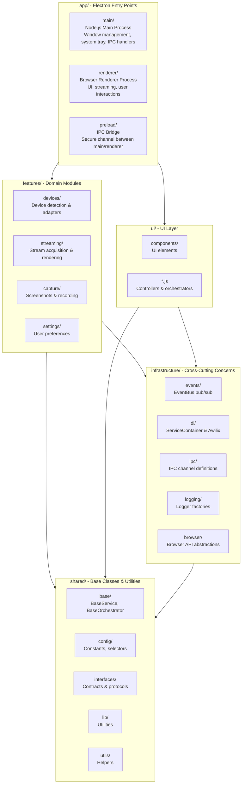
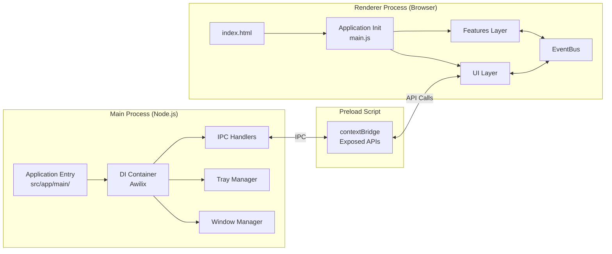
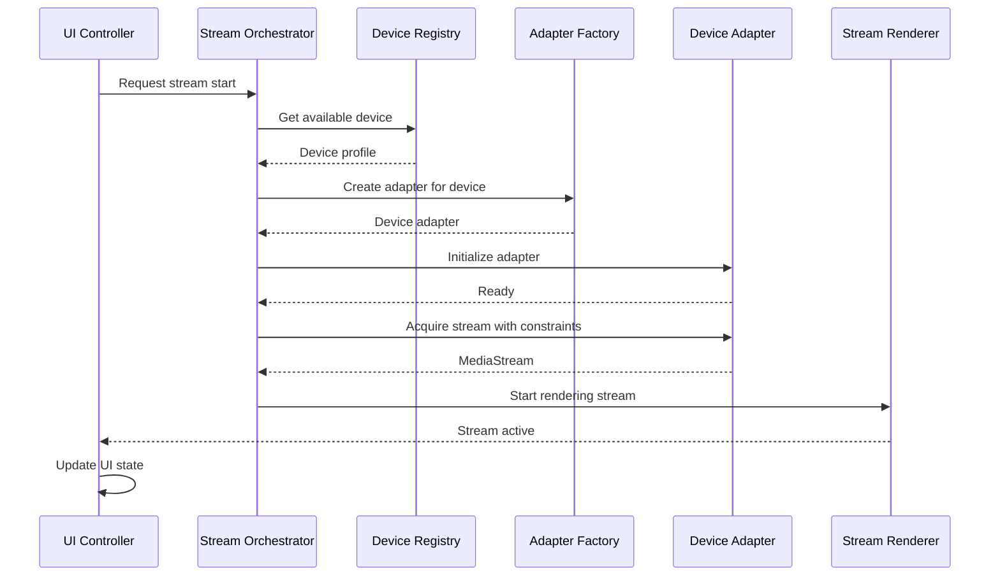
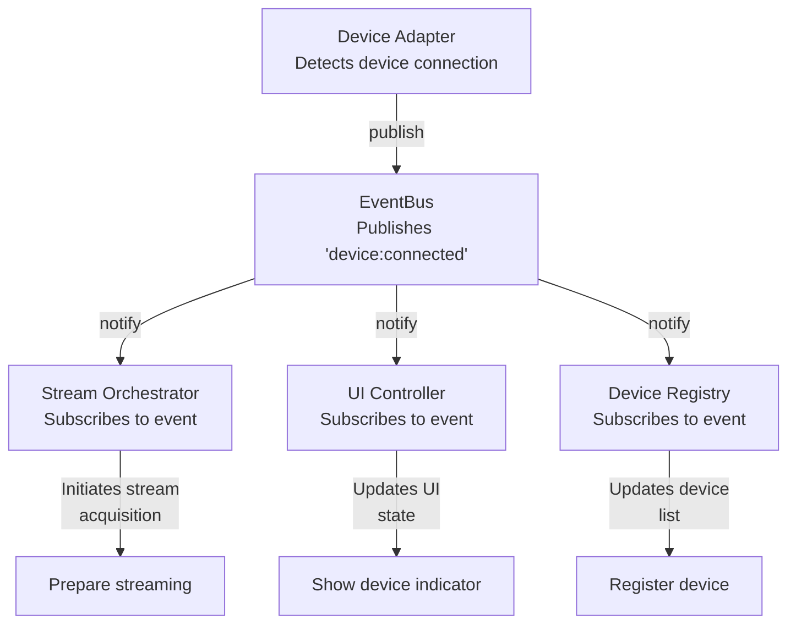

# Architecture Overview

This document provides a high-level overview of the PrismGB application architecture - an Electron desktop application for streaming and capturing video from the Mod Retro Chromatic handheld gaming device.

## Table of Contents

- [System Layer Diagram](#system-layer-diagram)
- [Directory Structure](#directory-structure)
- [Design Patterns](#design-patterns)
- [Key Architectural Decisions](#key-architectural-decisions)
- [Process Architecture](#process-architecture)
- [Data Flow](#data-flow)

## System Layer Diagram

The application is organized into five distinct layers, each with specific responsibilities:



### Layer Responsibilities

| Layer | Purpose | Examples |
|-------|---------|----------|
| **app/** | Electron process entry points and lifecycle | Window management, IPC setup, process initialization |
| **features/** | Domain-specific business logic | Device adapters, stream coordination, screenshot capture |
| **ui/** | User interface and presentation | Components, UI controllers, view orchestrators |
| **infrastructure/** | Cross-cutting technical concerns | Event bus, dependency injection, logging, IPC |
| **shared/** | Reusable code across all layers | Base classes, interfaces, constants, utilities |

## Directory Structure

```
src/
├── app/                    # Electron processes
│   ├── main/              # Node.js main process
│   │   ├── core/          # Container, app initialization
│   │   ├── windows/       # Window management
│   │   ├── tray/          # System tray integration
│   │   └── ipc/           # IPC handlers
│   ├── renderer/          # Browser renderer process
│   │   ├── index.html     # HTML entry point
│   │   └── main.js        # Renderer initialization
│   └── preload/           # IPC bridge
│       └── index.js       # Secure IPC channel exposure
│
├── features/              # Domain modules
│   ├── devices/           # Device detection & adapters
│   │   ├── adapters/      # Device-specific adapters
│   │   │   ├── base/      # BaseDeviceAdapter
│   │   │   └── chromatic/ # ChromaticAdapter
│   │   ├── profiles/      # Device configuration profiles
│   │   └── shared/        # DeviceRegistry, detection helpers
│   │
│   ├── streaming/         # Stream acquisition & rendering
│   │   ├── factories/     # AdapterFactory
│   │   ├── context/       # Stream acquisition context
│   │   ├── coordination/  # Stream coordination logic
│   │   └── renderer/      # Video rendering
│   │
│   ├── capture/           # Screenshots & recording
│   │   ├── screenshot/    # Screenshot capture
│   │   └── video/         # Video recording
│   │
│   └── settings/          # User preferences
│       └── renderer/      # Settings management
│
├── ui/                    # UI layer
│   ├── components/        # UI components
│   │   ├── canvas/        # Canvas rendering
│   │   ├── controls/      # Control panels
│   │   └── overlay/       # Overlay elements
│   ├── controllers/       # UI controllers
│   └── orchestrators/     # UI orchestration
│
├── infrastructure/        # Cross-cutting concerns
│   ├── events/           # EventBus pub/sub
│   │   ├── EventBus.js   # Core event bus implementation
│   │   └── EventChannels.js # Centralized event constants
│   │
│   ├── di/               # Dependency injection
│   │   ├── ServiceContainer.js # Renderer DI container
│   │   └── Awilix setup       # Main process DI (in app/main/core/)
│   │
│   ├── ipc/              # IPC channels
│   │   └── channels.json # Centralized channel definitions
│   │
│   ├── logging/          # Logging infrastructure
│   │   ├── LoggerFactory.js
│   │   └── Logger.js
│   │
│   └── browser/          # Browser API abstractions
│       ├── MediaStreamManager.js
│       └── CanvasRenderer.js
│
└── shared/               # Shared code
    ├── base/             # Base classes
    │   ├── BaseService.js      # Service base with dependency injection
    │   └── BaseOrchestrator.js # Orchestrator with lifecycle management
    │
    ├── config/           # Configuration & constants
    │   ├── constants.js  # Application constants
    │   ├── cssClasses.js # CSS class constants
    │   └── domSelectors.js # DOM selector constants
    │
    ├── interfaces/       # Contracts & protocols
    │   ├── IDeviceAdapter.js
    │   ├── IFallbackStrategy.js
    │   └── IStreamRenderer.js
    │
    ├── lib/              # Utilities
    │   ├── stream/       # Stream utilities
    │   └── validation/   # Validation helpers
    │
    └── utils/            # Helper functions
        ├── dom.js
        ├── timing.js
        └── errors.js
```

## Design Patterns

### Dependency Injection

The application uses dependency injection to manage service dependencies and enable testability.

**Main Process** (Node.js):
- **Framework**: Awilix
- **Container**: `src/app/main/core/container.js`
- **Services**: WindowManager, TrayManager, IPC handlers

```javascript
// Example: Awilix registration
container.register({
  windowManager: asClass(WindowManager).singleton(),
  trayManager: asClass(TrayManager).singleton()
});
```

**Renderer Process** (Browser):
- **Framework**: Custom ServiceContainer
- **Container**: `src/infrastructure/di/ServiceContainer.js`
- **Services**: Domain services, orchestrators, UI controllers

```javascript
// Example: ServiceContainer registration
container.register('deviceRegistry', () => new DeviceRegistry(dependencies));
container.register('streamOrchestrator', () => new StreamOrchestrator(dependencies));
```

### Event-Driven Architecture

Cross-service communication uses a pub/sub pattern via EventBus to maintain loose coupling.

**EventBus** (`src/infrastructure/events/EventBus.js`):
- Built on eventemitter3 for performance
- Type-safe event channels defined in EventChannels.js
- Supports wildcards and namespaced events

```javascript
// Publishing events
this.eventBus.publish('device:connected', { deviceId: 'chromatic-001' });

// Subscribing to events
this.eventBus.subscribe('device:connected', (data) => {
  console.log('Device connected:', data.deviceId);
});

// Namespaced events
this.eventBus.publish('stream:state:changed', { state: 'active' });
```

**EventChannels** (`src/infrastructure/events/EventChannels.js`):
- Centralized event name constants
- Prevents typos and improves discoverability
- Organized by domain

```javascript
export const EventChannels = {
  DEVICE: {
    CONNECTED: 'device:connected',
    DISCONNECTED: 'device:disconnected'
  },
  STREAM: {
    STATE_CHANGED: 'stream:state:changed',
    ERROR: 'stream:error'
  }
};
```

### Orchestrator Pattern

Orchestrators coordinate multiple services to accomplish complex workflows while keeping individual services focused.

**BaseOrchestrator** (`src/shared/base/BaseOrchestrator.js`):
- Provides lifecycle management (initialize/cleanup)
- Automatic event subscription cleanup
- Dependency validation

```javascript
import { BaseOrchestrator } from '@/shared/base/BaseOrchestrator.js';

export class StreamOrchestrator extends BaseOrchestrator {
  constructor(dependencies) {
    super(dependencies, ['eventBus', 'loggerFactory', 'deviceRegistry'], 'StreamOrchestrator');
  }

  async onInitialize() {
    // Subscribe to events with automatic cleanup
    this.subscribeWithCleanup({
      'device:connected': (data) => this.handleDeviceConnected(data),
      'stream:error': (data) => this.handleStreamError(data)
    });
  }

  async onCleanup() {
    // Custom cleanup logic
    await this.stopAllStreams();
  }
}
```

### Adapter Pattern

Device-specific implementations conform to common interfaces, enabling polymorphic device handling.

**IDeviceAdapter** (`src/shared/interfaces/IDeviceAdapter.js`):
- Defines contract for device communication
- Implemented by BaseDeviceAdapter and device-specific adapters

```javascript
// Device adapter hierarchy
IDeviceAdapter (interface)
  └── BaseDeviceAdapter (abstract base)
      └── ChromaticAdapter (concrete implementation)
```

**Usage**:
```javascript
// Factory creates appropriate adapter based on device
const adapter = adapterFactory.createAdapter(device);
await adapter.initialize();
const stream = await adapter.acquireStream(constraints);
```

### Facade Pattern

Complex subsystems are simplified through unified interfaces.

**UIController** (`src/ui/controllers/UIController.js`):
- Single entry point for UI operations
- Hides complexity of multiple UI components
- Coordinates UI state updates

**AppState** (`src/infrastructure/state/AppState.js`):
- Centralized application state management
- Event-driven state updates
- Single source of truth for app state

## Key Architectural Decisions

### 1. Process Separation for Security

**Decision**: Use Electron's process isolation with `nodeIntegration: false`.

**Rationale**:
- Prevents renderer process from directly accessing Node.js APIs
- Reduces attack surface for XSS vulnerabilities
- Follows Electron security best practices

**Implementation**:
- All Node.js operations occur in main process
- Renderer communicates via IPC through preload script
- Preload exposes only necessary APIs via contextBridge

```javascript
// src/app/preload/index.js
contextBridge.exposeInMainWorld('api', {
  devices: {
    getConnectedDevices: () => ipcRenderer.invoke('devices:getConnected')
  }
});
```

### 2. Domain-Driven Feature Modules

**Decision**: Organize code by domain/feature rather than technical layer.

**Rationale**:
- Improves discoverability - related code lives together
- Enables feature-level encapsulation
- Supports incremental migration and refactoring
- Aligns with business capabilities

**Structure**:
```
features/
├── devices/     # Everything related to device management
├── streaming/   # Everything related to video streaming
├── capture/     # Everything related to capture functionality
└── settings/    # Everything related to user preferences
```

### 3. Base Classes with Lifecycle Management

**Decision**: Provide BaseService and BaseOrchestrator with standardized lifecycles.

**Rationale**:
- Enforces consistent initialization/cleanup patterns
- Reduces boilerplate in service implementations
- Prevents resource leaks through automatic cleanup
- Simplifies testing with predictable lifecycle hooks

**Lifecycle**:
```javascript
// Standard lifecycle
constructor() → initialize() → onInitialize() → [active] → cleanup() → onCleanup()
```

**Benefits**:
- Automatic dependency validation in constructor
- Event subscription cleanup via subscribeWithCleanup()
- Logger setup with service-specific context
- Error handling and logging built-in

### 4. Centralized Constants

**Decision**: Define all magic strings and selectors as named constants.

**Rationale**:
- Eliminates typos and runtime errors
- Improves IDE autocomplete and refactoring
- Creates single source of truth
- Documents available options

**Examples**:
```javascript
// src/shared/config/cssClasses.js
export const CssClasses = {
  HIDDEN: 'hidden',
  ACTIVE: 'active',
  ERROR: 'error'
};

// src/shared/config/domSelectors.js
export const DomSelectors = {
  CANVAS: '#gameCanvas',
  CONTROLS: '#controls',
  STATUS: '#statusBar'
};

// src/infrastructure/events/EventChannels.js
export const EventChannels = {
  DEVICE: {
    CONNECTED: 'device:connected'
  }
};

// src/infrastructure/ipc/channels.json
{
  "DEVICES_GET_CONNECTED": "devices:getConnected"
}
```

### 5. Event-Driven Communication

**Decision**: Use EventBus for all cross-service communication instead of direct method calls.

**Rationale**:
- Decouples services - they don't need references to each other
- Enables multiple consumers of same event
- Supports adding new features without modifying existing code
- Facilitates testing - can verify events published/consumed

**Pattern**:
```javascript
// Service A publishes
this.eventBus.publish('device:connected', { deviceId });

// Service B subscribes (no coupling to Service A)
this.eventBus.subscribe('device:connected', this.handleDeviceConnected);
```

## Process Architecture

### Electron Multi-Process Model



### Process Communication

**Main to Renderer**:
```javascript
// Main process sends to specific window
mainWindow.webContents.send('device:status', { connected: true });
```

**Renderer to Main**:
```javascript
// Renderer invokes via exposed API
const devices = await window.api.devices.getConnectedDevices();
```

**Renderer Internal**:
```javascript
// Via EventBus (no IPC overhead)
eventBus.publish('ui:theme:changed', { theme: 'dark' });
```

## Data Flow

### Stream Acquisition Flow



### Event Flow Example



## Related Documentation

- [Dependency Injection](./dependency-injection.md) - Detailed DI patterns and container usage
- [Event System](./event-system.md) - EventBus API and event patterns
- [Domain Architecture](./domains/) - Domain-specific architecture docs
- [Testing Guide](../testing/guide.md) - Testing strategies and patterns

## Glossary

| Term | Definition |
|------|------------|
| **Adapter** | Device-specific implementation of IDeviceAdapter interface |
| **EventBus** | Pub/sub event system for cross-service communication |
| **Orchestrator** | Coordinator that manages multiple services for complex workflows |
| **Service** | Encapsulated business logic component with single responsibility |
| **Main Process** | Node.js process managing windows, system integration, native APIs |
| **Renderer Process** | Browser process running UI and application logic |
| **Preload Script** | Bridge script exposing safe IPC APIs to renderer |
| **IPC** | Inter-Process Communication between main and renderer processes |
