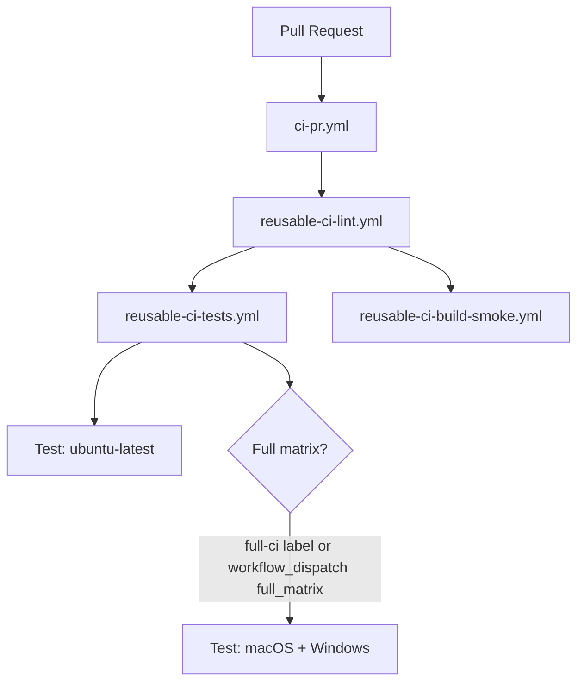
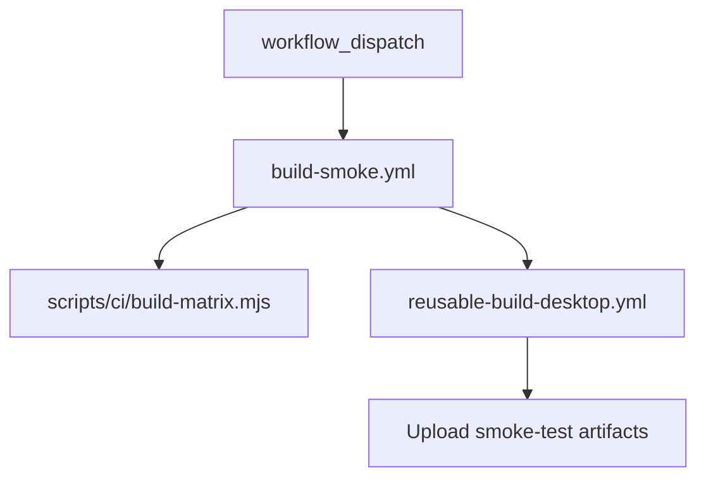
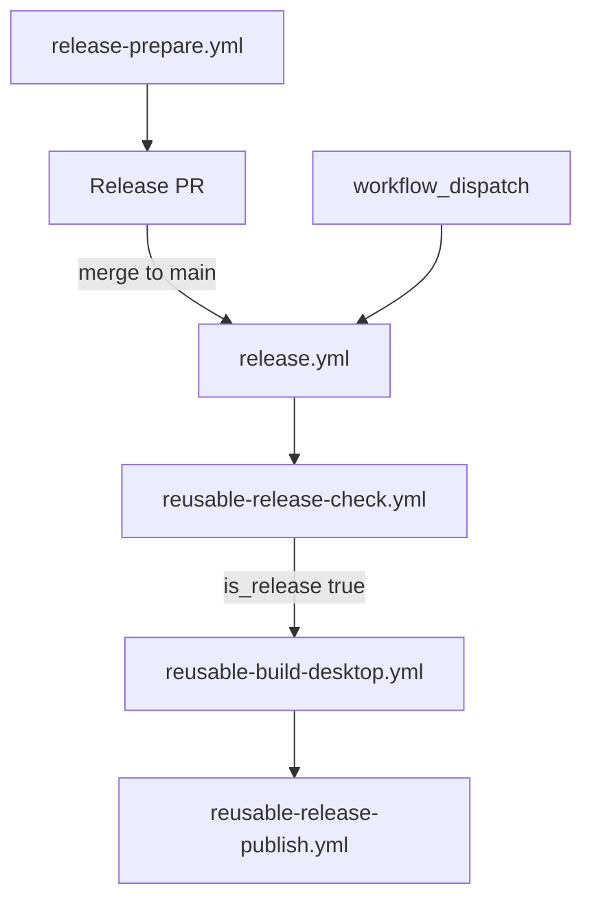
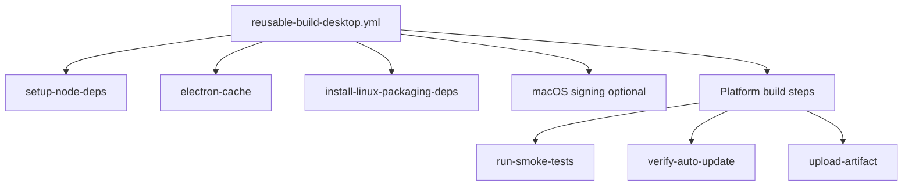
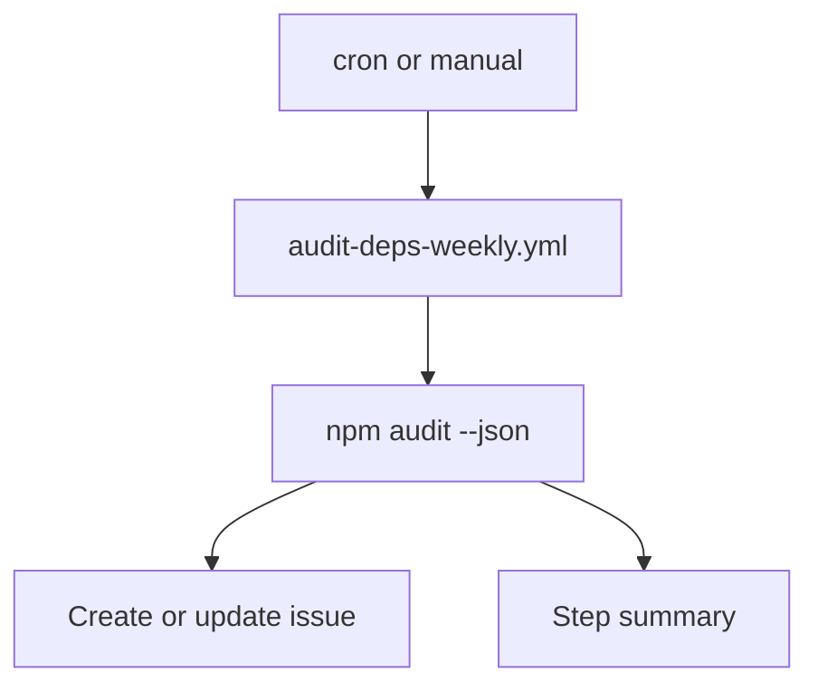
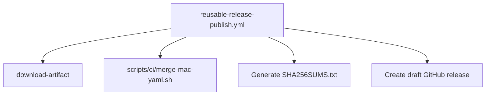

# CI/CD Workflows

This document describes the GitHub Actions workflows, reusable components, and shared scripts that power PrismGB CI/CD.

Related docs:
- `DEVELOPMENT.md`
- `CONTRIBUTING.md`
- `docs/naming-conventions.md`

## Entry Point Workflows

| Workflow | Trigger | Purpose |
| --- | --- | --- |
| `ci-pr.yml` | pull_request, workflow_dispatch | PR lint, tests, optional full OS matrix, and Vite build smoke test. |
| `build-smoke.yml` | workflow_dispatch | Manual packaging build and smoke tests across selected platforms. |
| `release-prepare.yml` | workflow_dispatch | Creates a release PR and bumps version. |
| `release.yml` | push to main (package.json), workflow_dispatch | Tags releases, builds artifacts, and publishes a draft release. |
| `audit-deps-weekly.yml` | schedule, workflow_dispatch | Runs `npm audit` and opens/updates issues for vulnerabilities. |
| `dependabot-automerge.yml` | pull_request | Auto-merges patch updates and labels minor/major updates. |
| `labels-sync.yml` | push to main (labels), workflow_dispatch | Syncs GitHub labels from `.github/labels.yml`. |

## Reusable Workflows

| Workflow | Purpose |
| --- | --- |
| `reusable-ci-lint.yml` | PR title validation and commit linting. |
| `reusable-ci-tests.yml` | Linux test run, optional macOS/Windows matrix. |
| `reusable-ci-build-smoke.yml` | Vite-only build smoke check. |
| `reusable-release-check.yml` | Detects release commits, tags, audits, and emits build matrix JSON. |
| `reusable-build-desktop.yml` | Cross-platform build, smoke tests, artifact upload. |
| `reusable-release-publish.yml` | Assembles artifacts and creates draft GitHub release. |

## Composite Actions

| Action | Purpose |
| --- | --- |
| `.github/actions/setup-node-deps` | Node setup, cache, and platform dependencies. |
| `.github/actions/electron-cache` | Electron/electron-builder cache handling. |
| `.github/actions/install-linux-packaging-deps` | Linux packaging toolchain and optional `fpm`. |
| `.github/actions/install-linux-fuse` | Install FUSE for AppImage smoke tests. |
| `.github/actions/run-smoke-tests` | Cross-platform smoke tests with xvfb on Linux. |
| `.github/actions/verify-auto-update` | Prints auto-update YAML files after builds. |

## Shared Scripts

| Script | Purpose |
| --- | --- |
| `scripts/ci/build-matrix.mjs` | Generates the OS/arch build matrix for release and smoke builds (Linux x64/ARM64, macOS x64/ARM64, Windows x64). |
| `scripts/ci/merge-mac-yaml.sh` | Merges per-arch macOS update YAML files into one. |

## PR Validation Flow (`ci-pr.yml`)

## Manual Build Smoke Flow (`build-smoke.yml`)

## Release Flow (`release-prepare.yml` -> `release.yml`)

## Desktop Build Detail (`reusable-build-desktop.yml`)

## Weekly Audit Flow (`audit-deps-weekly.yml`)

## Release Publish Detail (`reusable-release-publish.yml`)

## Naming and Conventions

- Entry points use kebab-case scope naming: `ci-pr.yml`, `build-smoke.yml`, `release-prepare.yml`.
- Reusable workflows are prefixed with `reusable-`.
- Shared build logic lives in composite actions and scripts to reduce drift.
