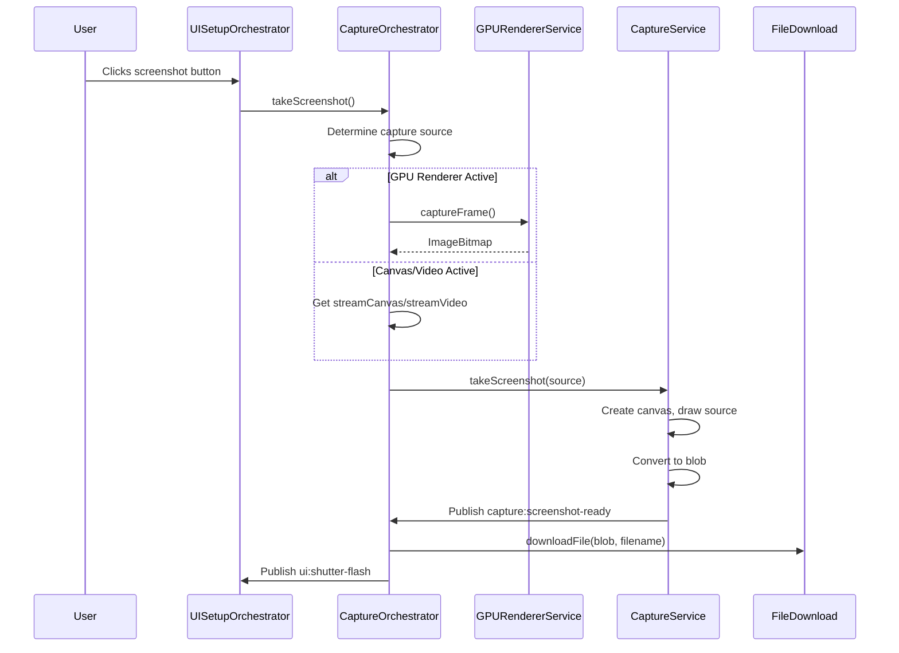
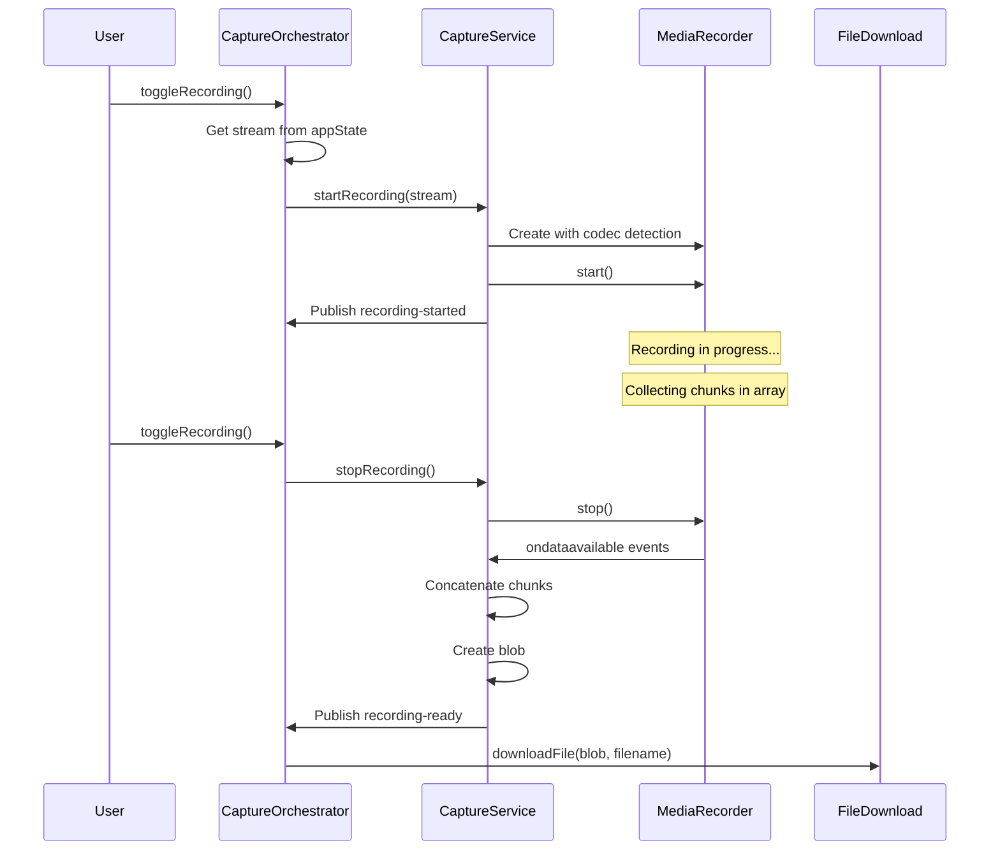

# Capture System Documentation

## 1. Overview

The capture system provides screenshot and video recording capabilities from the active video stream. It supports multiple capture sources (GPU-rendered frames, canvas elements, and raw video elements) and handles codec selection, file generation, and user feedback.

## 2. CaptureService

**Location:** `src/features/capture/services/capture.service.js`

Extends `BaseService` and provides UI-agnostic capture functionality.

### Screenshot Capabilities

- **Supported Sources:**
  - `HTMLVideoElement` - Raw video stream
  - `HTMLCanvasElement` - Canvas-rendered stream
  - `ImageBitmap` - GPU-buffered frames

- **Process:**
  1. Creates temporary canvas element
  2. Draws source to canvas context
  3. Converts canvas to blob (PNG format)
  4. Generates filename with timestamp

### Recording Capabilities

- **Technology:** MediaRecorder API
- **Codec Fallback Strategy:** VP9 → VP8 → WebM (in order of preference)
- **State Management:** `isRecording` boolean property
- **Methods:**
  - `startRecording(stream)` - Initiates recording from MediaStream
  - `stopRecording()` - Stops recording and generates file
  - `toggleRecording(stream)` - Convenience method to start/stop

### Events Published

```javascript
// Screenshot complete
'capture:screenshot-ready'
// Payload: { blob, filename }

// Recording started
'capture:recording-started'

// Recording stopped
'capture:recording-stopped'

// Recording file ready
'capture:recording-ready'
// Payload: { blob, filename }
```

## 3. CaptureOrchestrator

**Location:** `src/features/capture/services/capture.orchestrator.js`

Coordinates capture operations with intelligent source selection and user feedback.

### Source Selection Logic

The orchestrator determines the optimal capture source based on the active renderer:

- **GPU Renderer Active** → Capture from GPU worker (buffered `ImageBitmap`)
- **Canvas Renderer Active** → Capture from `streamCanvas` element
- **No Active Renderer** → Capture from `streamVideo` element (raw stream)

### Features

- **Visual Feedback:** Triggers shutter flash animation via `ui:shutter-flash` event
- **Auto-Download:** Automatically downloads captured files using `downloadFile()` utility
- **Recording State UI:** Updates application state and UI during recording

## 4. Screenshot Capture Flow



## 5. Recording Flow



### Recording Process Details

1. **Initialization:**
   - `toggleRecording()` called by user interaction
   - Retrieves current stream from `appState.currentStream`
   - Creates `MediaRecorder` instance with codec detection

2. **Recording:**
   - Collects data chunks in array as they become available
   - Maintains `isRecording` state for UI feedback

3. **Finalization:**
   - Concatenates all chunks into single blob
   - Generates timestamped filename
   - Publishes `capture:recording-ready` event
   - Triggers automatic download

## 6. Key Files

| File | Purpose |
|------|---------|
| `src/features/capture/services/capture.service.js` | Core capture logic (screenshots, recording) |
| `src/features/capture/services/capture.orchestrator.js` | Coordinates capture with source selection and UI feedback |
| `src/shared/lib/file-download.js` | Browser download utility |
| `src/shared/utils/filename-generator.js` | Timestamp-based filename generation |

## 7. Integration Points

### Required Dependencies

The capture system requires the following services:

- **EventBus** - For publishing capture events
- **AppState** - For accessing current stream and renderer state
- **GPURendererService** (optional) - For GPU-accelerated frame capture
- **LoggerFactory** - For diagnostic logging

### Event Subscriptions

The CaptureOrchestrator subscribes to application events but primarily responds to direct method calls from UI components.

### UI Integration

UI components trigger capture operations by calling methods on the CaptureOrchestrator:

```javascript
// Screenshot
captureOrchestrator.takeScreenshot();

// Recording toggle
captureOrchestrator.toggleRecording();
```

## 8. Technical Considerations

### Browser Compatibility

- **MediaRecorder API:** Supported in modern browsers (Chrome, Firefox, Edge)
- **Codec Support:** VP9 preferred, fallback to VP8 or basic WebM
- **Canvas API:** Universal support for screenshot functionality

### Performance

- **GPU Capture:** Minimal overhead when capturing from GPU-buffered frames
- **Canvas Capture:** Low overhead, synchronous operation
- **Video Capture:** Slightly higher overhead due to video element state

### File Formats

- **Screenshots:** PNG format for lossless quality
- **Recordings:** WebM container with VP8/VP9 codec
