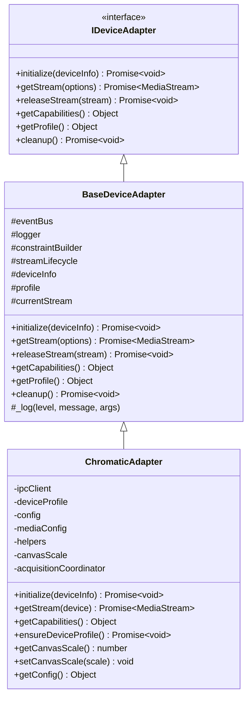
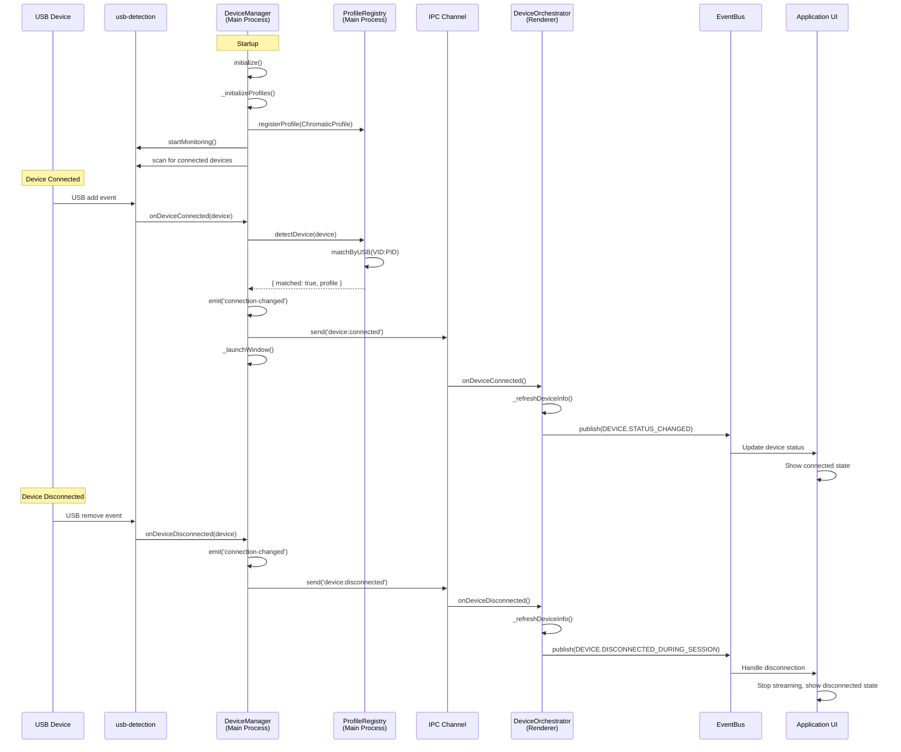

# Device Detection and Adapter System

## 1. Overview

The device detection and adapter system manages USB device monitoring, device-specific adapters, and media stream acquisition for supported gaming devices. The system is designed to:

- Detect supported USB devices in real-time
- Match devices to appropriate profiles and adapters
- Provide device-specific media stream acquisition
- Support extensibility for new device types

The architecture separates concerns between:
- **Main Process**: USB monitoring and device detection
- **Renderer Process**: Stream acquisition and device-specific behavior

## 2. Device Adapter Hierarchy

The adapter system uses a three-layer class hierarchy:



### IDeviceAdapter Interface

Location: `/Users/josstei/Development/prismgb-workspace/prismgb-app/src/shared/interfaces/device-adapter.interface.js`

All device adapters must implement these methods:

- `initialize(deviceInfo)` - Initialize adapter with device information
- `getStream(options)` - Acquire a media stream from the device
- `releaseStream(stream)` - Release and cleanup a media stream
- `getCapabilities()` - Return device capabilities (audio, video, resolution)
- `getProfile()` - Return device profile configuration
- `cleanup()` - Cleanup adapter resources

### BaseDeviceAdapter

Location: `/Users/josstei/Development/prismgb-workspace/prismgb-app/src/features/devices/adapters/base.adapter.js`

Provides common functionality for all device adapters:

- **Stream Management**: Uses `streamLifecycle` for acquiring and releasing streams
- **Constraint Building**: Uses `constraintBuilder` to create device-specific media constraints
- **Event Integration**: Integrates with `eventBus` for cross-service communication
- **Logging**: Provides logging infrastructure via injected `logger`

The base implementation creates an `AcquisitionContext` with device identity and profile, builds constraints, and acquires streams through the stream lifecycle service.

### ChromaticAdapter

Location: `/Users/josstei/Development/prismgb-workspace/prismgb-app/src/features/devices/adapters/chromatic/chromatic.adapter.js`

Adapter for the Mod Retro Chromatic device:

- **Native Resolution**: 160x144 (Game Boy Color resolution)
- **Canvas Scaling**: Supports 1x-8x scaling for pixel-perfect rendering
- **Audio Support**: Full stereo audio with device-aware fallback
- **Acquisition Strategy**: Uses `StreamAcquisitionCoordinator` with `DeviceAwareFallbackStrategy`
- **IPC Integration**: Communicates with main process for device profiles

## 3. DeviceRegistry

Location: `/Users/josstei/Development/prismgb-workspace/prismgb-app/src/features/devices/shared/device-registry.js`

The DeviceRegistry is a singleton registry containing all supported devices. It provides:

### Registration API

- `register(deviceEntry)` - Register a new device
- `unregister(id)` - Remove a device from registry
- `get(id)` - Get device entry by ID
- `getAll()` - Get all registered devices
- `getProfileClass(deviceId)` - Get ProfileClass constructor
- `getAdapterClass(deviceId)` - Get AdapterClass constructor

### Device Entry Structure

Each device entry contains:

```javascript
{
  id: 'chromatic-mod-retro',           // Unique identifier
  name: 'Mod Retro Chromatic',         // Display name
  manufacturer: 'ModRetro',            // Manufacturer name
  enabled: true,                        // Whether device is enabled
  usb: {
    vendorId: 0x374e,                   // USB Vendor ID (14158 decimal)
    productId: 0x0101                   // USB Product ID (257 decimal)
  },
  labelPatterns: [                      // Patterns for label matching
    'chromatic',
    'modretro',
    'mod retro',
    '374e:0101'
  ],
  profileModule: '@features/devices/...',  // Module path for profile
  adapterModule: '@features/devices/...',  // Module path for adapter
  ProfileClass: ChromaticProfile,       // Profile class constructor
  AdapterClass: ChromaticAdapter        // Adapter class constructor
}
```

### Built-in Devices

The registry ships with the Chromatic device pre-registered:

- **Device ID**: `chromatic-mod-retro`
- **USB VID:PID**: `0x374e:0x0101`
- **Profile**: ChromaticProfile
- **Adapter**: ChromaticAdapter

## 4. DeviceProfile

Location: `/Users/josstei/Development/prismgb-workspace/prismgb-app/src/features/devices/shared/device-profile.js`

DeviceProfile is the base class for device-specific profiles. Profiles store all device configuration:

### Profile Structure

```javascript
{
  // Identity
  id: 'chromatic-mod-retro',
  name: 'Mod Retro Chromatic',
  manufacturer: 'ModRetro',
  version: '1.0.0',

  // USB Detection
  usbIdentifiers: [
    { vendorId: 0x374e, productId: 0x0101, deviceClass: 239 }
  ],

  // Display Capabilities
  display: {
    nativeResolution: { width: 160, height: 144 },
    supportedResolutions: [...],
    aspectRatio: 1.1111,
    pixelPerfect: true
  },

  // Media Constraints
  media: {
    video: { width: { exact: 160 }, height: { exact: 144 }, ... },
    audio: {
      full: { echoCancellation: false, ... },
      simple: { echoCancellation: false, ... }
    },
    fallbackStrategy: 'audio-simple'
  },

  // Device Capabilities
  capabilities: [
    'video-capture',
    'audio-capture',
    'screenshot',
    'recording'
  ],

  // Rendering Configuration
  rendering: {
    canvasScale: 4,
    imageSmoothing: false,
    preferredRenderer: 'canvas'
  },

  // Behavior
  behavior: {
    autoLaunchDelay: 500,
    requiresStrictMode: true,
    allowFallback: false
  },

  // Metadata
  metadata: {
    description: '...',
    website: '...',
    supportContact: '...',
    documentation: '...'
  }
}
```

### Profile Methods

- `matchesUSB(device)` - Check if USB device matches this profile
- `hasCapability(capability)` - Check if capability is supported
- `getMediaConstraints(deviceId)` - Get media constraints for device
- `getResolutionByScale(scale)` - Calculate scaled resolution
- `toJSON()` - Serialize profile
- `getInfo()` - Get profile summary for display

### ChromaticProfile

Location: `/Users/josstei/Development/prismgb-workspace/prismgb-app/src/features/devices/adapters/chromatic/chromatic.profile.js`

The Chromatic profile extends DeviceProfile with:

- **Native Resolution**: 160x144 (Game Boy Color)
- **USB Identifiers**: VID 0x374e, PID 0x0101
- **Capabilities**: video-capture, audio-capture, screenshot, recording
- **Rendering**: 4x canvas scale by default, no image smoothing (pixel-perfect)
- **Fallback Strategy**: audio-simple (graceful degradation if full audio fails)

## 5. Device Detection Flow

The device detection system coordinates between main and renderer processes:



### Main Process Flow

1. **Initialization**:
   - `DeviceManager.initialize()` loads profiles from registry
   - Creates `ChromaticProfile` instance
   - Registers profile with `ProfileRegistry`
   - Indexes USB identifiers for fast lookup

2. **USB Monitoring**:
   - `usbDetection.startMonitoring()` begins USB event monitoring
   - Initial scan checks for already-connected devices
   - Listens for 'add' and 'remove' events

3. **Device Connection**:
   - USB 'add' event fires when device connects
   - `DeviceManager.onDeviceConnected()` receives event
   - `ProfileRegistry.detectDevice()` matches VID:PID against indexed profiles
   - If matched, emit 'connection-changed' event
   - Send IPC notification to renderer process
   - Auto-launch window after configured delay

4. **Device Disconnection**:
   - USB 'remove' event fires when device disconnects
   - `DeviceManager.onDeviceDisconnected()` receives event
   - Update connection status
   - Emit 'connection-changed' event
   - Send IPC notification to renderer process

### Renderer Process Flow

5. **IPC Event Handling**:
   - `DeviceOrchestrator` sets up IPC listeners on initialization
   - `window.deviceAPI.onDeviceConnected()` receives connection events
   - `window.deviceAPI.onDeviceDisconnected()` receives disconnection events

6. **Status Updates**:
   - `DeviceOrchestrator._refreshDeviceInfo()` queries main process for current status
   - `DeviceService.updateDeviceStatus()` fetches and caches device info
   - Publishes `DEVICE.STATUS_CHANGED` event via EventBus

7. **Stream Acquisition**:
   - When streaming starts, adapter is created from registry
   - `ChromaticAdapter` initialized with device info
   - `getStream()` creates `AcquisitionContext` with device ID and profile
   - `StreamAcquisitionCoordinator` acquires stream with fallback support

8. **UI Updates**:
   - `AppOrchestrator` subscribes to device events
   - Updates UI state based on connection status
   - Handles disconnection during active streaming sessions

## 6. Key Files

### Main Process

| File | Purpose |
|------|---------|
| `/src/features/devices/main/device.manager.js` | USB monitoring, device connection/disconnection handling |
| `/src/features/devices/main/profile.registry.js` | Profile registration, USB-based device matching |

### Renderer Process

| File | Purpose |
|------|---------|
| `/src/features/devices/services/device.orchestrator.js` | IPC event coordination, status updates |
| `/src/features/devices/services/device.service.js` | Device enumeration, status queries |

### Shared

| File | Purpose |
|------|---------|
| `/src/features/devices/shared/device-registry.js` | Central device registry, profile/adapter lookups |
| `/src/features/devices/shared/device-profile.js` | Base profile class, configuration management |
| `/src/features/devices/shared/device-detection.js` | Device detection utilities |
| `/src/features/devices/shared/device-iterator.js` | Registry iteration helpers |

### Adapters

| File | Purpose |
|------|---------|
| `/src/features/devices/adapters/base.adapter.js` | Base adapter with common functionality |
| `/src/features/devices/adapters/chromatic/chromatic.adapter.js` | Chromatic-specific adapter implementation |
| `/src/features/devices/adapters/chromatic/chromatic.profile.js` | Chromatic device profile |
| `/src/features/devices/adapters/chromatic/chromatic.config.js` | Chromatic configuration constants |

### Interfaces

| File | Purpose |
|------|---------|
| `/src/shared/interfaces/device-adapter.interface.js` | IDeviceAdapter interface definition |

## 7. Adding a New Device

To add support for a new device:

### Step 1: Create Device Profile

Create a new profile class extending `DeviceProfile`:

```javascript
// src/features/devices/adapters/mydevice/mydevice.profile.js
import { DeviceProfile } from '../../shared/device-profile.js';

export class MyDeviceProfile extends DeviceProfile {
  constructor(logger = null) {
    const profileConfig = {
      id: 'mydevice-manufacturer',
      name: 'My Device',
      manufacturer: 'Manufacturer',
      version: '1.0.0',
      usbIdentifiers: [
        { vendorId: 0x1234, productId: 0x5678 }
      ],
      display: {
        nativeResolution: { width: 320, height: 240 },
        aspectRatio: 4/3,
        pixelPerfect: true
      },
      media: {
        video: { width: { exact: 320 }, height: { exact: 240 } },
        audio: { full: { ... }, simple: { ... } }
      },
      capabilities: ['video-capture', 'screenshot'],
      rendering: { canvasScale: 3, imageSmoothing: false },
      behavior: { autoLaunchDelay: 500 },
      metadata: { description: 'My gaming device' }
    };

    super(profileConfig, logger);
  }
}
```

### Step 2: Create Device Adapter

Create an adapter extending `BaseDeviceAdapter`:

```javascript
// src/features/devices/adapters/mydevice/mydevice.adapter.js
import { BaseDeviceAdapter } from '../base.adapter.js';

export class MyDeviceAdapter extends BaseDeviceAdapter {
  constructor(dependencies) {
    super(dependencies);
    // Add device-specific initialization
  }

  async initialize(deviceInfo) {
    await super.initialize(deviceInfo);
    // Add device-specific setup
  }

  async getStream(options = {}) {
    // Device-specific stream acquisition
    return super.getStream(options);
  }

  getCapabilities() {
    const base = super.getCapabilities();
    return {
      ...base,
      // Add device-specific capabilities
    };
  }
}
```

### Step 3: Register Device

Add device to the registry:

```javascript
// src/features/devices/shared/device-registry.js
import { MyDeviceProfile } from '../adapters/mydevice/mydevice.profile.js';
import { MyDeviceAdapter } from '../adapters/mydevice/mydevice.adapter.js';

const BUILT_IN_DEVICES = [
  // ... existing devices
  {
    id: 'mydevice-manufacturer',
    name: 'My Device',
    manufacturer: 'Manufacturer',
    enabled: true,
    usb: {
      vendorId: 0x1234,
      productId: 0x5678
    },
    labelPatterns: ['mydevice', 'manufacturer'],
    profileModule: '@features/devices/adapters/mydevice/mydevice.profile.js',
    adapterModule: '@features/devices/adapters/mydevice/mydevice.adapter.js',
    ProfileClass: MyDeviceProfile,
    AdapterClass: MyDeviceAdapter
  }
];
```

The device will now be automatically detected when connected via USB and handled by the system.

## 8. Testing

Device-related tests are located in:

- `/tests/unit/features/devices/adapters/` - Adapter tests
- `/tests/unit/features/devices/services/` - Service and orchestrator tests
- `/tests/unit/features/devices/shared/` - Registry and profile tests

Run device tests:

```bash
npm run test:unit -- tests/unit/features/devices
```

## 9. Configuration

Device-related configuration:

```javascript
// src/shared/config/config-loader.js
{
  DEVICE_LAUNCH_DELAY: 500,  // Delay before auto-launching window (ms)
  USB_SCAN_DELAY: 1000       // Delay for initial USB scan (ms)
}
```

## 10. Troubleshooting

### Device Not Detected

1. Check USB VID:PID matches profile configuration
2. Verify ProfileRegistry has registered the profile
3. Check DeviceManager logs for USB events
4. Ensure USB monitoring is started

### Stream Acquisition Fails

1. Verify device profile has correct media constraints
2. Check browser permissions for camera/microphone access
3. Ensure device is not in use by another application
4. Review fallback strategy configuration

### Multiple Devices

The current implementation supports one device at a time. The first matched device will be connected. To support multiple devices simultaneously, the system would need:

- Device instance management
- Per-device stream coordination
- UI for device selection
