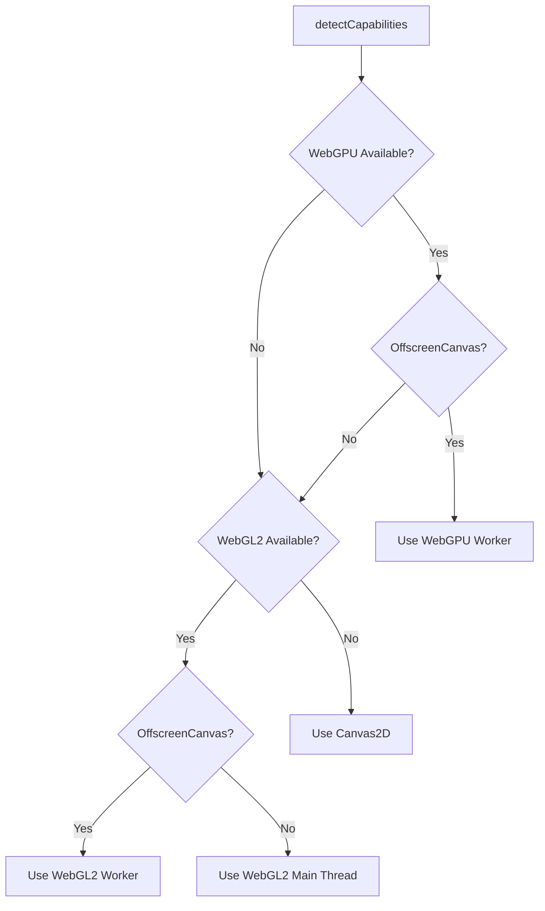
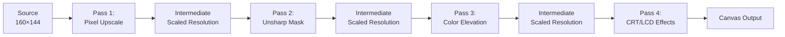

# Rendering System

The GPU/Canvas rendering system is the most sophisticated component of PrismGB, providing hardware-accelerated visual enhancement for Game Boy Color video streams.

## Overview

PrismGB implements a multi-tier rendering pipeline with automatic fallback:

- **Primary**: WebGPU with 4-pass shader pipeline (worker thread)
- **Fallback 1**: WebGL2 with 4-pass shader pipeline (worker thread)
- **Fallback 2**: WebGL2 main thread (if OffscreenCanvas unavailable)
- **Final Fallback**: Canvas2D (software rendering)

The GPU renderer transforms the native 160x144 pixel stream into enhanced, upscaled output through a sophisticated shader pipeline.

## Architecture

### File Structure

```
src/features/streaming/rendering/
├── gpu/
│   ├── capability.detector.js      # GPU feature detection
│   └── gpu.renderer.service.js     # Main thread GPU orchestration
├── workers/
│   ├── render.worker.js            # Worker thread renderer (WebGPU/WebGL2)
│   └── worker.protocol.js          # Main ↔ Worker communication protocol
├── shaders/
│   ├── webgpu/                     # WGSL shader sources
│   │   ├── pixel-upscale.wgsl
│   │   ├── unsharp-mask.wgsl
│   │   ├── color-elevation.wgsl
│   │   └── crt-lcd.wgsl
│   └── webgl2/                     # GLSL shader sources
│       ├── common.vert.glsl
│       ├── pixel-upscale.frag.glsl
│       ├── unsharp-mask.frag.glsl
│       ├── color-elevation.frag.glsl
│       └── crt-lcd.frag.glsl
├── presets/
│   └── render.presets.js           # Shader configuration presets
└── canvas.renderer.js              # Canvas2D fallback renderer
```

## Capability Detection

### Detection Flow



### Capability Detector

Location: `/src/features/streaming/rendering/gpu/capability.detector.js`

Detects available rendering APIs and determines the optimal pipeline:

```javascript
const capabilities = await detectCapabilities();
// Returns:
// {
//   webgpu: boolean,
//   webgl2: boolean,
//   offscreenCanvas: boolean,
//   transferControlToOffscreen: boolean,
//   maxTextureSize: number,
//   preferredAPI: 'webgpu' | 'webgl2' | 'canvas2d',
//   webgpuLimits: {...} | null,
//   webgl2Info: {...} | null
// }
```

Detection logic:

1. **WebGPU**: Request adapter with high-performance preference, validate device creation
2. **WebGL2**: Create test context, query texture limits and GPU info
3. **OffscreenCanvas**: Check for `transferControlToOffscreen()` support
4. **Preference**: WebGPU + OffscreenCanvas > WebGL2 + OffscreenCanvas > WebGL2 > Canvas2D

## GPU Renderer Architecture

### Main Thread: GPURendererService

Location: `/src/features/streaming/rendering/gpu/gpu.renderer.service.js`

Responsibilities:

- Initialize render worker with OffscreenCanvas
- Transfer video frames as ImageBitmap (zero-copy)
- Implement triple buffering (max 2 pending frames)
- Manage preset switching and configuration
- Handle resize events
- Provide frame capture API

Key implementation details:

```javascript
class GPURendererService extends BaseService {
  async initialize(canvasElement, nativeResolution) {
    // Transfer canvas control to offscreen (IRREVERSIBLE)
    this._offscreenCanvas = canvasElement.transferControlToOffscreen();
    this._canvasTransferred = true;

    // Create worker thread
    this._worker = new Worker(
      new URL('../workers/render.worker.js', import.meta.url),
      { type: 'module' }
    );

    // Send initialization message
    const message = createWorkerMessage(WorkerMessageType.INIT, {
      canvas: this._offscreenCanvas,
      config: { nativeWidth, nativeHeight, targetWidth, targetHeight, api, presetId }
    });

    this._worker.postMessage(message, [this._offscreenCanvas]);
  }

  async renderFrame(videoElement) {
    // Triple buffering - skip if queue full
    if (this._pendingFrames >= MAX_PENDING_FRAMES) return;

    // Convert video frame to ImageBitmap for efficient transfer
    const imageBitmap = await createImageBitmap(videoElement, {
      resizeWidth: NATIVE_WIDTH,
      resizeHeight: NATIVE_HEIGHT,
      resizeQuality: 'pixelated'
    });

    // Build uniforms from current preset
    const uniforms = buildUniformsFromPreset(preset, scaleFactor, width, height);

    // Transfer to worker
    this._pendingFrames++;
    const message = createWorkerMessage(WorkerMessageType.FRAME, { imageBitmap, uniforms });
    this._worker.postMessage(message, [imageBitmap]); // Transfer ownership
  }
}
```

**Triple Buffering**: Prevents frame drops by allowing up to 2 frames to be pending render while a 3rd is captured from video. If the worker falls behind, new frames are skipped rather than queued infinitely.

### Worker Thread: Render Worker

Location: `/src/features/streaming/rendering/workers/render.worker.js`

Runs on a dedicated thread to avoid blocking the UI. Implements two renderer backends:

#### WebGPU Renderer

```javascript
class WebGPURenderer {
  async initialize(offscreenCanvas, config) {
    // Request GPU device
    const adapter = await navigator.gpu.requestAdapter({ powerPreference: 'high-performance' });
    this.device = await adapter.requestDevice();

    // Configure canvas context
    this.context = offscreenCanvas.getContext('webgpu');
    this.canvasFormat = navigator.gpu.getPreferredCanvasFormat();
    this.context.configure({ device: this.device, format: this.canvasFormat, alphaMode: 'opaque' });

    // Create shader modules
    this.shaderModules = {
      pixelUpscale: this.device.createShaderModule({ code: pixelUpscaleWGSL }),
      unsharpMask: this.device.createShaderModule({ code: unsharpMaskWGSL }),
      colorElevation: this.device.createShaderModule({ code: colorElevationWGSL }),
      crtLcd: this.device.createShaderModule({ code: crtLcdWGSL })
    };

    // Create pipelines
    await this._createPipelines();

    // Create resources (textures, samplers, uniform buffers)
    this._createResources(config);
  }

  uploadFrame(imageBitmap) {
    // Zero-copy upload to GPU texture
    this.device.queue.copyExternalImageToTexture(
      { source: imageBitmap },
      { texture: this.sourceTexture },
      [imageBitmap.width, imageBitmap.height]
    );
  }

  render(uniforms) {
    // Update uniform buffers
    this._updateUniforms(uniforms);

    // Create command encoder
    const commandEncoder = this.device.createCommandEncoder();

    // Execute 4-pass pipeline (see next section)
    this._renderPass(commandEncoder, ...);

    // Submit to GPU
    this.device.queue.submit([commandEncoder.finish()]);
  }
}
```

#### WebGL2 Renderer

Similar structure but using WebGL2 API:

- Fragment shaders instead of compute shaders
- Framebuffer objects for intermediate textures
- Uniform locations instead of bind groups
- Manual ping-pong texture management

## 4-Pass Shader Pipeline

The heart of PrismGB's visual enhancement. Each pass transforms the image progressively:



### Pass 1: Pixel Upscale

**Shader**: `pixel-upscale.wgsl` / `pixel-upscale.frag.glsl`

**Purpose**: Integer-scale upsampling from 160x144 to target resolution using nearest-neighbor filtering.

**Algorithm**:
- Calculates which source pixel maps to each output pixel
- Uses integer scaling (2x, 3x, 4x, etc.) to maintain pixel-perfect alignment
- Samples with nearest-neighbor to preserve sharp pixel edges

**Uniforms**:
```glsl
struct Uniforms {
  sourceSize: vec2,      // 160.0, 144.0
  targetSize: vec2,      // outputWidth, outputHeight
  scaleFactor: f32       // Integer scale (2.0, 3.0, 4.0, etc.)
}
```

**Why integer scaling?** Maintains pixel grid alignment, preventing blur and artifacts that occur with fractional scaling.

### Pass 2: Unsharp Mask (Sharpening)

**Shader**: `unsharp-mask.wgsl` / `unsharp-mask.frag.glsl`

**Purpose**: Edge-aware sharpening to enhance visual clarity.

**Algorithm**:
1. Sample 5-tap cross pattern around current pixel
2. Calculate Laplacian (high-frequency detail)
3. Add scaled high-frequency back to original: `output = color + (color - blur) * strength`

**Uniforms**:
```glsl
struct Uniforms {
  texelSize: vec2,       // 1.0/outputWidth, 1.0/outputHeight
  strength: f32,         // 0.0 - 1.5 (typically 0.3 - 0.8)
  scaleFactor: f32       // Adapts kernel based on scale
}
```

**Edge-aware**: The Laplacian naturally amplifies edges while leaving flat areas unchanged, avoiding noise amplification.

### Pass 3: Color Elevation

**Shader**: `color-elevation.wgsl` / `color-elevation.frag.glsl`

**Purpose**: Color correction and enhancement to compensate for differences between GBC LCD and modern displays.

**Algorithm**:
1. **Gamma correction**: `pow(color, vec3(gamma))` (gamma < 1.0 brightens, > 1.0 darkens)
2. **Saturation**: Convert to HSL, scale saturation channel, convert back
3. **Green bias**: Add subtle green tint to emulate GBC LCD characteristics
4. **Brightness**: Linear multiply
5. **Contrast**: Scale around midpoint (0.5)

**Uniforms**:
```glsl
struct Uniforms {
  gamma: f32,            // 0.8 - 1.2 (lower = brighter)
  saturation: f32,       // 0.5 - 1.5 (1.0 = neutral)
  greenBias: f32,        // 0.0 - 0.1 (GBC green tint)
  brightness: f32,       // 0.8 - 1.2
  contrast: f32          // 0.8 - 1.3
}
```

**Why green bias?** The original GBC LCD had a slight green tint. Small values (0.02-0.04) make colors feel more authentic.

### Pass 4: CRT/LCD Effects

**Shader**: `crt-lcd.wgsl` / `crt-lcd.frag.glsl`

**Purpose**: Optional display simulation effects (scanlines, pixel mask, bloom, curvature, vignette).

**Algorithm**:
1. **Barrel distortion**: Apply curvature to UV coordinates: `uv = uv * (1.0 - curvature * dot(centered, centered))`
2. **Scanlines**: Darken horizontal lines based on pixel row
3. **Pixel mask**: Simulate RGB subpixel structure
4. **Bloom**: Add glow to bright areas using brightness threshold
5. **Vignette**: Darken corners based on distance from center

**Uniforms**:
```glsl
struct Uniforms {
  resolution: vec2,           // Canvas dimensions
  scaleFactor: f32,           // Pixel scale
  scanlineStrength: f32,      // 0.0 - 0.5
  pixelMaskStrength: f32,     // 0.0 - 0.4
  bloomStrength: f32,         // 0.0 - 0.3
  curvature: f32,             // 0.0 - 0.1
  vignetteStrength: f32       // 0.0 - 0.4
}
```

**All effects optional**: Can be disabled entirely for clean upscaling or combined for retro aesthetics.

## Render Presets

Location: `/src/features/streaming/rendering/presets/render.presets.js`

Presets are predefined configurations that control all 4 shader passes for different visual styles.

### Available Presets

| Preset | Description | Use Case |
|--------|-------------|----------|
| **AUTHENTIC** | True to original GBC display | Purists who want accurate reproduction |
| **VIVID** (default) | Enhanced colors, boosted saturation | Modern displays, vibrant visuals |
| **SHARP** | Maximum clarity with strong edge enhancement | Users who prefer crisp image |
| **RETRO_CRT** | CRT monitor simulation with scanlines | Nostalgic CRT aesthetic |
| **LCD_GRID** | Visible LCD pixel structure | Simulates original GBC LCD panel |

### Preset Configuration Example

```javascript
export const RenderPresets = {
  VIVID: {
    id: 'vivid',
    name: 'Vivid',
    description: 'Enhanced colors with boosted saturation',
    upscale: {
      enabled: true
    },
    unsharp: {
      enabled: true,
      strength: 0.3         // Moderate sharpening
    },
    color: {
      enabled: true,
      gamma: 0.88,          // Slightly brighter
      saturation: 1.2,      // 20% more saturated
      greenBias: 0.02,      // Subtle GBC tint
      brightness: 1.05,     // 5% brighter
      contrast: 1.1         // 10% more contrast
    },
    crt: {
      enabled: false,       // No CRT effects
      scanlineStrength: 0.0,
      pixelMaskStrength: 0.0,
      bloomStrength: 0.0,
      curvature: 0.0,
      vignetteStrength: 0.0
    }
  }
};
```

### Building Uniforms

Presets are converted to shader uniforms via `buildUniformsFromPreset()`:

```javascript
const uniforms = buildUniformsFromPreset(preset, scaleFactor, outputWidth, outputHeight);
// Returns object with uniforms for all 4 passes
```

## Worker Communication Protocol

Location: `/src/features/streaming/rendering/workers/worker.protocol.js`

Type-safe message passing between main thread and worker.

### Main → Worker Messages

| Message Type | Payload | Purpose |
|--------------|---------|---------|
| `INIT` | `{ canvas: OffscreenCanvas, config: {...} }` | Initialize renderer |
| `FRAME` | `{ imageBitmap: ImageBitmap, uniforms: {...} }` | Render new frame |
| `RESIZE` | `{ width: number, height: number, scaleFactor: number }` | Resize canvas |
| `SET_PRESET` | `{ presetId: string, preset: {...} }` | Change render preset |
| `CAPTURE` | (none) | Request frame capture |
| `DESTROY` | (none) | Clean up and terminate |

### Worker → Main Responses

| Response Type | Payload | Purpose |
|---------------|---------|---------|
| `READY` | `{ api: 'webgpu' \| 'webgl2' }` | Initialization complete |
| `FRAME_RENDERED` | (none) | Frame processed (decrements pending count) |
| `STATS` | `{ fps: number, frameTime: number }` | Performance metrics (1/sec) |
| `CAPTURE_READY` | `{ bitmap: ImageBitmap }` | Captured frame |
| `ERROR` | `{ message: string, code: string }` | Error occurred |
| `DESTROYED` | (none) | Cleanup complete |

### Message Creation

```javascript
// Main thread sends frame
const message = createWorkerMessage(WorkerMessageType.FRAME, {
  imageBitmap: bitmap,
  uniforms: uniformData
});
worker.postMessage(message, [bitmap]); // Transfer ImageBitmap

// Worker responds
const response = createWorkerResponse(WorkerResponseType.FRAME_RENDERED);
self.postMessage(response);
```

### Transferables

ImageBitmap and OffscreenCanvas are transferred (not cloned) for zero-copy performance:

```javascript
const transferables = getTransferables(payload);
// Returns array of ImageBitmap/OffscreenCanvas objects
worker.postMessage(message, transferables);
```

## Canvas2D Fallback

Location: `/src/features/streaming/rendering/canvas.renderer.js`

Used when GPU rendering is unavailable. Provides basic upscaling without shader effects.

### Features

- **requestVideoFrameCallback (RVFC)**: Frame-synced rendering, no polling
- **Frame skipping**: Avoids redundant draws of identical frames
- **HiDPI support**: Scales backing store by `devicePixelRatio` for sharp rendering
- **Pixel-perfect**: Disables image smoothing for clean upscaling

### Implementation

```javascript
class CanvasRenderer {
  startRendering(videoElement, canvasElement, isStreamingFn, isHiddenFn) {
    // Get context with performance hints
    const ctx = canvasElement.getContext('2d', {
      alpha: false,
      desynchronized: true,      // Lower latency
      willReadFrequently: false
    });

    // Disable image smoothing for pixel art
    ctx.imageSmoothingEnabled = false;

    // Apply DPR transform for HiDPI
    const dpr = window.devicePixelRatio || 1;
    ctx.setTransform(dpr, 0, 0, dpr, 0, 0);

    // Frame-synced render loop
    const renderVideoFrame = (now, metadata) => {
      // Skip identical frames
      const frameTime = metadata?.mediaTime ?? now;
      if (frameTime === this._lastFrameTime) {
        videoElement.requestVideoFrameCallback(renderVideoFrame);
        return;
      }

      // Draw video to canvas
      if (videoElement.readyState >= videoElement.HAVE_CURRENT_DATA) {
        ctx.drawImage(videoElement, 0, 0, displayWidth, displayHeight);
        this._lastFrameTime = frameTime;
      }

      // Continue loop
      if (isStreamingFn() && !isHiddenFn()) {
        videoElement.requestVideoFrameCallback(renderVideoFrame);
      }
    };

    videoElement.addEventListener('loadeddata', () => {
      videoElement.requestVideoFrameCallback(renderVideoFrame);
    }, { once: true });
  }

  resize(canvasElement, width, height) {
    const dpr = window.devicePixelRatio || 1;

    // Set backing store to display size × DPR
    canvasElement.width = width * dpr;
    canvasElement.height = height * dpr;

    // Set CSS dimensions to display size
    canvasElement.style.width = width + 'px';
    canvasElement.style.height = height + 'px';

    // Re-apply DPR transform
    ctx.setTransform(dpr, 0, 0, dpr, 0, 0);
  }
}
```

### HiDPI Rendering

**Problem**: On high-DPI displays (Retina, 4K), canvas defaults to 1:1 pixel ratio, resulting in blurry rendering.

**Solution**: Scale backing store by `devicePixelRatio`:

1. **Backing store**: `canvas.width = displayWidth * dpr` (physical pixels)
2. **CSS size**: `canvas.style.width = displayWidth + 'px'` (CSS pixels)
3. **Transform**: `ctx.setTransform(dpr, 0, 0, dpr, 0, 0)` (so drawing coordinates match CSS pixels)

Result: Sharp rendering on all displays, with drawing code using display (CSS) coordinates.

## Performance Characteristics

### GPU Renderer

- **Frame time**: ~0.5-2ms per frame (4 shader passes)
- **Throughput**: Easily handles 60 FPS at 4x scale (640x576)
- **Memory**: ~8MB GPU memory (textures + uniforms)
- **CPU overhead**: Minimal (worker thread, zero-copy transfers)

### Canvas2D Fallback

- **Frame time**: ~1-3ms per frame (simple blit)
- **Throughput**: 60 FPS at 4x scale
- **Memory**: Backing store only (~1.5MB at 4x)
- **CPU overhead**: Main thread (blocks UI during draw)

### Optimization Techniques

1. **Worker threading**: Offloads GPU commands to separate thread
2. **Zero-copy transfers**: ImageBitmap transferred, not cloned
3. **Triple buffering**: Prevents frame drops during GPU load spikes
4. **Frame skipping**: Avoids redundant work on identical frames
5. **Integer scaling**: Simpler math, better cache behavior
6. **Ping-pong textures**: Reuses intermediate buffers (no allocation per frame)

## Frame Capture

Both renderers support capturing the enhanced output as ImageBitmap:

```javascript
// GPU renderer
const bitmap = await gpuRenderer.captureFrame();
// Returns ImageBitmap with shader effects applied

// Canvas2D renderer
const bitmap = await createImageBitmap(canvasElement);
// Returns raw canvas content
```

GPU renderer uses double-buffering: each rendered frame is captured to an ImageBitmap buffer. Capture requests return the buffered frame instantly (no GPU readback delay).

## Error Handling

### GPU Device Lost

WebGPU device can be lost due to driver crashes, GPU reset, or system sleep:

```javascript
this.device.lost.then((info) => {
  this.hasError = true;
  this.errorMessage = `Device lost: ${info.reason} - ${info.message}`;
  self.postMessage(createWorkerResponse(WorkerResponseType.ERROR, {
    message: this.errorMessage,
    code: 'DEVICE_LOST'
  }));
});
```

**Mitigation**: Main thread receives ERROR response, falls back to Canvas2D renderer.

### Shader Compilation Errors

Shaders are validated asynchronously to catch compilation errors:

```javascript
const compilationInfo = await module.getCompilationInfo();
const errors = compilationInfo.messages.filter(m => m.type === 'error');

if (errors.length > 0) {
  const errorMsg = errors.map(e => `${e.message} at line ${e.lineNum}`).join('; ');
  throw new Error(`Shader compilation error: ${errorMsg}`);
}
```

**Mitigation**: Initialization fails gracefully, fallback renderer is used.

### Canvas Transfer Irreversibility

Once `transferControlToOffscreen()` is called, the canvas can never be used with Canvas2D context again:

```javascript
// WARNING: This is irreversible
this._offscreenCanvas = canvasElement.transferControlToOffscreen();
this._canvasTransferred = true;
```

**Mitigation**: GPURendererService tracks `_canvasTransferred` flag. If GPU renderer fails after transfer, app must create a new canvas element for Canvas2D fallback.

## Future Enhancements

Potential improvements to the rendering pipeline:

1. **Adaptive quality**: Reduce shader passes if FPS drops below 30
2. **Custom presets**: User-adjustable shader parameters
3. **Filter library**: Additional effects (phosphor persistence, ghosting, motion blur)
4. **Multi-pass bloom**: Higher quality glow effect
5. **Temporal anti-aliasing**: Reduce shimmer on scrolling content
6. **Save enhanced output**: Export processed video with shader effects applied

## Key Takeaways

- **Automatic fallback chain** ensures rendering works on all hardware
- **Worker thread execution** prevents GPU work from blocking UI
- **Zero-copy transfers** minimize CPU/memory overhead
- **4-pass shader pipeline** provides sophisticated visual enhancement
- **Preset system** makes advanced effects accessible to users
- **Integer scaling** maintains pixel-perfect alignment
- **HiDPI support** ensures sharp rendering on all displays
- **Triple buffering** prevents frame drops during GPU load spikes

The rendering system represents a careful balance of visual quality, performance, and compatibility - providing a premium experience where possible while degrading gracefully on limited hardware.
