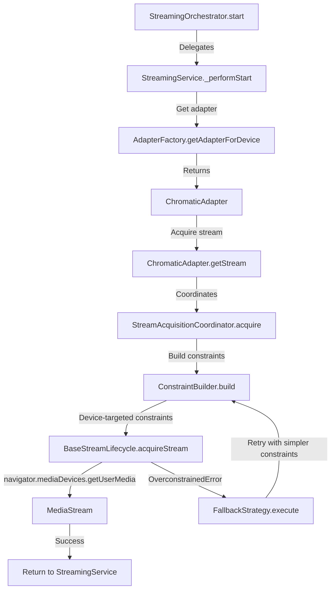
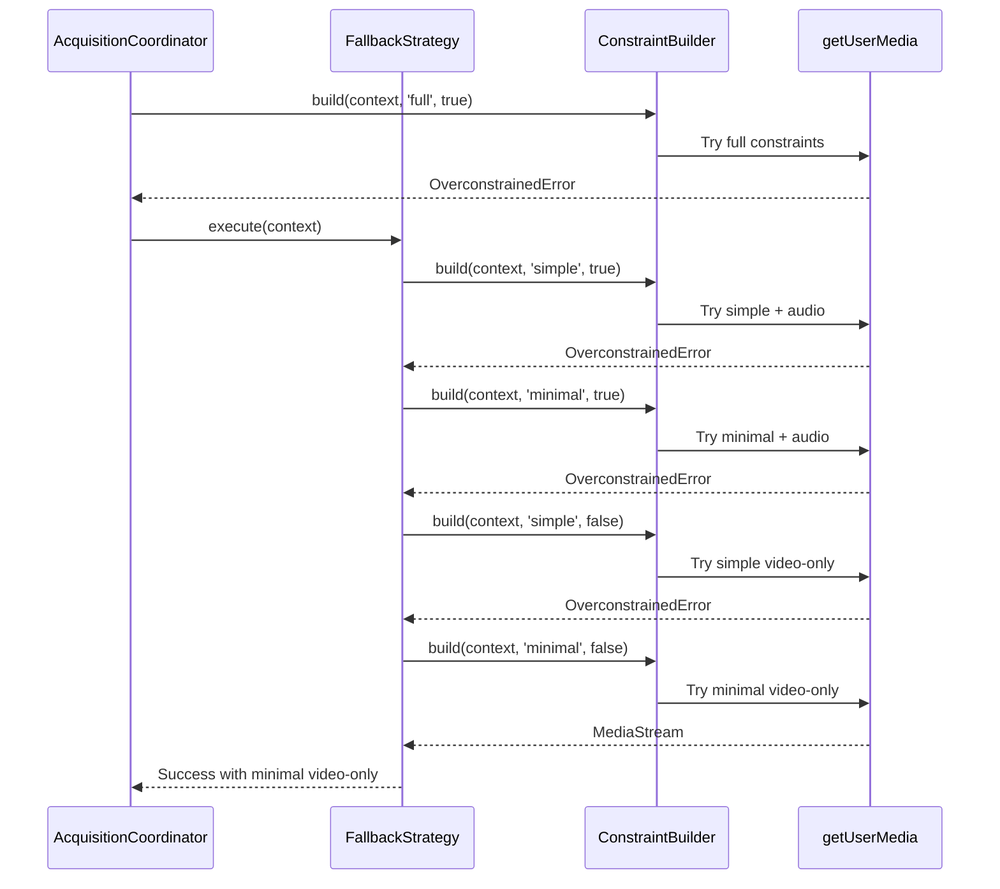

# Streaming Feature Documentation

## 1. Overview

The streaming feature handles MediaStream acquisition from connected devices with intelligent fallback mechanisms. It coordinates device detection, adapter selection, constraint building, and stream lifecycle management to provide reliable video/audio streaming from the Mod Retro Chromatic device.

Key capabilities:
- Device-specific stream acquisition through adapter pattern
- Intelligent constraint fallback when initial acquisition fails
- Immutable acquisition context to preserve device targeting
- Event-driven state machine for stream lifecycle
- Support for video-only and audio+video streams

## 2. Stream Acquisition Pipeline

The acquisition pipeline flows through multiple layers, from high-level orchestration down to browser MediaStream APIs:



### Pipeline Stages

1. **Orchestrator** - Entry point for user-initiated streaming
2. **Service** - State machine management and event emission
3. **Adapter Factory** - Device-specific adapter selection
4. **Device Adapter** - Device-specific stream acquisition logic
5. **Acquisition Coordinator** - Constraint building and fallback orchestration
6. **Constraint Builder** - MediaStreamConstraints generation
7. **Stream Lifecycle** - Browser API interaction
8. **Fallback Strategy** - Error recovery with progressive constraint relaxation

## 3. AcquisitionContext (Immutable)

**Location:** `src/features/streaming/acquisition/acquisition.context.js`

The `AcquisitionContext` is an immutable object that preserves device identity throughout the entire acquisition process, including fallback attempts.

### Purpose

Guarantees that device targeting (deviceId, groupId) cannot be accidentally lost or modified during constraint fallback, preventing acquisition from the wrong device.

### Structure

```javascript
class AcquisitionContext {
  #deviceId;      // USB device identifier
  #groupId;       // MediaStream group identifier
  #profile;       // Device configuration profile

  constructor(deviceId, groupId, profile) {
    this.#deviceId = deviceId;
    this.#groupId = groupId;
    this.#profile = Object.freeze({ ...profile });
    Object.freeze(this);
  }

  // Read-only getters
  get deviceId() { return this.#deviceId; }
  get groupId() { return this.#groupId; }
  get profile() { return this.#profile; }

  // Constraint helpers
  getDeviceConstraint() {
    return { exact: this.#groupId };
  }

  getAudioDeviceConstraint() {
    return { exact: this.#groupId };
  }
}
```

### Key Guarantees

- **Immutable** - Frozen object prevents modification
- **Private fields** - No direct access to internal state
- **Consistent targeting** - Device identity preserved across all fallback attempts
- **Profile preservation** - Device configuration remains intact

## 4. ConstraintBuilder

**Location:** `src/features/streaming/acquisition/constraint.builder.js`

The `ConstraintBuilder` generates MediaStreamConstraints objects with varying levels of complexity while ALWAYS preserving device targeting.

### Detail Levels

| Level | Description | Use Case |
|-------|-------------|----------|
| **full** | Complete constraints with all quality settings | Primary acquisition attempt |
| **simple** | Basic constraints with processing flags only | First fallback level |
| **minimal** | Device targeting only, no quality constraints | Final fallback before video-only |

### Constraint Structure

```javascript
// Full constraints example
{
  video: {
    groupId: { exact: "abc123..." },  // ALWAYS present
    width: { ideal: 160 },
    height: { ideal: 144 },
    frameRate: { ideal: 59.73 },
    aspectRatio: { ideal: 1.111 }
  },
  audio: {
    groupId: { exact: "abc123..." },  // ALWAYS present
    echoCancellation: false,
    noiseSuppression: false,
    autoGainControl: false
  }
}

// Minimal constraints example
{
  video: {
    groupId: { exact: "abc123..." }   // Device targeting preserved
  },
  audio: {
    groupId: { exact: "abc123..." }   // Device targeting preserved
  }
}
```

### Key Methods

- `build(context, detailLevel, includeAudio)` - Main entry point
- `buildDeviceConstraint(context)` - Device targeting only
- `buildQualityConstraints(profile)` - Resolution/framerate from profile

### Device Targeting Guarantee

Every constraint level includes `groupId: { exact: ... }` to ensure acquisition from the correct device, even during fallback.

## 5. Fallback Strategy

**Location:** `src/features/streaming/acquisition/fallback.strategy.js`

When `OverconstrainedError` occurs (browser cannot satisfy constraints), the fallback strategy progressively relaxes constraints while preserving device targeting.

### Fallback Chain



### Fallback Sequence

1. **Primary (full + audio)** - Ideal configuration with all quality settings
2. **Simple + audio** - Relaxed quality, preserve audio
3. **Minimal + audio** - Device targeting only, preserve audio
4. **Simple video-only** - Drop audio, try with processing flags
5. **Minimal video-only** - Last resort: device targeting only, video only

### Context Preservation

Each fallback attempt uses the same `AcquisitionContext` instance:
- Device identity never changes
- Profile remains constant
- Only constraint detail level varies

### Error Handling

If all fallback attempts fail, the original error is propagated to `StreamingService` which emits a `stream:error` event.

## 6. StreamingService State Machine

**Location:** `src/features/streaming/services/streaming.service.js`

The `StreamingService` manages stream lifecycle through a finite state machine with strict state transitions.

### States

```
IDLE → STARTING → STREAMING → STOPPING → IDLE
  ↑_______________________________________|
```

| State | Description | Allowed Transitions |
|-------|-------------|---------------------|
| **IDLE** | No active stream | → STARTING |
| **STARTING** | Acquisition in progress | → STREAMING, → IDLE (error) |
| **STREAMING** | Active stream playing | → STOPPING |
| **STOPPING** | Stream shutdown in progress | → IDLE |

### State Transitions

```javascript
// start() - IDLE → STARTING → STREAMING
async start(device) {
  if (this.state !== STREAM_STATES.IDLE) {
    throw new Error('Cannot start: not in IDLE state');
  }
  this.setState(STREAM_STATES.STARTING);

  try {
    const stream = await this._performStart(device);
    this.setState(STREAM_STATES.STREAMING);
    this.eventBus.publish('stream:started', { stream, device });
  } catch (error) {
    this.setState(STREAM_STATES.IDLE);
    this.eventBus.publish('stream:error', { error, operation: 'start' });
    throw error;
  }
}

// stop() - STREAMING → STOPPING → IDLE
async stop() {
  if (this.state !== STREAM_STATES.STREAMING) {
    return;
  }
  this.setState(STREAM_STATES.STOPPING);

  await this._performStop();
  this.setState(STREAM_STATES.IDLE);
  this.eventBus.publish('stream:stopped');
}
```

### Events Emitted

| Event | Payload | Description |
|-------|---------|-------------|
| `stream:started` | `{ stream, device, settings, capabilities }` | Stream acquisition successful |
| `stream:stopped` | `{}` | Stream stopped normally |
| `stream:error` | `{ error, operation }` | Stream error occurred |

### Event Payload Details

```javascript
// stream:started payload
{
  stream: MediaStream,           // The acquired stream
  device: {
    deviceId: string,
    label: string,
    profile: DeviceProfile
  },
  settings: MediaTrackSettings,  // Actual track settings
  capabilities: MediaTrackCapabilities  // Track capabilities
}

// stream:error payload
{
  error: Error,                  // The error object
  operation: 'start' | 'stop'    // Operation that failed
}
```

## 7. Key Files

### Acquisition Pipeline

| File | Purpose |
|------|---------|
| `src/features/streaming/acquisition/acquisition.context.js` | Immutable device context |
| `src/features/streaming/acquisition/constraint.builder.js` | MediaStreamConstraints generation |
| `src/features/streaming/acquisition/fallback.strategy.js` | Progressive constraint relaxation |
| `src/features/streaming/acquisition/stream-acquisition-coordinator.js` | Coordinates acquisition with fallback |

### Adapters and Factories

| File | Purpose |
|------|---------|
| `src/features/streaming/factories/adapter.factory.js` | Device adapter creation |
| `src/domains/devices/adapters/ChromaticAdapter.js` | Chromatic device stream logic |
| `src/domains/devices/adapters/BaseDeviceAdapter.js` | Base adapter interface |

### Services and Orchestration

| File | Purpose |
|------|---------|
| `src/features/streaming/services/streaming.service.js` | State machine and lifecycle |
| `src/features/streaming/services/streaming.orchestrator.js` | High-level coordination |
| `src/core/streaming/BaseStreamLifecycle.js` | Browser API interaction |

### Supporting Infrastructure

| File | Purpose |
|------|---------|
| `src/domains/devices/shared/DeviceRegistry.js` | Device detection and registry |
| `src/domains/devices/profiles/` | Device configuration profiles |
| `src/core/events/` | EventBus implementation |

## 8. Usage Example

### Starting a Stream

```javascript
// 1. Get connected device
const device = await deviceRegistry.getConnectedDevice();

// 2. Start streaming
await streamingService.start(device);

// 3. Listen for events
eventBus.subscribe('stream:started', ({ stream, device }) => {
  // Attach stream to video element
  videoElement.srcObject = stream;
});

eventBus.subscribe('stream:error', ({ error, operation }) => {
  console.error(`Stream ${operation} failed:`, error);
});
```

### Stopping a Stream

```javascript
await streamingService.stop();

eventBus.subscribe('stream:stopped', () => {
  videoElement.srcObject = null;
});
```

## 9. Testing Considerations

### Unit Tests

- Mock `AcquisitionContext` with frozen test data
- Test `ConstraintBuilder` output at each detail level
- Verify `FallbackStrategy` executes full chain
- Test state machine transitions in `StreamingService`

### Integration Tests

- Test full pipeline with real device (requires hardware)
- Verify fallback chain with constraint violations
- Test error propagation from browser APIs
- Verify event emission at each lifecycle stage

### Common Test Scenarios

1. **Successful acquisition** - Full constraints work on first try
2. **Partial fallback** - Full fails, simple succeeds
3. **Full fallback** - Only minimal video-only works
4. **Complete failure** - All fallback attempts fail
5. **State violations** - Attempt start during STARTING state
6. **Concurrent operations** - Multiple start/stop calls

## 10. Troubleshooting

### Stream Acquisition Fails

1. Check browser console for `OverconstrainedError` details
2. Verify device is detected in `DeviceRegistry`
3. Check `groupId` matches device in Chrome DevTools
4. Enable verbose logging in `StreamAcquisitionCoordinator`

### Wrong Device Selected

1. Verify `AcquisitionContext.groupId` is correct
2. Check constraint builder includes `groupId: { exact: ... }`
3. Ensure fallback strategy preserves context

### Audio Not Working

1. Check if fallback reached video-only mode
2. Verify device profile includes audio configuration
3. Test with `includeAudio: false` to isolate issue

### State Machine Errors

1. Check current state before calling start/stop
2. Verify event listeners are registered before starting
3. Ensure cleanup happens in all error paths
